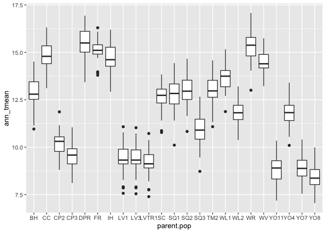
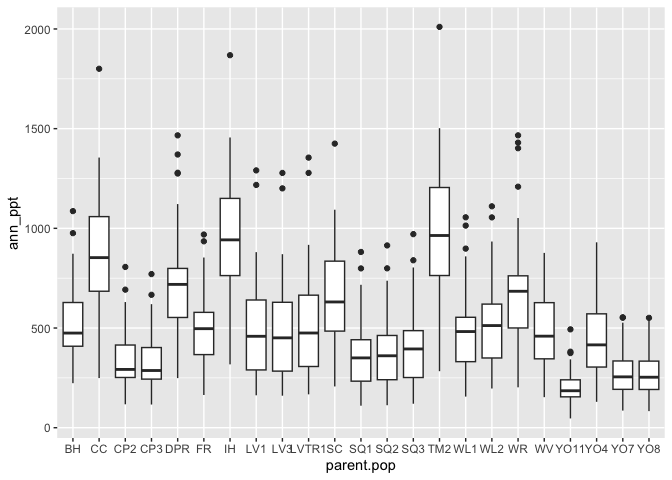
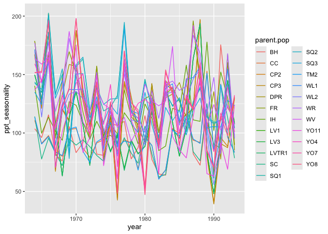
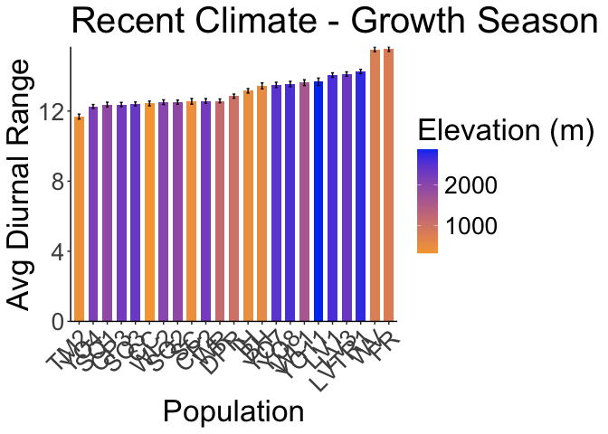
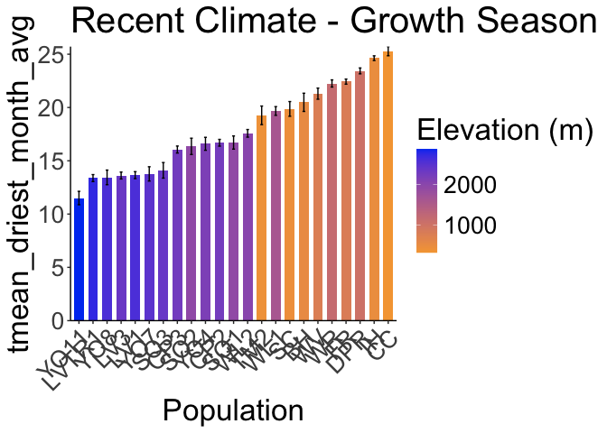
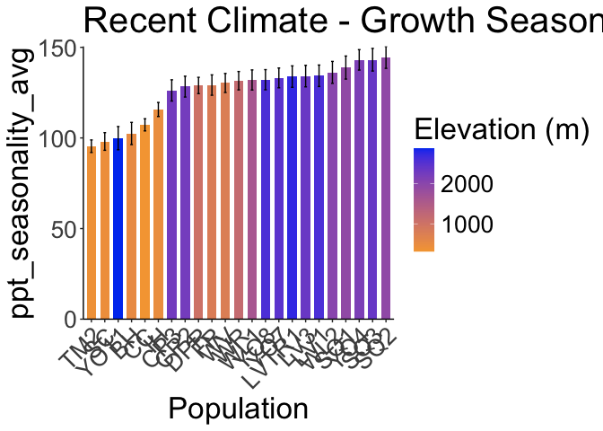
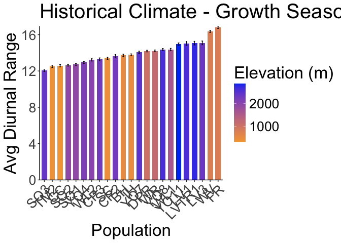
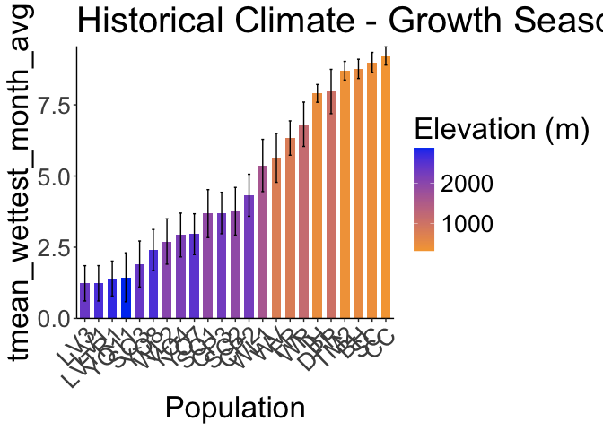

# BioClim Variables (https://www.worldclim.org/data/bioclim.html#google_vignette)
-   annual mean temperature (BIO1)
-   mean diurnal range (BIO2) - (Mean of monthly (max temp - min temp))
-   temperature seasonality (BIO4) (standard deviation *100)
-   temperature annual range (BIO7) (Max Temperature of Warmest Month - Min Temperature of Coldest Month)
-   mean temp of wettest quarter (BIO8)
-   mean temp of driest quarter (BIO9)
-   annual precipitation (BIO12) - sum of ppt for the entire year (not the avg)
-   precipitation seasonality (BIO15)  (Coefficient of Variation)
-   precip of warmest quarter (BIO18)
-   precip of coldest quarter (BIO19)

Can't caluclate with the function in QBMS for calculating it because I only want it for the growth season, which for most populations is less than 12 months. 
https://search.r-project.org/CRAN/refmans/QBMS/html/calc_biovars.html  

A quarter is a period of three months in the OG bioclim. Can't do that here because I don't have contiguous sets of 3 months (for example some low elev pops start their growht in December). So I will modify the "quarter" variables to be "period" variables. 

-   mean temp of wettest quarter (BIO8) - CHANGED TO mean temp of wettest month 
-   mean temp of driest quarter (BIO9) - CHANGED TO mean temp of driest month 
-   precip of warmest quarter (BIO18) - CHANGED TO precip of warmest month
-   precip of coldest quarter (BIO19) - CHANGED TO precip of coldest month 

## Relevant Libraries and Functions


```r
library(raster)
```

```
## Loading required package: sp
```

```r
library(tidyverse)
```

```
## ── Attaching core tidyverse packages ──────────────────────── tidyverse 2.0.0 ──
## ✔ dplyr     1.1.3     ✔ readr     2.1.4
## ✔ forcats   1.0.0     ✔ stringr   1.5.0
## ✔ ggplot2   3.4.3     ✔ tibble    3.2.1
## ✔ lubridate 1.9.2     ✔ tidyr     1.3.0
## ✔ purrr     1.0.2
```

```
## ── Conflicts ────────────────────────────────────────── tidyverse_conflicts() ──
## ✖ tidyr::extract() masks raster::extract()
## ✖ dplyr::filter()  masks stats::filter()
## ✖ dplyr::lag()     masks stats::lag()
## ✖ dplyr::select()  masks raster::select()
## ℹ Use the conflicted package (<http://conflicted.r-lib.org/>) to force all conflicts to become errors
```

```r
library(conflicted)
conflicts_prefer(dplyr::select())
```

```
## [conflicted] Will prefer dplyr::select over any other package.
```

```r
conflicts_prefer(dplyr::filter)
```

```
## [conflicted] Will prefer dplyr::filter over any other package.
```

```r
library(ggrepel)
library(cowplot)
library(gridExtra)
library(corrplot) #plotting correlations 
```

```
## corrplot 0.92 loaded
```

```r
library(rstatix) #performing cor_test
library(naniar) #replaces values with NA
sem <- function(x, na.rm=FALSE) {
  sd(x,na.rm=na.rm)/sqrt(length(na.omit(x)))
} #standard error function 

get_legend<-function(myggplot){
  tmp <- ggplot_gtable(ggplot_build(myggplot))
  leg <- which(sapply(tmp$grobs, function(x) x$name) == "guide-box")
  legend <- tmp$grobs[[leg]]
  return(legend)
} #legend function for grid_arrange

elev_three_palette <- c("#0043F0", "#C9727F", "#F5A540") #colors from Gremer et al 2019
elev_order <- c("High", "Mid", "Low")

#For scree plots 
#library("devtools") #The package devtools is required for the installation as factoextra is hosted on github.
#1install_github("kassambara/factoextra")
library("factoextra")
```

```
## Welcome! Want to learn more? See two factoextra-related books at https://goo.gl/ve3WBa
```

## Load the Flint growth season data (from "Flint_Growth_Season.Rmd")

```r
flint_recent_grwseason <- read_csv("../output/Climate/flint_climate_growthseason_recent.csv") %>%
  dplyr::select(month, parent.pop:tmx)
```

```
## Rows: 4950 Columns: 14
## ── Column specification ────────────────────────────────────────────────────────
## Delimiter: ","
## chr  (2): parent.pop, elevation.group
## dbl (12): month, growmonth, elev_m, PckSum, year, cwd, pck, ppt, tmn, tmx, A...
## 
## ℹ Use `spec()` to retrieve the full column specification for this data.
## ℹ Specify the column types or set `show_col_types = FALSE` to quiet this message.
```

```r
head(flint_recent_grwseason, 12)
```

```
## # A tibble: 12 × 11
##    month parent.pop elevation.group elev_m PckSum  year   cwd   pck      ppt
##    <dbl> <chr>      <chr>            <dbl>  <dbl> <dbl> <dbl> <dbl>    <dbl>
##  1    12 BH         Low               511.      0  1992  27.8     0 162.    
##  2     1 BH         Low               511.      0  1992  28.3     0  42.7   
##  3     2 BH         Low               511.      0  1992  40.1     0 175.    
##  4     3 BH         Low               511.      0  1992  52.0     0  76.3   
##  5     4 BH         Low               511.      0  1992  75.9     0   2.19  
##  6     5 BH         Low               511.      0  1992  78.6     0   0.0800
##  7     6 BH         Low               511.      0  1992  99.1     0   1.77  
##  8    11 CC         Low               313       0  1992  32.4     0  18.1   
##  9    12 CC         Low               313       0  1992  19.3     0 243.    
## 10     1 CC         Low               313       0  1992  19.4     0  80.9   
## 11     2 CC         Low               313       0  1992  30.7     0 276.    
## 12     3 CC         Low               313       0  1992  44.3     0 128.    
## # ℹ 2 more variables: tmn <dbl>, tmx <dbl>
```

```r
flint_recent_grwseason %>% filter(parent.pop=="DPR")
```

```
## # A tibble: 300 × 11
##    month parent.pop elevation.group elev_m PckSum  year   cwd   pck     ppt
##    <dbl> <chr>      <chr>            <dbl>  <dbl> <dbl> <dbl> <dbl>   <dbl>
##  1     3 DPR        Mid              1019.   107.  1992 29.4     0  136.   
##  2     4 DPR        Mid              1019.   107.  1992 45.3     0   62.4  
##  3     5 DPR        Mid              1019.   107.  1992 44.2     0    1.92 
##  4     6 DPR        Mid              1019.   107.  1992  0       0   50.3  
##  5     7 DPR        Mid              1019.   107.  1992 37.7     0    0    
##  6     8 DPR        Mid              1019.   107.  1992 41.0     0    0    
##  7     9 DPR        Mid              1019.   107.  1992 55.1     0    0.510
##  8    10 DPR        Mid              1019.   107.  1992 39.0     0  138.   
##  9    11 DPR        Mid              1019.   107.  1992 18.3     0   30.1  
## 10    12 DPR        Mid              1019.   107.  1992  9.90  119. 391.   
## # ℹ 290 more rows
## # ℹ 2 more variables: tmn <dbl>, tmx <dbl>
```

```r
flint_historical_grwseason <- read_csv("../output/Climate/flint_climate_growthseason_historical.csv") %>%
  dplyr::select(month, parent.pop:tmx)
```

```
## Rows: 4620 Columns: 14
## ── Column specification ────────────────────────────────────────────────────────
## Delimiter: ","
## chr  (2): parent.pop, elevation.group
## dbl (12): month, growmonth, elev_m, PckSum, year, cwd, pck, ppt, tmn, tmx, A...
## 
## ℹ Use `spec()` to retrieve the full column specification for this data.
## ℹ Specify the column types or set `show_col_types = FALSE` to quiet this message.
```

```r
head(flint_historical_grwseason, 12)
```

```
## # A tibble: 12 × 11
##    month parent.pop elevation.group elev_m PckSum  year   cwd   pck     ppt
##    <dbl> <chr>      <chr>            <dbl>  <dbl> <dbl> <dbl> <dbl>   <dbl>
##  1    11 BH         Low               511.  0.234  1962  44.6     0   9.85 
##  2    12 BH         Low               511.  0.234  1962  31.2     0  57.8  
##  3     1 BH         Low               511.  0.234  1962  28.5     0  59.8  
##  4     2 BH         Low               511.  0.234  1962  37.4     0 289.   
##  5     3 BH         Low               511.  0.234  1962  45.3     0  80.6  
##  6     4 BH         Low               511.  0.234  1962  74.5     0   8.19 
##  7     5 BH         Low               511.  0.234  1962  70.6     0   3.08 
##  8     6 BH         Low               511.  0.234  1962  97.2     0   0.820
##  9    11 CC         Low               313   0.951  1962  32.4     0  54.1  
## 10    12 CC         Low               313   0.951  1962  21.0     0 131.   
## 11     1 CC         Low               313   0.951  1962  19.7     0  93.1  
## 12     2 CC         Low               313   0.951  1962  27.8     0 360.   
## # ℹ 2 more variables: tmn <dbl>, tmx <dbl>
```

## Manually Calculate BioClim Variables

Referenced this r code: https://github.com/rspatial/dismo/blob/master/R/biovars.R 

### Recent Climate

#### Prep

Calculating average temp and diurnal range for each month 

```r
bioclim_recent_meantemp_prep <- flint_recent_grwseason %>% 
  mutate(tavg = (tmn + tmx)/2, t_diurnal = (tmx-tmn))
```

Calculating wettest, driest, warmest, and coldest months 


```r
recent_wettest_month <- bioclim_recent_meantemp_prep %>%  
  group_by(parent.pop, elevation.group, elev_m, year) %>% 
  slice_max(ppt)

recent_driest_month <- bioclim_recent_meantemp_prep %>%  #there's more than one driest month for some pops and years 
  group_by(parent.pop, elevation.group, elev_m, year) %>% 
  slice_min(ppt)

recent_warmest_month <- bioclim_recent_meantemp_prep %>% #there's one warmest month per pop/year
  group_by(parent.pop, elevation.group, elev_m, year) %>% 
  slice_max(tavg)

recent_coldest_month <- bioclim_recent_meantemp_prep %>% #there's one coldest month per pop/year
  group_by(parent.pop, elevation.group, elev_m, year) %>% 
  slice_min(tavg)
```


#### Calculations 

Bio 1, 2, 4, 7, 12, 15

```r
bioclim_recent_calc <- bioclim_recent_meantemp_prep %>% 
  group_by(parent.pop, elevation.group, elev_m, year) %>% 
  summarise(ann_tmean=mean(tavg),  #Bio1 - Annual Mean Temperature
            mean_diurnal_range=mean(t_diurnal), #Bio2 - Mean Diurnal Range
            temp_seasonality=sd(tavg), #Bio4 - Temperature Seasonality
            temp_ann_range=(max(tmx))-(min(tmn)), #bio7 - temp annual range
            ann_ppt=sum(ppt), #bio12 - annual precip
            ppt_seasonality=cv(ppt+1)) #bio15 - Precipitation Seasonality (+1 to avoid strange CVs for areas where mean rainfaill is < 1)
```

```
## `summarise()` has grouped output by 'parent.pop', 'elevation.group', 'elev_m'.
## You can override using the `.groups` argument.
```

```r
bioclim_recent_calc
```

```
## # A tibble: 690 × 10
## # Groups:   parent.pop, elevation.group, elev_m [23]
##    parent.pop elevation.group elev_m  year ann_tmean mean_diurnal_range
##    <chr>      <chr>            <dbl> <dbl>     <dbl>              <dbl>
##  1 BH         Low               511.  1992      13.4               13.0
##  2 BH         Low               511.  1993      12.3               13.0
##  3 BH         Low               511.  1994      12.7               14.0
##  4 BH         Low               511.  1995      12.4               11.8
##  5 BH         Low               511.  1996      13.4               13.0
##  6 BH         Low               511.  1997      13.5               13.8
##  7 BH         Low               511.  1998      11.0               11.6
##  8 BH         Low               511.  1999      11.7               14.0
##  9 BH         Low               511.  2000      13.6               14.0
## 10 BH         Low               511.  2001      13.1               13.9
## # ℹ 680 more rows
## # ℹ 4 more variables: temp_seasonality <dbl>, temp_ann_range <dbl>,
## #   ann_ppt <dbl>, ppt_seasonality <dbl>
```

Bio 8(Q), 9(Q), 18(Q), 19(Q)

```r
#bio8 = tmean_wettest_month
bio8_recent <- recent_wettest_month %>% 
  dplyr::select(parent.pop, elevation.group, elev_m, year, tmean_wettest_month=tavg)

#bio9 = tmean_driest_month
bio9_recent <- recent_driest_month %>% 
  group_by(parent.pop, elevation.group, elev_m, year) %>% 
  summarise(tmean_driest_month=mean(tavg)) #taking the average b/c some years where there are multiple driest months 
```

```
## `summarise()` has grouped output by 'parent.pop', 'elevation.group', 'elev_m'.
## You can override using the `.groups` argument.
```

```r
bio8_9_recent <- full_join(bio8_recent, bio9_recent)
```

```
## Joining with `by = join_by(parent.pop, elevation.group, elev_m, year)`
```

```r
#bio18 = ppt_warmest_month
bio18_recent <- recent_warmest_month %>% 
  dplyr::select(parent.pop, elevation.group, elev_m, year, ppt_warmest_month=ppt)

#bio19 = ppt_coldest_month
bio19_recent <- recent_wettest_month %>% 
  dplyr::select(parent.pop, elevation.group, elev_m, year, ppt_coldest_month=ppt)

bio18_19_recent <- full_join(bio18_recent, bio19_recent)
```

```
## Joining with `by = join_by(parent.pop, elevation.group, elev_m, year)`
```

```r
all_periods_recent <- full_join(bio8_9_recent, bio18_19_recent)
```

```
## Joining with `by = join_by(parent.pop, elevation.group, elev_m, year)`
```

Merge all bioclims

```r
bioclim_recent <- full_join(bioclim_recent_calc, all_periods_recent)
```

```
## Joining with `by = join_by(parent.pop, elevation.group, elev_m, year)`
```

```r
summary(bioclim_recent)
```

```
##   parent.pop        elevation.group        elev_m            year     
##  Length:690         Length:690         Min.   : 313.0   Min.   :1992  
##  Class :character   Class :character   1st Qu.: 748.9   1st Qu.:1999  
##  Mode  :character   Mode  :character   Median :1934.5   Median :2006  
##                                        Mean   :1649.7   Mean   :2006  
##                                        3rd Qu.:2373.2   3rd Qu.:2014  
##                                        Max.   :2872.3   Max.   :2021  
##    ann_tmean      mean_diurnal_range temp_seasonality temp_ann_range 
##  Min.   : 7.050   Min.   : 9.795     Min.   :3.565    Min.   :22.05  
##  1st Qu.: 9.621   1st Qu.:12.402     1st Qu.:5.826    1st Qu.:28.05  
##  Median :12.171   Median :13.084     Median :6.459    Median :29.45  
##  Mean   :11.866   Mean   :13.273     Mean   :6.397    Mean   :29.70  
##  3rd Qu.:13.788   3rd Qu.:14.003     3rd Qu.:7.034    3rd Qu.:31.54  
##  Max.   :17.073   Max.   :16.850     Max.   :9.133    Max.   :37.72  
##     ann_ppt        ppt_seasonality  tmean_wettest_month tmean_driest_month
##  Min.   :  17.82   Min.   : 28.11   Min.   :-5.380      Min.   :-0.74     
##  1st Qu.: 294.73   1st Qu.:102.06   1st Qu.: 1.036      1st Qu.:14.20     
##  Median : 481.77   Median :124.45   Median : 4.425      Median :17.47     
##  Mean   : 546.12   Mean   :124.71   Mean   : 4.380      Mean   :17.50     
##  3rd Qu.: 709.03   3rd Qu.:146.08   3rd Qu.: 7.765      3rd Qu.:21.71     
##  Max.   :1820.87   Max.   :229.39   Max.   :19.425      Max.   :26.91     
##  ppt_warmest_month ppt_coldest_month
##  Min.   : 0.000    Min.   :  5.57   
##  1st Qu.: 0.150    1st Qu.:146.82   
##  Median : 2.175    Median :233.88   
##  Mean   : 7.511    Mean   :250.58   
##  3rd Qu.: 8.850    3rd Qu.:335.14   
##  Max.   :73.960    Max.   :894.02
```

### Historical Climate
#### Prep

Calculating average temp and diurnal range for each month 

```r
bioclim_historical_meantemp_prep <- flint_historical_grwseason %>% 
  mutate(tavg = (tmn + tmx)/2, t_diurnal = (tmx-tmn))
```

Calculating wettest, driest, warmest, and coldest months 


```r
historical_wettest_month <- bioclim_historical_meantemp_prep %>%  
  group_by(parent.pop, elevation.group, elev_m, year) %>% 
  slice_max(ppt)

historical_driest_month <- bioclim_historical_meantemp_prep %>%  #there's more than one driest month for some pops and years 
  group_by(parent.pop, elevation.group, elev_m, year) %>% 
  slice_min(ppt)

historical_warmest_month <- bioclim_historical_meantemp_prep %>% #there's one warmest month per pop/year
  group_by(parent.pop, elevation.group, elev_m, year) %>% 
  slice_max(tavg)

historical_coldest_month <- bioclim_historical_meantemp_prep %>% #there's one coldest month per pop/year
  group_by(parent.pop, elevation.group, elev_m, year) %>% 
  slice_min(tavg)
```


#### Calculations 

Bio 1, 2, 4, 7, 12, 15

```r
bioclim_historical_calc <- bioclim_historical_meantemp_prep %>% 
  group_by(parent.pop, elevation.group, elev_m, year) %>% 
  summarise(ann_tmean=mean(tavg),  #Bio1 - Annual Mean Temperature
            mean_diurnal_range=mean(t_diurnal), #Bio2 - Mean Diurnal Range
            temp_seasonality=sd(tavg), #Bio4 - Temperature Seasonality
            temp_ann_range=(max(tmx))-(min(tmn)), #bio7 - temp annual range
            ann_ppt=sum(ppt), #bio12 - annual precip
            ppt_seasonality=cv(ppt+1)) #bio15 - Precipitation Seasonality (+1 to avoid strange CVs for areas where mean rainfaill is < 1)
```

```
## `summarise()` has grouped output by 'parent.pop', 'elevation.group', 'elev_m'.
## You can override using the `.groups` argument.
```

```r
bioclim_historical_calc
```

```
## # A tibble: 690 × 10
## # Groups:   parent.pop, elevation.group, elev_m [23]
##    parent.pop elevation.group elev_m  year ann_tmean mean_diurnal_range
##    <chr>      <chr>            <dbl> <dbl>     <dbl>              <dbl>
##  1 BH         Low               511.  1962      11.7               14.9
##  2 BH         Low               511.  1963      11.1               13.1
##  3 BH         Low               511.  1964      11.0               14.1
##  4 BH         Low               511.  1965      11.2               13.5
##  5 BH         Low               511.  1966      12.5               14.5
##  6 BH         Low               511.  1967      11.0               13.6
##  7 BH         Low               511.  1968      12.2               14.5
##  8 BH         Low               511.  1969      11.6               13.7
##  9 BH         Low               511.  1970      12.3               14.5
## 10 BH         Low               511.  1971      10.7               14.0
## # ℹ 680 more rows
## # ℹ 4 more variables: temp_seasonality <dbl>, temp_ann_range <dbl>,
## #   ann_ppt <dbl>, ppt_seasonality <dbl>
```

Bio 8(Q), 9(Q), 18(Q), 19(Q)

```r
#bio8 = tmean_wettest_month
bio8_historical <- historical_wettest_month %>% 
  dplyr::select(parent.pop, elevation.group, elev_m, year, tmean_wettest_month=tavg)

#bio9 = tmean_driest_month
bio9_historical <- historical_driest_month %>% 
  group_by(parent.pop, elevation.group, elev_m, year) %>% 
  summarise(tmean_driest_month=mean(tavg)) #taking the average b/c some years where there are multiple driest months 
```

```
## `summarise()` has grouped output by 'parent.pop', 'elevation.group', 'elev_m'.
## You can override using the `.groups` argument.
```

```r
bio8_9_historical <- full_join(bio8_historical, bio9_historical)
```

```
## Joining with `by = join_by(parent.pop, elevation.group, elev_m, year)`
```

```r
#bio18 = ppt_warmest_month
bio18_historical <- historical_warmest_month %>% 
  dplyr::select(parent.pop, elevation.group, elev_m, year, ppt_warmest_month=ppt)

#bio19 = ppt_coldest_month
bio19_historical <- historical_wettest_month %>% 
  dplyr::select(parent.pop, elevation.group, elev_m, year, ppt_coldest_month=ppt)

bio18_19_historical <- full_join(bio18_historical, bio19_historical)
```

```
## Joining with `by = join_by(parent.pop, elevation.group, elev_m, year)`
```

```r
all_periods_historical <- full_join(bio8_9_historical, bio18_19_historical)
```

```
## Joining with `by = join_by(parent.pop, elevation.group, elev_m, year)`
```

Merge all bioclims

```r
bioclim_historical <- full_join(bioclim_historical_calc, all_periods_historical)
```

```
## Joining with `by = join_by(parent.pop, elevation.group, elev_m, year)`
```

```r
summary(bioclim_historical)
```

```
##   parent.pop        elevation.group        elev_m            year     
##  Length:690         Length:690         Min.   : 313.0   Min.   :1962  
##  Class :character   Class :character   1st Qu.: 748.9   1st Qu.:1969  
##  Mode  :character   Mode  :character   Median :1934.5   Median :1976  
##                                        Mean   :1649.7   Mean   :1976  
##                                        3rd Qu.:2373.2   3rd Qu.:1984  
##                                        Max.   :2872.3   Max.   :1991  
##    ann_tmean      mean_diurnal_range temp_seasonality temp_ann_range 
##  Min.   : 4.107   Min.   :10.77      Min.   :2.925    Min.   :22.29  
##  1st Qu.: 9.134   1st Qu.:13.05      1st Qu.:5.307    1st Qu.:26.96  
##  Median :11.365   Median :13.94      Median :5.976    Median :28.69  
##  Mean   :11.059   Mean   :14.03      Mean   :5.980    Mean   :29.26  
##  3rd Qu.:13.465   3rd Qu.:14.74      3rd Qu.:6.657    3rd Qu.:31.46  
##  Max.   :16.297   Max.   :18.43      Max.   :8.354    Max.   :39.20  
##     ann_ppt        ppt_seasonality  tmean_wettest_month tmean_driest_month
##  Min.   :  68.45   Min.   : 39.25   Min.   :-4.275      Min.   :-0.21     
##  1st Qu.: 289.22   1st Qu.: 95.32   1st Qu.: 1.036      1st Qu.:12.81     
##  Median : 461.72   Median :116.55   Median : 4.780      Median :16.35     
##  Mean   : 528.20   Mean   :117.95   Mean   : 4.941      Mean   :16.45     
##  3rd Qu.: 712.41   3rd Qu.:138.63   3rd Qu.: 8.393      3rd Qu.:20.88     
##  Max.   :2010.44   Max.   :224.18   Max.   :18.550      Max.   :27.32     
##  ppt_warmest_month ppt_coldest_month
##  Min.   :  0.000   Min.   : 27.96   
##  1st Qu.:  0.195   1st Qu.:134.07   
##  Median :  3.565   Median :224.78   
##  Mean   : 10.153   Mean   :245.85   
##  3rd Qu.: 11.765   3rd Qu.:322.09   
##  Max.   :249.430   Max.   :951.79
```


## Bioclim trends

```r
bioclim_recent %>% ggplot(aes(x=parent.pop, y=ann_tmean)) + geom_boxplot()
```

<!-- -->

```r
bioclim_historical %>% ggplot(aes(x=parent.pop, y=ann_tmean)) + geom_boxplot()
```

<!-- -->

```r
bioclim_recent %>% ggplot(aes(x=parent.pop, y=ann_ppt)) + geom_boxplot() #seemingly more variation in ppt across years than temperature 
```

<!-- -->

```r
bioclim_historical %>% ggplot(aes(x=parent.pop, y=ann_ppt)) + geom_boxplot()
```

<!-- -->

```r
bioclim_recent %>% ggplot(aes(x=year, y=temp_seasonality, group=parent.pop, color=parent.pop)) + geom_line()
```

<!-- -->

```r
bioclim_historical %>% ggplot(aes(x=year, y=temp_seasonality, group=parent.pop, color=parent.pop)) + geom_line()
```

<!-- -->

```r
bioclim_recent %>% ggplot(aes(x=year, y=ppt_seasonality, group=parent.pop, color=parent.pop)) + geom_line()
```

<!-- -->

```r
bioclim_historical %>% ggplot(aes(x=year, y=ppt_seasonality, group=parent.pop, color=parent.pop)) + geom_line()
```

<!-- -->

## Averages

### Recent Years - BioClim

```r
bioclim_recent_avgs <- bioclim_recent %>% group_by(parent.pop, elevation.group, elev_m) %>%
  summarise_at(c("ann_tmean", "mean_diurnal_range", "temp_seasonality", "temp_ann_range", "tmean_wettest_month", "tmean_driest_month", "ann_ppt", "ppt_seasonality","ppt_warmest_month", "ppt_coldest_month"), c(mean, sem), na.rm = TRUE) 
names(bioclim_recent_avgs) <- gsub("fn2", "sem", colnames(bioclim_recent_avgs))
names(bioclim_recent_avgs) <-gsub("fn1", "avg", colnames(bioclim_recent_avgs))
bioclim_recent_avgs
```

```
## # A tibble: 23 × 23
## # Groups:   parent.pop, elevation.group [23]
##    parent.pop elevation.group elev_m ann_tmean_avg mean_diurnal_range_avg
##    <chr>      <chr>            <dbl>         <dbl>                  <dbl>
##  1 BH         Low               511.         12.9                    13.5
##  2 CC         Low               313          13.3                    11.9
##  3 CP2        High             2244.         10.1                    12.7
##  4 CP3        High             2266.          9.46                   12.5
##  5 DPR        Mid              1019.         15.4                    13.0
##  6 FR         Mid               787          14.9                    15.8
##  7 IH         Low               454.         14.6                    13.2
##  8 LV1        High             2593.          9.27                   14.2
##  9 LV3        High             2354.          9.24                   14.1
## 10 LVTR1      High             2741.          9.06                   14.3
## # ℹ 13 more rows
## # ℹ 18 more variables: temp_seasonality_avg <dbl>, temp_ann_range_avg <dbl>,
## #   tmean_wettest_month_avg <dbl>, tmean_driest_month_avg <dbl>,
## #   ann_ppt_avg <dbl>, ppt_seasonality_avg <dbl>, ppt_warmest_month_avg <dbl>,
## #   ppt_coldest_month_avg <dbl>, ann_tmean_sem <dbl>,
## #   mean_diurnal_range_sem <dbl>, temp_seasonality_sem <dbl>,
## #   temp_ann_range_sem <dbl>, tmean_wettest_month_sem <dbl>, …
```

```r
write_csv(bioclim_recent_avgs, "../output/Climate/Pops_BioClimAvgs_Recent.csv")

bioclim_recent_avgs %>% ggplot(aes(x=fct_reorder(parent.pop, ann_tmean_avg), y=ann_tmean_avg, fill=elev_m)) + 
  geom_col(width = 0.7,position = position_dodge(0.75)) + 
  geom_errorbar(aes(ymin=ann_tmean_avg-ann_tmean_sem,ymax=ann_tmean_avg+ann_tmean_sem),width=.2, position = position_dodge(0.75)) +
  scale_y_continuous(expand = c(0, 0)) +
  scale_fill_gradient(low = "#F5A540", high = "#0043F0") +
  labs(fill="Elevation (m)", y="Avg Annual Mean Temp", x="Population", title ="Recent Climate - Growth Season") +
  theme_classic() +
  theme(text=element_text(size=25), axis.text.x = element_text(angle = 45,  hjust = 1))
```

<!-- -->

```r
ggsave("../output/Climate/Bioclim_AnnMeanTmp_RecentClim.png", width = 12, height = 6, units = "in")

bioclim_recent_avgs %>% ggplot(aes(x=fct_reorder(parent.pop, mean_diurnal_range_avg), y=mean_diurnal_range_avg, fill=elev_m)) + 
  geom_col(width = 0.7,position = position_dodge(0.75)) + 
  geom_errorbar(aes(ymin=mean_diurnal_range_avg-mean_diurnal_range_sem,ymax=mean_diurnal_range_avg+mean_diurnal_range_sem),width=.2, position = position_dodge(0.75)) +
  scale_y_continuous(expand = c(0, 0)) +
  scale_fill_gradient(low = "#F5A540", high = "#0043F0") +
  labs(fill="Elevation (m)", y="Avg Diurnal Range", x="Population", title ="Recent Climate - Growth Season") +
  theme_classic() +
  theme(text=element_text(size=25), axis.text.x = element_text(angle = 45,  hjust = 1))
```

<!-- -->

```r
ggsave("../output/Climate/Bioclim_DiurnalRange_RecentClim.png", width = 12, height = 6, units = "in")

bioclim_recent_avgs %>% ggplot(aes(x=fct_reorder(parent.pop, temp_seasonality_avg), y=temp_seasonality_avg, fill=elev_m)) + 
  geom_col(width = 0.7,position = position_dodge(0.75)) + 
  geom_errorbar(aes(ymin=temp_seasonality_avg-temp_seasonality_sem,ymax=temp_seasonality_avg+temp_seasonality_sem),width=.2, position = position_dodge(0.75)) +
  scale_y_continuous(expand = c(0, 0)) +
  scale_fill_gradient(low = "#F5A540", high = "#0043F0") +
  labs(fill="Elevation (m)",  x="Population", title ="Recent Climate - Growth Season") +
  theme_classic() +
  theme(text=element_text(size=25), axis.text.x = element_text(angle = 45,  hjust = 1))
```

<!-- -->

```r
ggsave("../output/Climate/Bioclim_TempSeasonality_RecentClim.png", width = 12, height = 6, units = "in")

bioclim_recent_avgs %>% ggplot(aes(x=fct_reorder(parent.pop, temp_ann_range_avg), y=temp_ann_range_avg, fill=elev_m)) + 
  geom_col(width = 0.7,position = position_dodge(0.75)) + 
  geom_errorbar(aes(ymin=temp_ann_range_avg-temp_ann_range_sem,ymax=temp_ann_range_avg+temp_ann_range_sem),width=.2, position = position_dodge(0.75)) +
  scale_y_continuous(expand = c(0, 0)) +
  scale_fill_gradient(low = "#F5A540", high = "#0043F0") +
  labs(fill="Elevation (m)",  x="Population", title ="Recent Climate - Growth Season") +
  theme_classic() +
  theme(text=element_text(size=25), axis.text.x = element_text(angle = 45,  hjust = 1))
```

<!-- -->

```r
ggsave("../output/Climate/Bioclim_AnnTmpRange_RecentClim.png", width = 12, height = 6, units = "in")

bioclim_recent_avgs %>% ggplot(aes(x=fct_reorder(parent.pop, tmean_wettest_month_avg), y=tmean_wettest_month_avg, fill=elev_m)) + 
  geom_col(width = 0.7,position = position_dodge(0.75)) + 
  geom_errorbar(aes(ymin=tmean_wettest_month_avg-tmean_wettest_month_sem,ymax=tmean_wettest_month_avg+tmean_wettest_month_sem),width=.2, position = position_dodge(0.75)) +
  scale_y_continuous(expand = c(0, 0)) +
  scale_fill_gradient(low = "#F5A540", high = "#0043F0") +
  labs(fill="Elevation (m)",  x="Population", title ="Recent Climate - Growth Season") +
  theme_classic() +
  theme(text=element_text(size=25), axis.text.x = element_text(angle = 45,  hjust = 1))
```

<!-- -->

```r
ggsave("../output/Climate/Bioclim_TmpMeanWet_RecentClim.png", width = 12, height = 6, units = "in")

bioclim_recent_avgs %>% ggplot(aes(x=fct_reorder(parent.pop, tmean_driest_month_avg), y=tmean_driest_month_avg, fill=elev_m)) + 
  geom_col(width = 0.7,position = position_dodge(0.75)) + 
  geom_errorbar(aes(ymin=tmean_driest_month_avg-tmean_driest_month_sem,ymax=tmean_driest_month_avg+tmean_driest_month_sem),width=.2, position = position_dodge(0.75)) +
  scale_y_continuous(expand = c(0, 0)) +
  scale_fill_gradient(low = "#F5A540", high = "#0043F0") +
  labs(fill="Elevation (m)",  x="Population", title ="Recent Climate - Growth Season") +
  theme_classic() +
  theme(text=element_text(size=25), axis.text.x = element_text(angle = 45,  hjust = 1))
```

<!-- -->

```r
ggsave("../output/Climate/Bioclim_TmpMeanDry_RecentClim.png", width = 12, height = 6, units = "in")

bioclim_recent_avgs %>% ggplot(aes(x=fct_reorder(parent.pop, ann_ppt_avg), y=ann_ppt_avg, fill=elev_m)) + 
  geom_col(width = 0.7,position = position_dodge(0.75)) + 
  geom_errorbar(aes(ymin=ann_ppt_avg-ann_ppt_sem,ymax=ann_ppt_avg+ann_ppt_sem),width=.2, position = position_dodge(0.75)) +
  scale_y_continuous(expand = c(0, 0)) +
  scale_fill_gradient(low = "#F5A540", high = "#0043F0") +
  labs(fill="Elevation (m)",  x="Population", title ="Recent Climate - Growth Season") +
  theme_classic() +
  theme(text=element_text(size=25), axis.text.x = element_text(angle = 45,  hjust = 1))
```

<!-- -->

```r
ggsave("../output/Climate/Bioclim_AnnPPT_RecentClim.png", width = 12, height = 6, units = "in")

bioclim_recent_avgs %>% ggplot(aes(x=fct_reorder(parent.pop, ppt_seasonality_avg), y=ppt_seasonality_avg, fill=elev_m)) + 
  geom_col(width = 0.7,position = position_dodge(0.75)) + 
  geom_errorbar(aes(ymin=ppt_seasonality_avg-ppt_seasonality_sem,ymax=ppt_seasonality_avg+ppt_seasonality_sem),width=.2, position = position_dodge(0.75)) +
  scale_y_continuous(expand = c(0, 0)) +
  scale_fill_gradient(low = "#F5A540", high = "#0043F0") +
  labs(fill="Elevation (m)",  x="Population", title ="Recent Climate - Growth Season") +
  theme_classic() +
  theme(text=element_text(size=25), axis.text.x = element_text(angle = 45,  hjust = 1))
```

<!-- -->

```r
ggsave("../output/Climate/Bioclim_PPTSeasonality_RecentClim.png", width = 12, height = 6, units = "in")

bioclim_recent_avgs %>% ggplot(aes(x=fct_reorder(parent.pop, ppt_warmest_month_avg), y=ppt_warmest_month_avg, fill=elev_m)) + 
  geom_col(width = 0.7,position = position_dodge(0.75)) + 
  geom_errorbar(aes(ymin=ppt_warmest_month_avg-ppt_warmest_month_sem,ymax=ppt_warmest_month_avg+ppt_warmest_month_sem),width=.2, position = position_dodge(0.75)) +
  scale_y_continuous(expand = c(0, 0)) +
  scale_fill_gradient(low = "#F5A540", high = "#0043F0") +
  labs(fill="Elevation (m)",  x="Population", title ="Recent Climate - Growth Season") +
  theme_classic() +
  theme(text=element_text(size=25), axis.text.x = element_text(angle = 45,  hjust = 1))
```

<!-- -->

```r
ggsave("../output/Climate/Bioclim_PPTWarm_RecentClim.png", width = 12, height = 6, units = "in")

bioclim_recent_avgs %>% ggplot(aes(x=fct_reorder(parent.pop, ppt_coldest_month_avg), y=ppt_coldest_month_avg, fill=elev_m)) + 
  geom_col(width = 0.7,position = position_dodge(0.75)) + 
  geom_errorbar(aes(ymin=ppt_coldest_month_avg-ppt_coldest_month_sem,ymax=ppt_coldest_month_avg+ppt_coldest_month_sem),width=.2, position = position_dodge(0.75)) +
  scale_y_continuous(expand = c(0, 0)) +
  scale_fill_gradient(low = "#F5A540", high = "#0043F0") +
  labs(fill="Elevation (m)",  x="Population", title ="Recent Climate - Growth Season") +
  theme_classic() +
  theme(text=element_text(size=25), axis.text.x = element_text(angle = 45,  hjust = 1))
```

<!-- -->

```r
ggsave("../output/Climate/Bioclim_PPTCold_RecentClim.png", width = 12, height = 6, units = "in")
```

### Historical Years - BioClim

```r
names(bioclim_historical)
```

```
##  [1] "parent.pop"          "elevation.group"     "elev_m"             
##  [4] "year"                "ann_tmean"           "mean_diurnal_range" 
##  [7] "temp_seasonality"    "temp_ann_range"      "ann_ppt"            
## [10] "ppt_seasonality"     "tmean_wettest_month" "tmean_driest_month" 
## [13] "ppt_warmest_month"   "ppt_coldest_month"
```

```r
bioclim_historical_avgs <- bioclim_historical %>% group_by(parent.pop, elevation.group, elev_m) %>%
  summarise_at(c("ann_tmean", "mean_diurnal_range", "temp_seasonality", "temp_ann_range", "tmean_wettest_month", "tmean_driest_month", "ann_ppt", "ppt_seasonality","ppt_warmest_month", "ppt_coldest_month"), c(mean, sem), na.rm = TRUE) 
names(bioclim_historical_avgs) <- gsub("fn2", "sem", colnames(bioclim_historical_avgs))
names(bioclim_historical_avgs) <-gsub("fn1", "avg", colnames(bioclim_historical_avgs))
bioclim_historical_avgs
```

```
## # A tibble: 23 × 23
## # Groups:   parent.pop, elevation.group [23]
##    parent.pop elevation.group elev_m ann_tmean_avg mean_diurnal_range_avg
##    <chr>      <chr>            <dbl>         <dbl>                  <dbl>
##  1 BH         Low               511.         11.9                    13.8
##  2 CC         Low               313          14.0                    13.2
##  3 CP2        High             2244.         10.8                    13.7
##  4 CP3        High             2266.         10.2                    13.3
##  5 DPR        Mid              1019.         15.1                    14.2
##  6 FR         Mid               787          14.3                    17.1
##  7 IH         Low               454.         13.9                    13.8
##  8 LV1        High             2593.          6.36                   15.0
##  9 LV3        High             2354.          6.30                   15.0
## 10 LVTR1      High             2741.          6.18                   15.0
## # ℹ 13 more rows
## # ℹ 18 more variables: temp_seasonality_avg <dbl>, temp_ann_range_avg <dbl>,
## #   tmean_wettest_month_avg <dbl>, tmean_driest_month_avg <dbl>,
## #   ann_ppt_avg <dbl>, ppt_seasonality_avg <dbl>, ppt_warmest_month_avg <dbl>,
## #   ppt_coldest_month_avg <dbl>, ann_tmean_sem <dbl>,
## #   mean_diurnal_range_sem <dbl>, temp_seasonality_sem <dbl>,
## #   temp_ann_range_sem <dbl>, tmean_wettest_month_sem <dbl>, …
```

```r
write_csv(bioclim_historical_avgs, "../output/Climate/Pops_BioClimAvgs_Historical.csv")

bioclim_historical_avgs %>% ggplot(aes(x=fct_reorder(parent.pop, ann_tmean_avg), y=ann_tmean_avg, fill=elev_m)) + 
  geom_col(width = 0.7,position = position_dodge(0.75)) + 
  geom_errorbar(aes(ymin=ann_tmean_avg-ann_tmean_sem,ymax=ann_tmean_avg+ann_tmean_sem),width=.2, position = position_dodge(0.75)) +
  scale_y_continuous(expand = c(0, 0)) +
  scale_fill_gradient(low = "#F5A540", high = "#0043F0") +
  labs(fill="Elevation (m)", y="Avg Annual Mean Temp", x="Population", title ="Historical Climate - Growth Season") +
  theme_classic() +
  theme(text=element_text(size=25), axis.text.x = element_text(angle = 45,  hjust = 1))
```

<!-- -->

```r
ggsave("../output/Climate/Bioclim_AnnMeanTmp_HistoricalClim.png", width = 12, height = 6, units = "in")

bioclim_historical_avgs %>% ggplot(aes(x=fct_reorder(parent.pop, mean_diurnal_range_avg), y=mean_diurnal_range_avg, fill=elev_m)) + 
  geom_col(width = 0.7,position = position_dodge(0.75)) + 
  geom_errorbar(aes(ymin=mean_diurnal_range_avg-mean_diurnal_range_sem,ymax=mean_diurnal_range_avg+mean_diurnal_range_sem),width=.2, position = position_dodge(0.75)) +
  scale_y_continuous(expand = c(0, 0)) +
  scale_fill_gradient(low = "#F5A540", high = "#0043F0") +
  labs(fill="Elevation (m)", y="Avg Diurnal Range", x="Population", title ="Historical Climate - Growth Season") +
  theme_classic() +
  theme(text=element_text(size=25), axis.text.x = element_text(angle = 45,  hjust = 1))
```

<!-- -->

```r
ggsave("../output/Climate/Bioclim_DiurnalRange_HistoricalClim.png", width = 12, height = 6, units = "in")

bioclim_historical_avgs %>% ggplot(aes(x=fct_reorder(parent.pop, temp_seasonality_avg), y=temp_seasonality_avg, fill=elev_m)) + 
  geom_col(width = 0.7,position = position_dodge(0.75)) + 
  geom_errorbar(aes(ymin=temp_seasonality_avg-temp_seasonality_sem,ymax=temp_seasonality_avg+temp_seasonality_sem),width=.2, position = position_dodge(0.75)) +
  scale_y_continuous(expand = c(0, 0)) +
  scale_fill_gradient(low = "#F5A540", high = "#0043F0") +
  labs(fill="Elevation (m)",  x="Population", title ="Historical Climate - Growth Season") +
  theme_classic() +
  theme(text=element_text(size=25), axis.text.x = element_text(angle = 45,  hjust = 1))
```

<!-- -->

```r
ggsave("../output/Climate/Bioclim_TempSeasonality_HistoricalClim.png", width = 12, height = 6, units = "in")

bioclim_historical_avgs %>% ggplot(aes(x=fct_reorder(parent.pop, temp_ann_range_avg), y=temp_ann_range_avg, fill=elev_m)) + 
  geom_col(width = 0.7,position = position_dodge(0.75)) + 
  geom_errorbar(aes(ymin=temp_ann_range_avg-temp_ann_range_sem,ymax=temp_ann_range_avg+temp_ann_range_sem),width=.2, position = position_dodge(0.75)) +
  scale_y_continuous(expand = c(0, 0)) +
  scale_fill_gradient(low = "#F5A540", high = "#0043F0") +
  labs(fill="Elevation (m)",  x="Population", title ="Historical Climate - Growth Season") +
  theme_classic() +
  theme(text=element_text(size=25), axis.text.x = element_text(angle = 45,  hjust = 1))
```

<!-- -->

```r
ggsave("../output/Climate/Bioclim_AnnTmpRange_HistoricalClim.png", width = 12, height = 6, units = "in")

bioclim_historical_avgs %>% ggplot(aes(x=fct_reorder(parent.pop, tmean_wettest_month_avg), y=tmean_wettest_month_avg, fill=elev_m)) + 
  geom_col(width = 0.7,position = position_dodge(0.75)) + 
  geom_errorbar(aes(ymin=tmean_wettest_month_avg-tmean_wettest_month_sem,ymax=tmean_wettest_month_avg+tmean_wettest_month_sem),width=.2, position = position_dodge(0.75)) +
  scale_y_continuous(expand = c(0, 0)) +
  scale_fill_gradient(low = "#F5A540", high = "#0043F0") +
  labs(fill="Elevation (m)",  x="Population", title ="Historical Climate - Growth Season") +
  theme_classic() +
  theme(text=element_text(size=25), axis.text.x = element_text(angle = 45,  hjust = 1))
```

<!-- -->

```r
ggsave("../output/Climate/Bioclim_TmpMeanWet_HistoricalClim.png", width = 12, height = 6, units = "in")

bioclim_historical_avgs %>% ggplot(aes(x=fct_reorder(parent.pop, tmean_driest_month_avg), y=tmean_driest_month_avg, fill=elev_m)) + 
  geom_col(width = 0.7,position = position_dodge(0.75)) + 
  geom_errorbar(aes(ymin=tmean_driest_month_avg-tmean_driest_month_sem,ymax=tmean_driest_month_avg+tmean_driest_month_sem),width=.2, position = position_dodge(0.75)) +
  scale_y_continuous(expand = c(0, 0)) +
  scale_fill_gradient(low = "#F5A540", high = "#0043F0") +
  labs(fill="Elevation (m)",  x="Population", title ="Historical Climate - Growth Season") +
  theme_classic() +
  theme(text=element_text(size=25), axis.text.x = element_text(angle = 45,  hjust = 1))
```

<!-- -->

```r
ggsave("../output/Climate/Bioclim_TmpMeanDry_HistoricalClim.png", width = 12, height = 6, units = "in")

bioclim_historical_avgs %>% ggplot(aes(x=fct_reorder(parent.pop, ann_ppt_avg), y=ann_ppt_avg, fill=elev_m)) + 
  geom_col(width = 0.7,position = position_dodge(0.75)) + 
  geom_errorbar(aes(ymin=ann_ppt_avg-ann_ppt_sem,ymax=ann_ppt_avg+ann_ppt_sem),width=.2, position = position_dodge(0.75)) +
  scale_y_continuous(expand = c(0, 0)) +
  scale_fill_gradient(low = "#F5A540", high = "#0043F0") +
  labs(fill="Elevation (m)",  x="Population", title ="Historical Climate - Growth Season") +
  theme_classic() +
  theme(text=element_text(size=25), axis.text.x = element_text(angle = 45,  hjust = 1))
```

<!-- -->

```r
ggsave("../output/Climate/Bioclim_AnnPPT_HistoricalClim.png", width = 12, height = 6, units = "in")

bioclim_historical_avgs %>% ggplot(aes(x=fct_reorder(parent.pop, ppt_seasonality_avg), y=ppt_seasonality_avg, fill=elev_m)) + 
  geom_col(width = 0.7,position = position_dodge(0.75)) + 
  geom_errorbar(aes(ymin=ppt_seasonality_avg-ppt_seasonality_sem,ymax=ppt_seasonality_avg+ppt_seasonality_sem),width=.2, position = position_dodge(0.75)) +
  scale_y_continuous(expand = c(0, 0)) +
  scale_fill_gradient(low = "#F5A540", high = "#0043F0") +
  labs(fill="Elevation (m)",  x="Population", title ="Historical Climate - Growth Season") +
  theme_classic() +
  theme(text=element_text(size=25), axis.text.x = element_text(angle = 45,  hjust = 1))
```

<!-- -->

```r
ggsave("../output/Climate/Bioclim_PPTSeasonality_HistoricalClim.png", width = 12, height = 6, units = "in")

bioclim_historical_avgs %>% ggplot(aes(x=fct_reorder(parent.pop, ppt_warmest_month_avg), y=ppt_warmest_month_avg, fill=elev_m)) + 
  geom_col(width = 0.7,position = position_dodge(0.75)) + 
  geom_errorbar(aes(ymin=ppt_warmest_month_avg-ppt_warmest_month_sem,ymax=ppt_warmest_month_avg+ppt_warmest_month_sem),width=.2, position = position_dodge(0.75)) +
  scale_y_continuous(expand = c(0, 0)) +
  scale_fill_gradient(low = "#F5A540", high = "#0043F0") +
  labs(fill="Elevation (m)",  x="Population", title ="Historical Climate - Growth Season") +
  theme_classic() +
  theme(text=element_text(size=25), axis.text.x = element_text(angle = 45,  hjust = 1))
```

<!-- -->

```r
ggsave("../output/Climate/Bioclim_PPTWarm_HistoricalClim.png", width = 12, height = 6, units = "in")

bioclim_historical_avgs %>% ggplot(aes(x=fct_reorder(parent.pop, ppt_coldest_month_avg), y=ppt_coldest_month_avg, fill=elev_m)) + 
  geom_col(width = 0.7,position = position_dodge(0.75)) + 
  geom_errorbar(aes(ymin=ppt_coldest_month_avg-ppt_coldest_month_sem,ymax=ppt_coldest_month_avg+ppt_coldest_month_sem),width=.2, position = position_dodge(0.75)) +
  scale_y_continuous(expand = c(0, 0)) +
  scale_fill_gradient(low = "#F5A540", high = "#0043F0") +
  labs(fill="Elevation (m)",  x="Population", title ="Historical Climate - Growth Season") +
  theme_classic() +
  theme(text=element_text(size=25), axis.text.x = element_text(angle = 45,  hjust = 1))
```

<!-- -->

```r
ggsave("../output/Climate/Bioclim_PPTCold_HistoricalClim.png", width = 12, height = 6, units = "in")
```


## Climate trait correlations

```r
names(bioclim_recent)
```

```
##  [1] "parent.pop"          "elevation.group"     "elev_m"             
##  [4] "year"                "ann_tmean"           "mean_diurnal_range" 
##  [7] "temp_seasonality"    "temp_ann_range"      "ann_ppt"            
## [10] "ppt_seasonality"     "tmean_wettest_month" "tmean_driest_month" 
## [13] "ppt_warmest_month"   "ppt_coldest_month"
```

```r
bioclim_recent <- tibble(bioclim_recent)
bioclim_recent %>% cor_test(ann_tmean:ppt_coldest_month, method = "pearson")
```

```
## # A tibble: 100 × 8
##    var1      var2              cor statistic         p conf.low conf.high method
##    <chr>     <chr>           <dbl>     <dbl>     <dbl>    <dbl>     <dbl> <chr> 
##  1 ann_tmean ann_tmean      1        1.76e+9 0           1        1       Pears…
##  2 ann_tmean mean_diurnal… -0.032   -8.44e-1 3.99e-  1  -0.107    0.0426  Pears…
##  3 ann_tmean temp_seasona… -0.073   -1.92e+0 5.51e-  2  -0.147    0.00159 Pears…
##  4 ann_tmean temp_ann_ran…  0.31     8.55e+0 7.82e- 17   0.241    0.376   Pears…
##  5 ann_tmean ann_ppt        0.41     1.19e+1 1.25e- 29   0.348    0.472   Pears…
##  6 ann_tmean ppt_seasonal… -0.0031  -8.19e-2 9.35e-  1  -0.0777   0.0715  Pears…
##  7 ann_tmean tmean_wettes…  0.53     1.63e+1 9.31e- 51   0.472    0.580   Pears…
##  8 ann_tmean tmean_driest…  0.7      2.60e+1 4.39e-104   0.664    0.739   Pears…
##  9 ann_tmean ppt_warmest_… -0.25    -6.87e+0 1.46e- 11  -0.322   -0.182   Pears…
## 10 ann_tmean ppt_coldest_…  0.2      5.27e+0 1.83e-  7   0.124    0.268   Pears…
## # ℹ 90 more rows
```

```r
recent_cor_bioclim_mat <- bioclim_recent %>% dplyr::select(ann_tmean:ppt_coldest_month) %>% cor_mat()
recent_cor_bioclim_mat
```

```
## # A tibble: 10 × 11
##    rowname  ann_tmean mean_diurnal_range temp_seasonality temp_ann_range ann_ppt
##  * <chr>        <dbl>              <dbl>            <dbl>          <dbl>   <dbl>
##  1 ann_tme…    1                  -0.032           -0.073          0.31    0.41 
##  2 mean_di…   -0.032               1                0.1            0.39   -0.38 
##  3 temp_se…   -0.073               0.1              1              0.74   -0.13 
##  4 temp_an…    0.31                0.39             0.74           1      -0.032
##  5 ann_ppt     0.41               -0.38            -0.13          -0.032   1    
##  6 ppt_sea…   -0.0031              0.12             0.36           0.17   -0.078
##  7 tmean_w…    0.53               -0.069           -0.53          -0.19    0.24 
##  8 tmean_d…    0.7                -0.05             0.061          0.37    0.5  
##  9 ppt_war…   -0.25               -0.12            -0.26          -0.39    0.028
## 10 ppt_col…    0.2                -0.27             0.058         -0.026   0.83 
## # ℹ 5 more variables: ppt_seasonality <dbl>, tmean_wettest_month <dbl>,
## #   tmean_driest_month <dbl>, ppt_warmest_month <dbl>, ppt_coldest_month <dbl>
```

```r
recent_cor_bioclim = bioclim_recent %>% dplyr::select(ann_tmean:ppt_coldest_month) %>% cor()
file_path= "../output/Climate/BioClim_RecentClim_Cors.png"
png(width = 12, height = 6, res= 300, units = "in", file=file_path, type = "cairo")
corrplot(recent_cor_bioclim)
dev.off()
```

```
## quartz_off_screen 
##                 2
```

```r
bioclim_historical <- tibble(bioclim_historical)
bioclim_historical %>% cor_test(ann_tmean:ppt_coldest_month, method = "pearson")
```

```
## # A tibble: 100 × 8
##    var1      var2              cor statistic         p conf.low conf.high method
##    <chr>     <chr>           <dbl>     <dbl>     <dbl>    <dbl>     <dbl> <chr> 
##  1 ann_tmean ann_tmean      1        Inf     0           1         1      Pears…
##  2 ann_tmean mean_diurnal…  0.036      0.945 3.45e-  1  -0.0387    0.110  Pears…
##  3 ann_tmean temp_seasona…  0.24       6.53  1.29e- 10   0.170     0.311  Pears…
##  4 ann_tmean temp_ann_ran…  0.56      17.8   1.19e- 58   0.508     0.611  Pears…
##  5 ann_tmean ann_ppt        0.26       7.18  1.84e- 12   0.193     0.332  Pears…
##  6 ann_tmean ppt_seasonal…  0.16       4.32  1.76e-  5   0.0891    0.234  Pears…
##  7 ann_tmean tmean_wettes…  0.57      18.0   6.93e- 60   0.514     0.615  Pears…
##  8 ann_tmean tmean_driest…  0.77      31.8   2.23e-137   0.740     0.800  Pears…
##  9 ann_tmean ppt_warmest_… -0.33      -9.14  7.08e- 19  -0.394    -0.261  Pears…
## 10 ann_tmean ppt_coldest_…  0.0078     0.206 8.37e-  1  -0.0668    0.0824 Pears…
## # ℹ 90 more rows
```

```r
historical_cor_bioclim_mat <- bioclim_historical %>% dplyr::select(ann_tmean:ppt_coldest_month) %>% cor_mat()
historical_cor_bioclim_mat
```

```
## # A tibble: 10 × 11
##    rowname  ann_tmean mean_diurnal_range temp_seasonality temp_ann_range ann_ppt
##  * <chr>        <dbl>              <dbl>            <dbl>          <dbl>   <dbl>
##  1 ann_tme…    1                   0.036            0.24          0.56    0.26  
##  2 mean_di…    0.036               1               -0.022         0.3    -0.26  
##  3 temp_se…    0.24               -0.022            1             0.71    0.17  
##  4 temp_an…    0.56                0.3              0.71          1       0.2   
##  5 ann_ppt     0.26               -0.26             0.17          0.2     1     
##  6 ppt_sea…    0.16                0.089            0.26          0.088   0.02  
##  7 tmean_w…    0.57                0.016           -0.3           0.12    0.12  
##  8 tmean_d…    0.77               -0.035            0.37          0.64    0.43  
##  9 ppt_war…   -0.33               -0.061           -0.22         -0.37    0.0094
## 10 ppt_col…    0.0078             -0.12             0.16          0.0079  0.76  
## # ℹ 5 more variables: ppt_seasonality <dbl>, tmean_wettest_month <dbl>,
## #   tmean_driest_month <dbl>, ppt_warmest_month <dbl>, ppt_coldest_month <dbl>
```

```r
historical_cor_bioclim = bioclim_historical %>% dplyr::select(ann_tmean:ppt_coldest_month) %>% cor()
file_path= "../output/Climate/BioClim_HistoricalClim_Cors.png"
png(width = 12, height = 6, res= 300, units = "in", file=file_path, type = "cairo")
corrplot(historical_cor_bioclim)
dev.off()
```

```
## quartz_off_screen 
##                 2
```
Correlations vary slightly between recent and historical climate 
