# Climate PCAs

-   Should use this code to check the significance of the PCA:
    <https://github.com/StatQuest/pca_demo/blob/master/pca_demo.R>
-   Remember this paper: Björklund, M. 2019. Be careful with your
    principal components. Evolution 73: 2151--2158.

## Load necessary libraries 

``` r
library(tidyverse)
```

```
## ── Attaching core tidyverse packages ──────────────────────── tidyverse 2.0.0 ──
## ✔ dplyr     1.1.4     ✔ readr     2.1.5
## ✔ forcats   1.0.0     ✔ stringr   1.5.1
## ✔ ggplot2   3.5.1     ✔ tibble    3.2.1
## ✔ lubridate 1.9.3     ✔ tidyr     1.3.1
## ✔ purrr     1.0.2     
## ── Conflicts ────────────────────────────────────────── tidyverse_conflicts() ──
## ✖ dplyr::filter() masks stats::filter()
## ✖ dplyr::lag()    masks stats::lag()
## ℹ Use the conflicted package (<http://conflicted.r-lib.org/>) to force all conflicts to become errors
```

``` r
library(ggrepel)
#library(cowplot)
library(gridExtra)
```

```
## 
## Attaching package: 'gridExtra'
## 
## The following object is masked from 'package:dplyr':
## 
##     combine
```

``` r
library(corrplot) #plotting correlations 
```

```
## corrplot 0.94 loaded
```

``` r
library(rstatix) #performing cor_test
```

```
## 
## Attaching package: 'rstatix'
## 
## The following object is masked from 'package:stats':
## 
##     filter
```

``` r
library(QBMS) #for function calc_biovars to calculate bioclim variables
library(ggfortify) #easier PCA figures
sem <- function(x, na.rm=FALSE) {
  sd(x,na.rm=na.rm)/sqrt(length(na.omit(x)))
} #standard error function 

get_legend<-function(myggplot){
  tmp <- ggplot_gtable(ggplot_build(myggplot))
  leg <- which(sapply(tmp$grobs, function(x) x$name) == "guide-box")
  legend <- tmp$grobs[[leg]]
  return(legend)
} #legend function for grid_arrange

elev_three_palette <- c("#0043F0", "#C9727F", "#F5A540") #colors from Gremer et al 2019
elev_order <- c("High", "Mid", "Low")
month_order <- c("jan","feb","mar","apr","may","jun","jul","aug","sep","oct","nov","dec")
```

## Load Flint Data

``` r
flint_all_year <- read_csv("../output/Climate/flint_climate_UCDpops.csv")
```

```
## Rows: 38675 Columns: 14
## ── Column specification ────────────────────────────────────────────────────────
## Delimiter: ","
## chr  (3): parent.pop, elevation.group, month
## dbl (11): elev_m, Lat, Long, year, aet, cwd, pck, pet, ppt, tmn, tmx
## 
## ℹ Use `spec()` to retrieve the full column specification for this data.
## ℹ Specify the column types or set `show_col_types = FALSE` to quiet this message.
```

``` r
head(flint_all_year)
```

```
## # A tibble: 6 × 14
##   parent.pop elevation.group elev_m   Lat  Long  year month   aet   cwd   pck
##   <chr>      <chr>            <dbl> <dbl> <dbl> <dbl> <chr> <dbl> <dbl> <dbl>
## 1 BH         Low               511.  37.4 -120.  1895 dec    3.23  27.9     0
## 2 BH         Low               511.  37.4 -120.  1895 nov    4.89  40.8     0
## 3 BH         Low               511.  37.4 -120.  1895 oct    8.9   80.8     0
## 4 BH         Low               511.  37.4 -120.  1896 apr   72.5   36.2     0
## 5 BH         Low               511.  37.4 -120.  1896 aug   24.5  149.      0
## 6 BH         Low               511.  37.4 -120.  1896 dec    3.38  30.3     0
## # ℹ 4 more variables: pet <dbl>, ppt <dbl>, tmn <dbl>, tmx <dbl>
```

## Generate bioclim for all year
-   annual mean temperature (BIO1)
-   mean diurnal range (BIO2) - (Mean of monthly (max temp - min temp))
-   temperature seasonality (BIO4) (standard deviation *100)
-   temperature annual range (BIO7) (Max Temperature of Warmest Month - Min Temperature of Coldest Month)
-   mean temp of wettest quarter (BIO8)
-   mean temp of driest quarter (BIO9)
-   annual precipitation (BIO12) - sum of ppt for the entire year (not the avg)
-   precipitation seasonality (BIO15)  (Coefficient of Variation)
-   precip of warmest quarter (BIO18)
-   precip of coldest quarter (BIO19)

### Prep

``` r
bioclim_allyear_prep <- flint_all_year %>% 
  filter(parent.pop != "UCD_Garden", parent.pop != "WL2_Garden") %>%  #remove garden sites 
  rename(tmin=tmn, tmax=tmx) %>% #rename columns to match what calc_biovars expects
  filter(year != "1895", year !="2024") %>%  #remove years with less than 12 months of data
  arrange(parent.pop, year, month)

bioclim_all_year <- tibble(bio1=NA, bio2=NA, bio4=NA, bio7=NA, bio8=NA, bio9=NA, bio12=NA, bio15=NA, bio18=NA, bio19=NA, year=2025) #blank tibble to bind calculations to
bioclim_all_year
```

```
## # A tibble: 1 × 11
##   bio1  bio2  bio4  bio7  bio8  bio9  bio12 bio15 bio18 bio19  year
##   <lgl> <lgl> <lgl> <lgl> <lgl> <lgl> <lgl> <lgl> <lgl> <lgl> <dbl>
## 1 NA    NA    NA    NA    NA    NA    NA    NA    NA    NA     2025
```

``` r
popids <- unique(bioclim_allyear_prep$parent.pop) #list of pop ids for for loop 

pop_elev <- flint_all_year %>% select(parent.pop:Long) %>% distinct()
```

### Calculation

``` r
for(i in popids) {
  A <- bioclim_allyear_prep %>% filter(parent.pop==i) %>% calc_biovars() %>% mutate(parent.pop=i)
  #print(A)
  bioclim_all_year <- bind_rows(bioclim_all_year, A)
}
unique(bioclim_all_year$parent.pop) #has all the populations in there!
```

```
##  [1] NA      "BH"    "CC"    "CP2"   "CP3"   "DPR"   "FR"    "IH"    "LV1"  
## [10] "LV3"   "LVTR1" "SC"    "SQ1"   "SQ2"   "SQ3"   "TM2"   "WL1"   "WL2"  
## [19] "WR"    "WV"    "YO11"  "YO4"   "YO7"   "YO8"
```

### SUBSET

``` r
bioclim_all_year_final <- bioclim_all_year %>% 
  select(parent.pop, year, ann_tmean=bio1, mean_diurnal_range=bio2, 
         temp_seasonality=bio4, temp_ann_range=bio7, tmean_wettest_quarter=bio8,
         tmean_driest_quarter=bio9, ann_ppt=bio12, ppt_seasonality=bio15,
         ppt_warmest_quarter=bio18, ppt_coldest_quarter=bio19) %>%
  filter(year!=2025)
head(bioclim_all_year_final)
```

```
## # A tibble: 6 × 12
##   parent.pop  year ann_tmean mean_diurnal_range temp_seasonality temp_ann_range
##   <chr>      <dbl>     <dbl>              <dbl>            <dbl>          <dbl>
## 1 BH          1896      14.8               14.0             616.           30.8
## 2 BH          1897      14.4               13.8             707.           32.8
## 3 BH          1898      14.5               14.7             700.           35.7
## 4 BH          1899      14.9               15.2             649.           34.4
## 5 BH          1900      15.0               15.0             597.           34.5
## 6 BH          1901      15.3               15.4             648.           34.2
## # ℹ 6 more variables: tmean_wettest_quarter <dbl>, tmean_driest_quarter <dbl>,
## #   ann_ppt <dbl>, ppt_seasonality <dbl>, ppt_warmest_quarter <dbl>,
## #   ppt_coldest_quarter <dbl>
```

### Merge with pop info

``` r
pop_elev_bioclim_all_year <- left_join(bioclim_all_year_final, pop_elev) %>% 
  select(parent.pop, elevation.group:Long, year:ppt_coldest_quarter)
```

```
## Joining with `by = join_by(parent.pop)`
```

``` r
head(pop_elev_bioclim_all_year)
```

```
## # A tibble: 6 × 16
##   parent.pop elevation.group elev_m   Lat  Long  year ann_tmean
##   <chr>      <chr>            <dbl> <dbl> <dbl> <dbl>     <dbl>
## 1 BH         Low               511.  37.4 -120.  1896      14.8
## 2 BH         Low               511.  37.4 -120.  1897      14.4
## 3 BH         Low               511.  37.4 -120.  1898      14.5
## 4 BH         Low               511.  37.4 -120.  1899      14.9
## 5 BH         Low               511.  37.4 -120.  1900      15.0
## 6 BH         Low               511.  37.4 -120.  1901      15.3
## # ℹ 9 more variables: mean_diurnal_range <dbl>, temp_seasonality <dbl>,
## #   temp_ann_range <dbl>, tmean_wettest_quarter <dbl>,
## #   tmean_driest_quarter <dbl>, ann_ppt <dbl>, ppt_seasonality <dbl>,
## #   ppt_warmest_quarter <dbl>, ppt_coldest_quarter <dbl>
```

``` r
#write_csv(pop_elev_bioclim_all_year, "../output/Climate/bioclim_all_year_UCD_pops.csv")
```

## Calculation of recent (last 30 years) and historical climate (prior 30 years)

Note: Removed 2024 to facilitate use of QBMS package (also most of the plants did not experience 2024)


``` r
flint_all_year_recent <- flint_all_year %>% 
  filter(parent.pop != "UCD_Garden", parent.pop != "WL2_Garden") %>%  #remove garden sites 
  filter(year>1993 & year<=2023) %>% 
  select(parent.pop:month, cwd, pck, ppt, tmn, tmx)
head(flint_all_year_recent)
```

```
## # A tibble: 6 × 12
##   parent.pop elevation.group elev_m   Lat  Long  year month   cwd   pck   ppt
##   <chr>      <chr>            <dbl> <dbl> <dbl> <dbl> <chr> <dbl> <dbl> <dbl>
## 1 BH         Low               511.  37.4 -120.  1994 apr    58.6     0  63.0
## 2 BH         Low               511.  37.4 -120.  1994 aug   180.      0   0  
## 3 BH         Low               511.  37.4 -120.  1994 dec    29.0     0  59.3
## 4 BH         Low               511.  37.4 -120.  1994 feb    41.4     0  98.7
## 5 BH         Low               511.  37.4 -120.  1994 jan    31.3     0  44.4
## 6 BH         Low               511.  37.4 -120.  1994 jul   174.      0   0  
## # ℹ 2 more variables: tmn <dbl>, tmx <dbl>
```

``` r
tail(flint_all_year_recent)
```

```
## # A tibble: 6 × 12
##   parent.pop elevation.group elev_m   Lat  Long  year month   cwd   pck   ppt
##   <chr>      <chr>            <dbl> <dbl> <dbl> <dbl> <chr> <dbl> <dbl> <dbl>
## 1 YO8        High             2591.  37.8 -119.  2023 jun   105.   884.  22.1
## 2 YO8        High             2591.  37.8 -119.  2023 mar    10.9 1877. 563. 
## 3 YO8        High             2591.  37.8 -119.  2023 may    88.0 1426.  33.6
## 4 YO8        High             2591.  37.8 -119.  2023 nov    37.2    0   71.5
## 5 YO8        High             2591.  37.8 -119.  2023 oct    74.7    0   11.0
## 6 YO8        High             2591.  37.8 -119.  2023 sep    99.2    0   19.6
## # ℹ 2 more variables: tmn <dbl>, tmx <dbl>
```

``` r
flint_all_year_historical <- flint_all_year %>% 
  filter(parent.pop != "UCD_Garden", parent.pop != "WL2_Garden") %>%  #remove garden sites 
  filter(year<=1993 & year>1963) %>% 
  select(parent.pop:month, cwd, pck, ppt, tmn, tmx)
head(flint_all_year_historical, 13)
```

```
## # A tibble: 13 × 12
##    parent.pop elevation.group elev_m   Lat  Long  year month   cwd   pck    ppt
##    <chr>      <chr>            <dbl> <dbl> <dbl> <dbl> <chr> <dbl> <dbl>  <dbl>
##  1 BH         Low               511.  37.4 -120.  1964 apr    70.3     0  28.8 
##  2 BH         Low               511.  37.4 -120.  1964 aug   177.      0   0.04
##  3 BH         Low               511.  37.4 -120.  1964 dec    27.9     0 219.  
##  4 BH         Low               511.  37.4 -120.  1964 feb    40.4     0   2.35
##  5 BH         Low               511.  37.4 -120.  1964 jan    28.1     0  65.8 
##  6 BH         Low               511.  37.4 -120.  1964 jul   161.      0   0   
##  7 BH         Low               511.  37.4 -120.  1964 jun    42.8     0  10.6 
##  8 BH         Low               511.  37.4 -120.  1964 mar    55.9     0  73.6 
##  9 BH         Low               511.  37.4 -120.  1964 may    42.0     0  27.9 
## 10 BH         Low               511.  37.4 -120.  1964 nov    40.2     0 120.  
## 11 BH         Low               511.  37.4 -120.  1964 oct    92       0  46.8 
## 12 BH         Low               511.  37.4 -120.  1964 sep   129.      0   5.56
## 13 BH         Low               511.  37.4 -120.  1965 apr    39.2     0 104.  
## # ℹ 2 more variables: tmn <dbl>, tmx <dbl>
```

``` r
tail(flint_all_year_historical, 13)
```

```
## # A tibble: 13 × 12
##    parent.pop elevation.group elev_m   Lat  Long  year month    cwd     pck
##    <chr>      <chr>            <dbl> <dbl> <dbl> <dbl> <chr>  <dbl>   <dbl>
##  1 YO8        High             2591.  37.8 -119.  1992 sep   103.      0   
##  2 YO8        High             2591.  37.8 -119.  1993 apr    56.8   955.  
##  3 YO8        High             2591.  37.8 -119.  1993 aug   121.      0   
##  4 YO8        High             2591.  37.8 -119.  1993 dec    26.2    80.9 
##  5 YO8        High             2591.  37.8 -119.  1993 feb    13.9  1053.  
##  6 YO8        High             2591.  37.8 -119.  1993 jan     9.32  782.  
##  7 YO8        High             2591.  37.8 -119.  1993 jul   125.      0   
##  8 YO8        High             2591.  37.8 -119.  1993 jun    80.4     3.36
##  9 YO8        High             2591.  37.8 -119.  1993 mar    20.0  1063.  
## 10 YO8        High             2591.  37.8 -119.  1993 may    91.7   558.  
## 11 YO8        High             2591.  37.8 -119.  1993 nov    36.2     0   
## 12 YO8        High             2591.  37.8 -119.  1993 oct    73.0     0   
## 13 YO8        High             2591.  37.8 -119.  1993 sep   104.      0   
## # ℹ 3 more variables: ppt <dbl>, tmn <dbl>, tmx <dbl>
```

``` r
bioclim_all_year_recent <- pop_elev_bioclim_all_year %>% filter(year>1993 & year<=2023)
head(bioclim_all_year_recent)
```

```
## # A tibble: 6 × 16
##   parent.pop elevation.group elev_m   Lat  Long  year ann_tmean
##   <chr>      <chr>            <dbl> <dbl> <dbl> <dbl>     <dbl>
## 1 BH         Low               511.  37.4 -120.  1994      15.6
## 2 BH         Low               511.  37.4 -120.  1995      16.1
## 3 BH         Low               511.  37.4 -120.  1996      16.4
## 4 BH         Low               511.  37.4 -120.  1997      16.4
## 5 BH         Low               511.  37.4 -120.  1998      14.7
## 6 BH         Low               511.  37.4 -120.  1999      15.5
## # ℹ 9 more variables: mean_diurnal_range <dbl>, temp_seasonality <dbl>,
## #   temp_ann_range <dbl>, tmean_wettest_quarter <dbl>,
## #   tmean_driest_quarter <dbl>, ann_ppt <dbl>, ppt_seasonality <dbl>,
## #   ppt_warmest_quarter <dbl>, ppt_coldest_quarter <dbl>
```

``` r
tail(bioclim_all_year_recent)
```

```
## # A tibble: 6 × 16
##   parent.pop elevation.group elev_m   Lat  Long  year ann_tmean
##   <chr>      <chr>            <dbl> <dbl> <dbl> <dbl>     <dbl>
## 1 YO8        High             2591.  37.8 -119.  2018      6.14
## 2 YO8        High             2591.  37.8 -119.  2019      4.76
## 3 YO8        High             2591.  37.8 -119.  2020      6.52
## 4 YO8        High             2591.  37.8 -119.  2021      6.26
## 5 YO8        High             2591.  37.8 -119.  2022      5.80
## 6 YO8        High             2591.  37.8 -119.  2023      4.28
## # ℹ 9 more variables: mean_diurnal_range <dbl>, temp_seasonality <dbl>,
## #   temp_ann_range <dbl>, tmean_wettest_quarter <dbl>,
## #   tmean_driest_quarter <dbl>, ann_ppt <dbl>, ppt_seasonality <dbl>,
## #   ppt_warmest_quarter <dbl>, ppt_coldest_quarter <dbl>
```

``` r
bioclim_all_year_historical <- pop_elev_bioclim_all_year %>% filter(year<=1993 & year>1963)
head(bioclim_all_year_historical, 13)
```

```
## # A tibble: 13 × 16
##    parent.pop elevation.group elev_m   Lat  Long  year ann_tmean
##    <chr>      <chr>            <dbl> <dbl> <dbl> <dbl>     <dbl>
##  1 BH         Low               511.  37.4 -120.  1964      14.8
##  2 BH         Low               511.  37.4 -120.  1965      14.6
##  3 BH         Low               511.  37.4 -120.  1966      15.7
##  4 BH         Low               511.  37.4 -120.  1967      15.2
##  5 BH         Low               511.  37.4 -120.  1968      15.4
##  6 BH         Low               511.  37.4 -120.  1969      15.1
##  7 BH         Low               511.  37.4 -120.  1970      15.7
##  8 BH         Low               511.  37.4 -120.  1971      14.4
##  9 BH         Low               511.  37.4 -120.  1972      15.2
## 10 BH         Low               511.  37.4 -120.  1973      15.4
## 11 BH         Low               511.  37.4 -120.  1974      15.5
## 12 BH         Low               511.  37.4 -120.  1975      14.3
## 13 BH         Low               511.  37.4 -120.  1976      14.9
## # ℹ 9 more variables: mean_diurnal_range <dbl>, temp_seasonality <dbl>,
## #   temp_ann_range <dbl>, tmean_wettest_quarter <dbl>,
## #   tmean_driest_quarter <dbl>, ann_ppt <dbl>, ppt_seasonality <dbl>,
## #   ppt_warmest_quarter <dbl>, ppt_coldest_quarter <dbl>
```

``` r
tail(bioclim_all_year_historical, 13)
```

```
## # A tibble: 13 × 16
##    parent.pop elevation.group elev_m   Lat  Long  year ann_tmean
##    <chr>      <chr>            <dbl> <dbl> <dbl> <dbl>     <dbl>
##  1 YO8        High             2591.  37.8 -119.  1981      5.25
##  2 YO8        High             2591.  37.8 -119.  1982      3.34
##  3 YO8        High             2591.  37.8 -119.  1983      3.44
##  4 YO8        High             2591.  37.8 -119.  1984      4.37
##  5 YO8        High             2591.  37.8 -119.  1985      4.56
##  6 YO8        High             2591.  37.8 -119.  1986      4.96
##  7 YO8        High             2591.  37.8 -119.  1987      4.67
##  8 YO8        High             2591.  37.8 -119.  1988      5.24
##  9 YO8        High             2591.  37.8 -119.  1989      4.74
## 10 YO8        High             2591.  37.8 -119.  1990      4.58
## 11 YO8        High             2591.  37.8 -119.  1991      4.97
## 12 YO8        High             2591.  37.8 -119.  1992      5.63
## 13 YO8        High             2591.  37.8 -119.  1993      4.52
## # ℹ 9 more variables: mean_diurnal_range <dbl>, temp_seasonality <dbl>,
## #   temp_ann_range <dbl>, tmean_wettest_quarter <dbl>,
## #   tmean_driest_quarter <dbl>, ann_ppt <dbl>, ppt_seasonality <dbl>,
## #   ppt_warmest_quarter <dbl>, ppt_coldest_quarter <dbl>
```


## All years and months included (Flint)

### Correlations - Flint Recent


``` r
#normalize the data
climate_normalized_all_flint_recent <- flint_all_year_recent %>% select(cwd, pck, ppt, tmn, tmx) %>% scale() #normalize the data so they're all on the same scale
head(climate_normalized_all_flint_recent)
```

```
##              cwd        pck          ppt        tmn        tmx
## [1,]  0.06385205 -0.4408443 -0.275680983  0.4316999  0.5717189
## [2,]  3.32118870 -0.4408443 -0.757000895  1.8243019  2.1596724
## [3,] -0.72746773 -0.4408443 -0.303503827 -0.3020832 -0.5395080
## [4,] -0.39482976 -0.4408443 -0.002344473 -0.1795457 -0.3465473
## [5,] -0.66618527 -0.4408443 -0.417929094 -0.1910787 -0.1774229
## [6,]  3.14456677 -0.4408443 -0.757000895  1.9727884  2.1891840
```

``` r
cor.norm = cor(climate_normalized_all_flint_recent) #test correlations among the traits
corrplot(cor.norm)
```

<!-- -->

``` r
#tmn and tmx highly correlated, consider removing one 
```

### PCA - Flint Recent


``` r
#flint_all_year_recent[c(8:12)]
all_flint_recent.pc = prcomp(flint_all_year_recent[c(8:12)], scale = TRUE, center = TRUE)

str(all_flint_recent.pc)
```

```
## List of 5
##  $ sdev    : num [1:5] 1.841 0.852 0.743 0.559 0.143
##  $ rotation: num [1:5, 1:5] -0.438 0.354 0.411 -0.498 -0.517 ...
##   ..- attr(*, "dimnames")=List of 2
##   .. ..$ : chr [1:5] "cwd" "pck" "ppt" "tmn" ...
##   .. ..$ : chr [1:5] "PC1" "PC2" "PC3" "PC4" ...
##  $ center  : Named num [1:5] 56.19 136.7 99.04 3.62 16.5
##   ..- attr(*, "names")= chr [1:5] "cwd" "pck" "ppt" "tmn" ...
##  $ scale   : Named num [1:5] 37.37 310.1 130.83 6.94 8.81
##   ..- attr(*, "names")= chr [1:5] "cwd" "pck" "ppt" "tmn" ...
##  $ x       : num [1:8280, 1:5] -0.807 -3.944 0.467 0.284 0.151 ...
##   ..- attr(*, "dimnames")=List of 2
##   .. ..$ : NULL
##   .. ..$ : chr [1:5] "PC1" "PC2" "PC3" "PC4" ...
##  - attr(*, "class")= chr "prcomp"
```

plot % Variance Explained

``` r
summary(all_flint_recent.pc)
```

```
## Importance of components:
##                           PC1    PC2    PC3     PC4    PC5
## Standard deviation     1.8411 0.8517 0.7429 0.55923 0.1432
## Proportion of Variance 0.6779 0.1451 0.1104 0.06255 0.0041
## Cumulative Proportion  0.6779 0.8230 0.9334 0.99590 1.0000
```

``` r
tibble(PC=str_c("PC",str_pad(1:5,2,pad="0")),
       percent_var=all_flint_recent.pc$sdev[1:5]^2/sum(all_flint_recent.pc$sdev^2)*100) %>%
  ggplot(aes(x=PC, y=percent_var)) +
  geom_col() +
  ggtitle("Percent Variance Explained")
```

<!-- -->

Combine PCs with metadata

``` r
all_flint_recent.pc.dat = data.frame(all_flint_recent.pc$x)

all_flint_recent_locs.pc = cbind(flint_all_year_recent, all_flint_recent.pc.dat)

all_flint_recent_loadings = data.frame(varnames=rownames(all_flint_recent.pc$rotation), all_flint_recent.pc$rotation)
all_flint_recent_loadings
```

```
##     varnames        PC1        PC2        PC3        PC4         PC5
## cwd      cwd -0.4375147 0.48284632 -0.1169675 -0.7468708  0.06279216
## pck      pck  0.3537335 0.85245433 -0.1127332  0.3653255  0.04497444
## ppt      ppt  0.4105535 0.08599456  0.8405313 -0.3255797 -0.10749797
## tmn      tmn -0.4978510 0.08803738  0.4475741  0.3337625  0.65777953
## tmx      tmx -0.5167626 0.15822580  0.2584463  0.3021949 -0.74148818
```


``` r
autoplot(all_flint_recent.pc, data = flint_all_year_recent,
         colour='elev_m', alpha=0.5,
         loadings=TRUE, loadings.colour='black', loadings.linewidth = 0.7,
         loadings.label = TRUE, loadings.label.size=8, loadings.label.colour="black", loadings.label.vjust = -0.2) +
   scale_colour_gradient(low = "#F5A540", high = "#0043F0") +
  geom_vline(xintercept = 0, linetype="dashed") + geom_hline(yintercept = 0, linetype="dashed") +
  theme_classic()
```

<!-- -->

``` r
#for plot customizations see: ?ggbiplot
```

PCs 3 and 4

``` r
autoplot(all_flint_recent.pc, data = flint_all_year_recent,
         x=3, y=4,
         colour='elev_m', alpha=0.5,
         loadings=TRUE, loadings.colour='black', loadings.linewidth = 0.7,
         loadings.label = TRUE, loadings.label.size=8, loadings.label.colour="black", loadings.label.vjust = -0.2) +
   scale_colour_gradient(low = "#F5A540", high = "#0043F0") +
  geom_vline(xintercept = 0, linetype="dashed") + geom_hline(yintercept = 0, linetype="dashed") +
  theme_classic()
```

<!-- -->

### Correlations - Flint Historical


``` r
#normalize the data
climate_normalized_all_flint_historical <- flint_all_year_historical %>% select(cwd, pck, ppt, tmn, tmx) %>% scale() #normalize the data so they're all on the same scale
head(climate_normalized_all_flint_historical)
```

```
##             cwd        pck        ppt        tmn         tmx
## [1,]  0.4623667 -0.4785732 -0.5629182  0.2760654  0.49284665
## [2,]  3.4541146 -0.4785732 -0.7907863  1.9432796  2.18207861
## [3,] -0.7296073 -0.4785732  0.9463904  0.3094969 -0.26995950
## [4,] -0.3797216 -0.4785732 -0.7724585 -0.3140731 -0.06120338
## [5,] -0.7242634 -0.4785732 -0.2693556 -0.2326747 -0.48887132
## [6,]  2.9998820 -0.4785732 -0.7911037  1.9113016  2.21141731
```

``` r
cor.norm = cor(climate_normalized_all_flint_historical) #test correlations among the traits
corrplot(cor.norm)
```

<!-- -->

``` r
#tmn and tmx highly correlated, consider removing one 
```

### PCA - Flint Historical


``` r
#flint_all_year_historical[c(8:12)]
all_flint_historical.pc = prcomp(flint_all_year_historical[c(8:12)], scale = TRUE, center = TRUE)

str(all_flint_historical.pc)
```

```
## List of 5
##  $ sdev    : num [1:5] 1.831 0.845 0.766 0.569 0.151
##  $ rotation: num [1:5, 1:5] -0.436 0.361 0.401 -0.498 -0.52 ...
##   ..- attr(*, "dimnames")=List of 2
##   .. ..$ : chr [1:5] "cwd" "pck" "ppt" "tmn" ...
##   .. ..$ : chr [1:5] "PC1" "PC2" "PC3" "PC4" ...
##  $ center  : Named num [1:5] 53.88 161.64 99.71 2.12 15.76
##   ..- attr(*, "names")= chr [1:5] "cwd" "pck" "ppt" "tmn" ...
##  $ scale   : Named num [1:5] 35.55 337.75 126.04 6.88 8.86
##   ..- attr(*, "names")= chr [1:5] "cwd" "pck" "ppt" "tmn" ...
##  $ x       : num [1:8280, 1:5] -0.994 -4.099 0.511 -0.129 0.405 ...
##   ..- attr(*, "dimnames")=List of 2
##   .. ..$ : NULL
##   .. ..$ : chr [1:5] "PC1" "PC2" "PC3" "PC4" ...
##  - attr(*, "class")= chr "prcomp"
```

plot % Variance Explained

``` r
summary(all_flint_historical.pc)
```

```
## Importance of components:
##                           PC1    PC2    PC3     PC4     PC5
## Standard deviation     1.8306 0.8451 0.7664 0.56934 0.15136
## Proportion of Variance 0.6703 0.1429 0.1175 0.06483 0.00458
## Cumulative Proportion  0.6703 0.8131 0.9306 0.99542 1.00000
```

``` r
tibble(PC=str_c("PC",str_pad(1:5,2,pad="0")),
       percent_var=all_flint_historical.pc$sdev[1:5]^2/sum(all_flint_historical.pc$sdev^2)*100) %>%
  ggplot(aes(x=PC, y=percent_var)) +
  geom_col() +
  ggtitle("Percent Variance Explained")
```

<!-- -->

Combine PCs with metadata

``` r
all_flint_historical.pc.dat = data.frame(all_flint_historical.pc$x)

all_flint_historical_locs.pc = cbind(flint_all_year_historical, all_flint_historical.pc.dat)

all_flint_historical_loadings = data.frame(varnames=rownames(all_flint_historical.pc$rotation), all_flint_historical.pc$rotation)
all_flint_historical_loadings
```

```
##     varnames        PC1         PC2          PC3        PC4        PC5
## cwd      cwd -0.4358724  0.51207063 -0.001054664 -0.7366577  0.0716467
## pck      pck  0.3611190  0.84705403  0.081176117  0.3791182  0.0420993
## ppt      ppt  0.4011767 -0.10312569  0.844996282 -0.3207170 -0.1074441
## tmn      tmn -0.4984774 -0.01783453  0.449071730  0.3456835  0.6557742
## tmx      tmx -0.5197941  0.09659272  0.278792380  0.3020733 -0.7426375
```


``` r
autoplot(all_flint_historical.pc, data = flint_all_year_historical,
         colour='elev_m', alpha=0.5,
         loadings=TRUE, loadings.colour='black', loadings.linewidth = 0.7,
         loadings.label = TRUE, loadings.label.size=8, loadings.label.colour="black", loadings.label.vjust = -0.2) +
   scale_colour_gradient(low = "#F5A540", high = "#0043F0") +
  geom_vline(xintercept = 0, linetype="dashed") + geom_hline(yintercept = 0, linetype="dashed") +
  theme_classic()
```

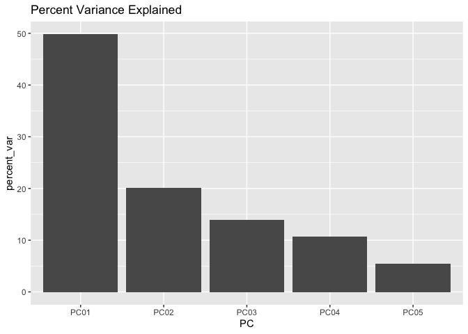<!-- -->

PCs 3 and 4

``` r
autoplot(all_flint_historical.pc, data = flint_all_year_historical,
         x=3, y=4,
         colour='elev_m', alpha=0.5,
         loadings=TRUE, loadings.colour='black', loadings.linewidth = 0.7,
         loadings.label = TRUE, loadings.label.size=8, loadings.label.colour="black", loadings.label.vjust = -0.2) +
   scale_colour_gradient(low = "#F5A540", high = "#0043F0") +
  geom_vline(xintercept = 0, linetype="dashed") + geom_hline(yintercept = 0, linetype="dashed") +
  theme_classic()
```

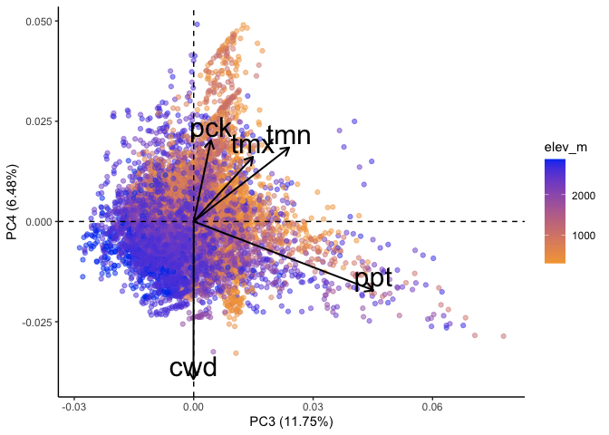<!-- -->

## All years included (bioclim)

### Correlations - bioclim Recent


``` r
#normalize the data
climate_normalized_all_bioclim_recent <- bioclim_all_year_recent %>% select(ann_tmean:ppt_coldest_quarter) %>% scale() #normalize the data so they're all on the same scale
head(climate_normalized_all_bioclim_recent)
```

```
##      ann_tmean mean_diurnal_range temp_seasonality temp_ann_range
## [1,]  1.295100          2.0439650        1.0121811     1.31062005
## [2,]  1.409635          1.3269674       -1.8548014    -0.70107931
## [3,]  1.479351          1.7432886       -0.3135370     0.59215599
## [4,]  1.480816          1.7935342       -0.6614303     0.02888017
## [5,]  1.096789          0.6027919        0.3881556     2.47165796
## [6,]  1.266979          2.4570960       -0.4204548     0.36224749
##      tmean_wettest_quarter tmean_driest_quarter    ann_ppt ppt_seasonality
## [1,]             0.7934165            1.5264426 -1.4479903    -1.331594590
## [2,]             1.2175963            1.1509515 -0.6923683     0.842690801
## [3,]             1.1377588            1.6102448 -0.4231781     0.002706514
## [4,]             0.8899157            1.1412405 -1.3978211     4.460389109
## [5,]             0.7507209            0.6092948 -0.5400222    -0.091168450
## [6,]             0.8517326            1.0520434 -1.5441975     0.470971830
##      ppt_warmest_quarter ppt_coldest_quarter
## [1,]          -0.6028566          -1.3861359
## [2,]          -0.7001399          -0.6063717
## [3,]          -0.7068633          -0.1831243
## [4,]          -1.3927858          -0.7786240
## [5,]          -0.2997554          -0.1977579
## [6,]          -0.6326316          -1.2550968
```

``` r
cor.norm = cor(climate_normalized_all_bioclim_recent) #test correlations among the traits
corrplot(cor.norm)
```

<!-- -->

``` r
#ann_ppt and ppt_coldest quarter highly correlated, consider removing one 
#ann_tmean and t_mean wettest and driest quarter are highly correlated, consider only keeping one 
```

### PCA - bioclim Recent


``` r
all_bioclim_recent.pc = prcomp(bioclim_all_year_recent[c(7:10, 13:15)], scale = TRUE, center = TRUE) #took out ppt_coldest quarter & t_mean wettest and driest quarter

str(all_bioclim_recent.pc)
```

```
## List of 5
##  $ sdev    : num [1:7] 1.546 1.227 1.037 0.901 0.793 ...
##  $ rotation: num [1:7, 1:7] -0.368 -0.458 -0.252 -0.405 0.501 ...
##   ..- attr(*, "dimnames")=List of 2
##   .. ..$ : chr [1:7] "ann_tmean" "mean_diurnal_range" "temp_seasonality" "temp_ann_range" ...
##   .. ..$ : chr [1:7] "PC1" "PC2" "PC3" "PC4" ...
##  $ center  : Named num [1:7] 10.1 12.9 681.9 32 1188.4 ...
##   ..- attr(*, "names")= chr [1:7] "ann_tmean" "mean_diurnal_range" "temp_seasonality" "temp_ann_range" ...
##  $ scale   : Named num [1:7] 4.27 1.04 45.06 1.74 505.89 ...
##   ..- attr(*, "names")= chr [1:7] "ann_tmean" "mean_diurnal_range" "temp_seasonality" "temp_ann_range" ...
##  $ x       : num [1:690, 1:7] -3.05 -1.09 -2.01 -2.9 -2.16 ...
##   ..- attr(*, "dimnames")=List of 2
##   .. ..$ : NULL
##   .. ..$ : chr [1:7] "PC1" "PC2" "PC3" "PC4" ...
##  - attr(*, "class")= chr "prcomp"
```

plot % Variance Explained

``` r
summary(all_bioclim_recent.pc)
```

```
## Importance of components:
##                           PC1    PC2    PC3    PC4     PC5     PC6     PC7
## Standard deviation     1.5462 1.2274 1.0370 0.9012 0.79292 0.63471 0.42854
## Proportion of Variance 0.3415 0.2152 0.1536 0.1160 0.08982 0.05755 0.02623
## Cumulative Proportion  0.3415 0.5567 0.7104 0.8264 0.91621 0.97377 1.00000
```

``` r
tibble(PC=str_c("PC",str_pad(1:5,2,pad="0")),
       percent_var=all_bioclim_recent.pc$sdev[1:5]^2/sum(all_bioclim_recent.pc$sdev^2)*100) %>%
  ggplot(aes(x=PC, y=percent_var)) +
  geom_col() +
  ggtitle("Percent Variance Explained")
```

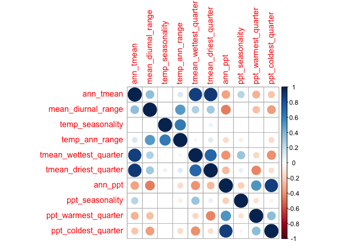<!-- -->

Combine PCs with metadata

``` r
all_bioclim_recent.pc.dat = data.frame(all_bioclim_recent.pc$x)

all_bioclim_recent_locs.pc = cbind(bioclim_all_year_recent, all_bioclim_recent.pc.dat)

all_bioclim_recent_loadings = data.frame(varnames=rownames(all_bioclim_recent.pc$rotation), all_bioclim_recent.pc$rotation)
all_bioclim_recent_loadings
```

```
##                                varnames         PC1         PC2          PC3
## ann_tmean                     ann_tmean -0.36840840 -0.26660137 -0.087324426
## mean_diurnal_range   mean_diurnal_range -0.45825370 -0.02736718  0.423300557
## temp_seasonality       temp_seasonality -0.25173642  0.60110089 -0.417702342
## temp_ann_range           temp_ann_range -0.40492827  0.56670291  0.008039559
## ann_ppt                         ann_ppt  0.50098505  0.19634986 -0.089850305
## ppt_seasonality         ppt_seasonality -0.09331283 -0.28521180 -0.790423376
## ppt_warmest_quarter ppt_warmest_quarter  0.40895888  0.35468471  0.076216865
##                             PC4          PC5         PC6         PC7
## ann_tmean           -0.61582300 -0.631655360  0.01403132 -0.08455809
## mean_diurnal_range  -0.35255319  0.502347141  0.08729285  0.47518921
## temp_seasonality     0.13413906 -0.256314530 -0.10381730  0.55350049
## temp_ann_range      -0.08366797  0.169748134  0.23731553 -0.65014064
## ann_ppt             -0.37205237 -0.006579415  0.73120048  0.17107671
## ppt_seasonality     -0.20233053  0.488665289 -0.04076605 -0.06151872
## ppt_warmest_quarter -0.54047577  0.123734536 -0.62351453 -0.07033997
```


``` r
autoplot(all_bioclim_recent.pc, data = bioclim_all_year_recent,
         colour='elev_m', alpha=0.5,
         loadings=TRUE, loadings.colour='black', loadings.linewidth = 0.7,
         loadings.label = TRUE, loadings.label.size=6, loadings.label.colour="black", 
         loadings.label.vjust = -0.2, loadings.label.repel=TRUE) +
   scale_colour_gradient(low = "#F5A540", high = "#0043F0") +
  geom_vline(xintercept = 0, linetype="dashed") + geom_hline(yintercept = 0, linetype="dashed") +
  theme_classic()
```

<!-- -->

PCs 3 and 4

``` r
autoplot(all_bioclim_recent.pc, data = bioclim_all_year_recent,
         x=3, y=4,
         colour='elev_m', alpha=0.5,
         loadings=TRUE, loadings.colour='black', loadings.linewidth = 0.7,
         loadings.label = TRUE, loadings.label.size=6, loadings.label.colour="black", 
         loadings.label.vjust = -0.2, loadings.label.repel=TRUE) +
   scale_colour_gradient(low = "#F5A540", high = "#0043F0") +
  geom_vline(xintercept = 0, linetype="dashed") + geom_hline(yintercept = 0, linetype="dashed") +
  theme_classic()
```

<!-- -->

PCs 4 and 5

``` r
autoplot(all_bioclim_recent.pc, data = bioclim_all_year_recent,
         x=4, y=5,
         colour='elev_m', alpha=0.5,
         loadings=TRUE, loadings.colour='black', loadings.linewidth = 0.7,
         loadings.label = TRUE, loadings.label.size=6, loadings.label.colour="black", 
         loadings.label.vjust = -0.2, loadings.label.repel=TRUE) +
   scale_colour_gradient(low = "#F5A540", high = "#0043F0") +
  geom_vline(xintercept = 0, linetype="dashed") + geom_hline(yintercept = 0, linetype="dashed") +
  theme_classic()
```

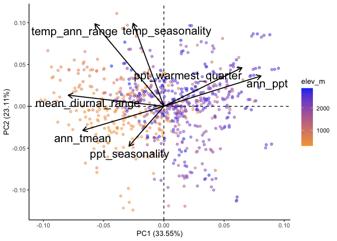<!-- -->

### Correlations - bioclim Historical


``` r
#normalize the data
climate_normalized_all_bioclim_historical <- bioclim_all_year_historical %>% select(ann_tmean:ppt_coldest_quarter) %>% scale() #normalize the data so they're all on the same scale
head(climate_normalized_all_bioclim_historical)
```

```
##      ann_tmean mean_diurnal_range temp_seasonality temp_ann_range
## [1,]  1.306524           1.958356        0.7395284      1.2908364
## [2,]  1.262203           1.486297       -0.4041783      0.5530571
## [3,]  1.495560           2.184317        0.4211911      1.6503871
## [4,]  1.388782           1.715987        2.2406234      2.9064798
## [5,]  1.436989           1.924051        0.3345106      1.6550566
## [6,]  1.370276           1.668259        0.8233783      0.7631841
##      tmean_wettest_quarter tmean_driest_quarter    ann_ppt ppt_seasonality
## [1,]             0.9416544             1.412163 -1.1872369       0.5491926
## [2,]             2.0153016             1.097816 -1.1987951       0.6289464
## [3,]             0.7876665             1.346092 -1.6525321       1.5896815
## [4,]             2.2357923             1.149243 -1.0568889       0.1234090
## [5,]             1.0316288             1.438046 -1.3974756      -0.5180738
## [6,]             0.9110702             1.644091 -0.6066592       0.7845779
##      ppt_warmest_quarter ppt_coldest_quarter
## [1,]          -0.9584770          -0.9507382
## [2,]          -0.1691167          -1.2061119
## [3,]          -1.1085066          -1.1629483
## [4,]           0.7999582          -1.1744868
## [5,]          -0.6802804          -1.0277046
## [6,]          -0.5068839           0.1313744
```

``` r
cor.norm = cor(climate_normalized_all_bioclim_historical) #test correlations among the traits
corrplot(cor.norm)
```

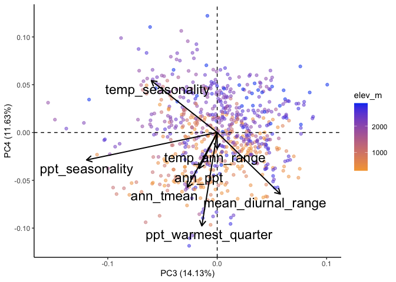<!-- -->

``` r
#ann_ppt and ppt_coldest quarter highly correlated, consider removing one 
#ann_tmean and t_mean wettest and driest quarter are highly correlated, consider only keeping one 
```

### PCA - bioclim Historical


``` r
all_bioclim_historical.pc = prcomp(bioclim_all_year_historical[c(7:10, 13:15)], scale = TRUE, center = TRUE) #took out ppt_coldest quarter & t_mean wettest and driest quarter

str(all_bioclim_historical.pc)
```

```
## List of 5
##  $ sdev    : num [1:7] 1.643 1.186 0.945 0.907 0.832 ...
##  $ rotation: num [1:7, 1:7] -0.356 -0.453 -0.335 -0.459 0.424 ...
##   ..- attr(*, "dimnames")=List of 2
##   .. ..$ : chr [1:7] "ann_tmean" "mean_diurnal_range" "temp_seasonality" "temp_ann_range" ...
##   .. ..$ : chr [1:7] "PC1" "PC2" "PC3" "PC4" ...
##  $ center  : Named num [1:7] 8.94 13.64 663.27 32.64 1196.51 ...
##   ..- attr(*, "names")= chr [1:7] "ann_tmean" "mean_diurnal_range" "temp_seasonality" "temp_ann_range" ...
##  $ scale   : Named num [1:7] 4.5 1.12 52.32 2.14 501.81 ...
##   ..- attr(*, "names")= chr [1:7] "ann_tmean" "mean_diurnal_range" "temp_seasonality" "temp_ann_range" ...
##  $ x       : num [1:690, 1:7] -3.14 -1.9 -3.76 -3.52 -3.04 ...
##   ..- attr(*, "dimnames")=List of 2
##   .. ..$ : NULL
##   .. ..$ : chr [1:7] "PC1" "PC2" "PC3" "PC4" ...
##  - attr(*, "class")= chr "prcomp"
```

plot % Variance Explained

``` r
summary(all_bioclim_historical.pc)
```

```
## Importance of components:
##                           PC1    PC2    PC3    PC4     PC5     PC6     PC7
## Standard deviation     1.6426 1.1859 0.9452 0.9074 0.83219 0.58784 0.37471
## Proportion of Variance 0.3855 0.2009 0.1276 0.1176 0.09893 0.04936 0.02006
## Cumulative Proportion  0.3855 0.5864 0.7140 0.8316 0.93058 0.97994 1.00000
```

``` r
tibble(PC=str_c("PC",str_pad(1:5,2,pad="0")),
       percent_var=all_bioclim_historical.pc$sdev[1:5]^2/sum(all_bioclim_historical.pc$sdev^2)*100) %>%
  ggplot(aes(x=PC, y=percent_var)) +
  geom_col() +
  ggtitle("Percent Variance Explained")
```

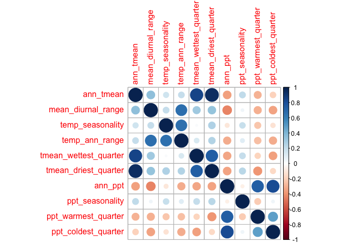<!-- -->

Combine PCs with metadata

``` r
all_bioclim_historical.pc.dat = data.frame(all_bioclim_historical.pc$x)

all_bioclim_historical_locs.pc = cbind(bioclim_all_year_historical, all_bioclim_historical.pc.dat)

all_bioclim_historical_loadings = data.frame(varnames=rownames(all_bioclim_historical.pc$rotation), all_bioclim_historical.pc$rotation)
all_bioclim_historical_loadings
```

```
##                                varnames        PC1        PC2          PC3
## ann_tmean                     ann_tmean -0.3560086 -0.2472350 -0.180329601
## mean_diurnal_range   mean_diurnal_range -0.4530184  0.1620576 -0.005995675
## temp_seasonality       temp_seasonality -0.3350632  0.4610658 -0.184322718
## temp_ann_range           temp_ann_range -0.4592690  0.4579481 -0.163156716
## ann_ppt                         ann_ppt  0.4238994  0.3004995 -0.495530903
## ppt_seasonality         ppt_seasonality -0.1376433 -0.4823129 -0.770365280
## ppt_warmest_quarter ppt_warmest_quarter  0.3823617  0.4091312 -0.260454924
##                             PC4         PC5         PC6         PC7
## ann_tmean           -0.36073480 -0.78965353  0.04312164  0.15515218
## mean_diurnal_range  -0.56655696  0.33516496  0.31340968 -0.48675227
## temp_seasonality     0.57300234 -0.30768755 -0.07690741 -0.46071476
## temp_ann_range      -0.01793547  0.23935821 -0.11369664  0.69440219
## ann_ppt             -0.02704029 -0.10078437  0.67915324  0.11099838
## ppt_seasonality      0.12554867  0.30354555 -0.19836699 -0.08782995
## ppt_warmest_quarter -0.45137191 -0.09924908 -0.61682626 -0.15656564
```


``` r
autoplot(all_bioclim_historical.pc, data = bioclim_all_year_historical,
         colour='elev_m', alpha=0.5,
         loadings=TRUE, loadings.colour='black', loadings.linewidth = 0.7,
         loadings.label = TRUE, loadings.label.size=6, loadings.label.colour="black", 
         loadings.label.vjust = -0.2, loadings.label.repel=TRUE) +
   scale_colour_gradient(low = "#F5A540", high = "#0043F0") +
  geom_vline(xintercept = 0, linetype="dashed") + geom_hline(yintercept = 0, linetype="dashed") +
  theme_classic()
```

<!-- -->

PCs 3 and 4

``` r
autoplot(all_bioclim_historical.pc, data = bioclim_all_year_historical,
         x=3, y=4,
         colour='elev_m', alpha=0.5,
         loadings=TRUE, loadings.colour='black', loadings.linewidth = 0.7,
         loadings.label = TRUE, loadings.label.size=6, loadings.label.colour="black", 
         loadings.label.vjust = -0.2, loadings.label.repel=TRUE) +
   scale_colour_gradient(low = "#F5A540", high = "#0043F0") +
  geom_vline(xintercept = 0, linetype="dashed") + geom_hline(yintercept = 0, linetype="dashed") +
  theme_classic()
```

<!-- -->

PCs 4 and 5

``` r
autoplot(all_bioclim_historical.pc, data = bioclim_all_year_historical,
         x=4, y=5,
         colour='elev_m', alpha=0.5,
         loadings=TRUE, loadings.colour='black', loadings.linewidth = 0.7,
         loadings.label = TRUE, loadings.label.size=6, loadings.label.colour="black", 
         loadings.label.vjust = -0.2, loadings.label.repel=TRUE) +
   scale_colour_gradient(low = "#F5A540", high = "#0043F0") +
  geom_vline(xintercept = 0, linetype="dashed") + geom_hline(yintercept = 0, linetype="dashed") +
  theme_classic()
```

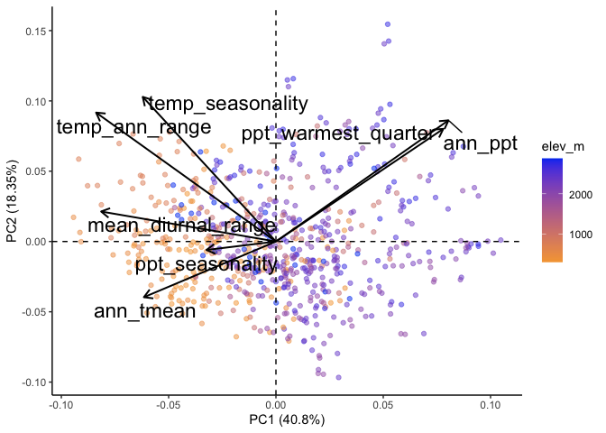<!-- -->

## Monthly Averages - Flint  

### Calculate avgs


``` r
flint_all_year_recent_mosavgs <- flint_all_year_recent %>% 
  group_by(parent.pop, elevation.group, elev_m, Lat, Long, month) %>% 
  summarise_at(c("cwd",  "pck", "ppt", "tmn", "tmx"), c(mean), na.rm = TRUE) %>% 
  mutate(TimePd = "Recent") 
flint_all_year_recent_mosavgs
```

```
## # A tibble: 276 × 12
## # Groups:   parent.pop, elevation.group, elev_m, Lat, Long [23]
##    parent.pop elevation.group elev_m   Lat  Long month   cwd   pck     ppt   tmn
##    <chr>      <chr>            <dbl> <dbl> <dbl> <chr> <dbl> <dbl>   <dbl> <dbl>
##  1 BH         Low               511.  37.4 -120. apr    59.0     0  48.2    6.41
##  2 BH         Low               511.  37.4 -120. aug   154.      0   1.00  17.1 
##  3 BH         Low               511.  37.4 -120. dec    30.0     0 111.     2.59
##  4 BH         Low               511.  37.4 -120. feb    41.0     0  93.9    3.32
##  5 BH         Low               511.  37.4 -120. jan    29.4     0 124.     2.81
##  6 BH         Low               511.  37.4 -120. jul   138.      0   0.281 17.5 
##  7 BH         Low               511.  37.4 -120. jun    89.3     0   6.34  13.6 
##  8 BH         Low               511.  37.4 -120. mar    53.9     0  90.1    4.82
##  9 BH         Low               511.  37.4 -120. may    51.4     0  23.2    9.78
## 10 BH         Low               511.  37.4 -120. nov    45.6     0  52.2    5.24
## # ℹ 266 more rows
## # ℹ 2 more variables: tmx <dbl>, TimePd <chr>
```

``` r
flint_all_year_historical_mosavgs <- flint_all_year_historical %>% 
  group_by(parent.pop, elevation.group, elev_m, Lat, Long, month) %>% 
  summarise_at(c("cwd", "pck", "ppt", "tmn", "tmx"), c(mean), na.rm = TRUE) %>% 
  mutate(TimePd = "Historical")
flint_all_year_historical_mosavgs
```

```
## # A tibble: 276 × 12
## # Groups:   parent.pop, elevation.group, elev_m, Lat, Long [23]
##    parent.pop elevation.group elev_m   Lat  Long month   cwd   pck    ppt   tmn
##    <chr>      <chr>            <dbl> <dbl> <dbl> <chr> <dbl> <dbl>  <dbl> <dbl>
##  1 BH         Low               511.  37.4 -120. apr    62.2 0      46.4   5.57
##  2 BH         Low               511.  37.4 -120. aug   149.  0       1.82 15.3 
##  3 BH         Low               511.  37.4 -120. dec    28.5 0      89.3   1.44
##  4 BH         Low               511.  37.4 -120. feb    40.4 0      92.2   2.76
##  5 BH         Low               511.  37.4 -120. jan    28.0 0.234 104.    1.46
##  6 BH         Low               511.  37.4 -120. jul   126.  0       2.09 15.6 
##  7 BH         Low               511.  37.4 -120. jun    87.5 0       5.73 12.4 
##  8 BH         Low               511.  37.4 -120. mar    51.2 0     101.    4.04
##  9 BH         Low               511.  37.4 -120. may    63.5 0      12.6   8.83
## 10 BH         Low               511.  37.4 -120. nov    43.8 0      82.0   4.37
## # ℹ 266 more rows
## # ℹ 2 more variables: tmx <dbl>, TimePd <chr>
```

``` r
flint_all_year_mosavgs <- bind_rows(flint_all_year_recent_mosavgs, flint_all_year_historical_mosavgs) #combine into 1 dataframe 
head(flint_all_year_mosavgs)
```

```
## # A tibble: 6 × 12
## # Groups:   parent.pop, elevation.group, elev_m, Lat, Long [1]
##   parent.pop elevation.group elev_m   Lat  Long month   cwd   pck     ppt   tmn
##   <chr>      <chr>            <dbl> <dbl> <dbl> <chr> <dbl> <dbl>   <dbl> <dbl>
## 1 BH         Low               511.  37.4 -120. apr    59.0     0  48.2    6.41
## 2 BH         Low               511.  37.4 -120. aug   154.      0   1.00  17.1 
## 3 BH         Low               511.  37.4 -120. dec    30.0     0 111.     2.59
## 4 BH         Low               511.  37.4 -120. feb    41.0     0  93.9    3.32
## 5 BH         Low               511.  37.4 -120. jan    29.4     0 124.     2.81
## 6 BH         Low               511.  37.4 -120. jul   138.      0   0.281 17.5 
## # ℹ 2 more variables: tmx <dbl>, TimePd <chr>
```

``` r
tail(flint_all_year_mosavgs)
```

```
## # A tibble: 6 × 12
## # Groups:   parent.pop, elevation.group, elev_m, Lat, Long [1]
##   parent.pop elevation.group elev_m   Lat  Long month   cwd   pck   ppt    tmn
##   <chr>      <chr>            <dbl> <dbl> <dbl> <chr> <dbl> <dbl> <dbl>  <dbl>
## 1 YO8        High             2591.  37.8 -119. jun   102.  108.   20.1  1.97 
## 2 YO8        High             2591.  37.8 -119. mar    35.0 741.  172.  -8.11 
## 3 YO8        High             2591.  37.8 -119. may    79.7 409.   42.7 -2.19 
## 4 YO8        High             2591.  37.8 -119. nov    31.9  88.9 148.  -5.77 
## 5 YO8        High             2591.  37.8 -119. oct    71.9   0    64.0 -0.564
## 6 YO8        High             2591.  37.8 -119. sep    98.1   0    32.5  2.92 
## # ℹ 2 more variables: tmx <dbl>, TimePd <chr>
```

### Correlations - Recent + Historical


``` r
#normalize the data
climate_normalized_flint_all_year_mosavgs <- flint_all_year_mosavgs %>% ungroup() %>% 
  select(cwd:tmx) %>% scale() #normalize the data so they're all on the same scale
head(climate_normalized_flint_all_year_mosavgs)
```

```
##             cwd        pck         ppt          tmn        tmx
## [1,]  0.1174447 -0.5739577 -0.61290844  0.521717748  0.5038936
## [2,]  2.8989661 -0.5739577 -1.17761049  2.093401748  2.1572587
## [3,] -0.7370644 -0.5739577  0.13917900 -0.040767264 -0.2888936
## [4,] -0.4138246 -0.5739577 -0.06519753  0.066597468 -0.1392279
## [5,] -0.7544141 -0.5739577  0.29970897 -0.009157593 -0.2560043
## [6,]  2.4438726 -0.5739577 -1.18624573  2.159226555  2.2221087
```

``` r
cor.norm = cor(climate_normalized_flint_all_year_mosavgs) #test correlations among the traits
corrplot(cor.norm)
```

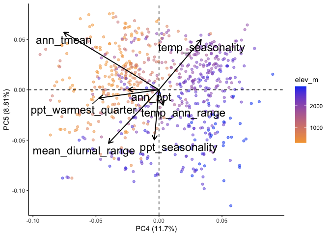<!-- -->

``` r
#tmn and tmx highly correlated, consider removing one (98%)
#tmx and pck highly neg correlated (-85%)
#tmn and pck highly neg correlated (-86%)
```

### PCA - Recent + Historical


``` r
#flint_all_year_mosavgs[c(8:12)]
mos_flint.pc = prcomp(flint_all_year_mosavgs[c(7:11)], scale = TRUE, center = TRUE)

str(mos_flint.pc)
```

```
## List of 5
##  $ sdev    : num [1:5] 1.955 0.834 0.528 0.434 0.118
##  $ rotation: num [1:5, 1:5] -0.428 0.357 0.459 -0.484 -0.495 ...
##   ..- attr(*, "dimnames")=List of 2
##   .. ..$ : chr [1:5] "cwd" "pck" "ppt" "tmn" ...
##   .. ..$ : chr [1:5] "PC1" "PC2" "PC3" "PC4" ...
##  $ center  : Named num [1:5] 55.04 149.17 99.37 2.87 16.13
##   ..- attr(*, "names")= chr [1:5] "cwd" "pck" "ppt" "tmn" ...
##  $ scale   : Named num [1:5] 33.99 259.9 83.53 6.78 8.61
##   ..- attr(*, "names")= chr [1:5] "cwd" "pck" "ppt" "tmn" ...
##  $ x       : num [1:552, 1:5] -1.038 -4.066 0.337 -0.021 0.387 ...
##   ..- attr(*, "dimnames")=List of 2
##   .. ..$ : NULL
##   .. ..$ : chr [1:5] "PC1" "PC2" "PC3" "PC4" ...
##  - attr(*, "class")= chr "prcomp"
```

plot % Variance Explained

``` r
summary(mos_flint.pc)
```

```
## Importance of components:
##                           PC1    PC2     PC3     PC4     PC5
## Standard deviation     1.9553 0.8341 0.52789 0.43435 0.11761
## Proportion of Variance 0.7646 0.1391 0.05573 0.03773 0.00277
## Cumulative Proportion  0.7646 0.9038 0.95950 0.99723 1.00000
```

``` r
tibble(PC=str_c("PC",str_pad(1:5,2,pad="0")),
       percent_var=mos_flint.pc$sdev[1:5]^2/sum(mos_flint.pc$sdev^2)*100) %>%
  ggplot(aes(x=PC, y=percent_var)) +
  geom_col() +
  ggtitle("Percent Variance Explained")
```

<!-- -->

Combine PCs with metadata

``` r
mos_flint.pc.dat = data.frame(mos_flint.pc$x)

mos_flint_locs.pc = cbind(flint_all_year_mosavgs, mos_flint.pc.dat)

mos_flint_loadings = data.frame(varnames=rownames(mos_flint.pc$rotation), mos_flint.pc$rotation)
mos_flint_loadings
```

```
##     varnames        PC1         PC2        PC3         PC4         PC5
## cwd      cwd -0.4280114  0.50466179 -0.4332043 -0.60959831 -0.05335446
## pck      pck  0.3567715  0.80751419  0.4555328  0.09929400 -0.05714456
## ppt      ppt  0.4590727 -0.27517710  0.3104865 -0.77938818  0.09839717
## tmn      tmn -0.4839634 -0.13103360  0.5509755 -0.10252705 -0.65918421
## tmx      tmx -0.4945220  0.01857602  0.4526015 -0.02393468  0.74140541
```


``` r
autoplot(mos_flint.pc, data = flint_all_year_mosavgs,
         colour='elev_m', alpha=0.5,
         label=TRUE, label.label="month",
         loadings=TRUE, loadings.colour='black', loadings.linewidth = 0.7,
         loadings.label = TRUE, loadings.label.size=6, loadings.label.colour="black", 
         loadings.label.vjust = -0.2, loadings.label.repel=TRUE) +
   scale_colour_gradient(low = "#F5A540", high = "#0043F0") +
  geom_vline(xintercept = 0, linetype="dashed") + geom_hline(yintercept = 0, linetype="dashed") +
  theme_classic()
```

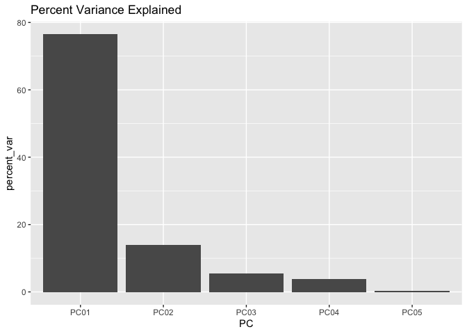<!-- -->

``` r
#high elev seems most similar to low elev in summer months 
```


``` r
mos_flint_locs.pc_avg <- mos_flint_locs.pc %>%
  group_by(parent.pop, elev_m, TimePd,month) %>%
  summarise(across(.cols=starts_with("PC"), .fns = mean)) %>%
  ungroup()
```

```
## `summarise()` has grouped output by 'parent.pop', 'elev_m', 'TimePd'. You can
## override using the `.groups` argument.
```

``` r
mos_flint_locs.pc_avg
```

```
## # A tibble: 552 × 10
##    parent.pop elev_m TimePd month   pck     PC1    PC2      PC3     PC4      PC5
##    <chr>       <dbl> <chr>  <chr> <dbl>   <dbl>  <dbl>    <dbl>   <dbl>    <dbl>
##  1 BH           511. Histo… apr   0     -1.01   -0.226 -0.123    0.257   0.0354 
##  2 BH           511. Histo… aug   0     -3.83    1.05   0.125   -1.07    0.0975 
##  3 BH           511. Histo… dec   0      0.378  -0.804 -0.261    0.544  -0.101  
##  4 BH           511. Histo… feb   0      0.0132 -0.657 -0.171    0.277  -0.0405 
##  5 BH           511. Histo… jan   0.234  0.466  -0.859 -0.203    0.417  -0.0909 
##  6 BH           511. Histo… jul   0     -3.60    0.702  0.479   -0.664   0.157  
##  7 BH           511. Histo… jun   0     -2.64    0.174  0.511    0.0510  0.194  
##  8 BH           511. Histo… mar   0     -0.254  -0.548 -0.0903  -0.0221 -0.0400 
##  9 BH           511. Histo… may   0     -1.77   -0.147  0.301    0.485   0.169  
## 10 BH           511. Histo… nov   0     -0.340  -0.600  0.00766  0.280  -0.00529
## # ℹ 542 more rows
```

``` r
mos_flint_locs.pc_avg$month <- factor(mos_flint_locs.pc_avg$month, levels=month_order) 
```


``` r
mos_flint_locs.pc_avg %>% 
  ggplot(aes(x=PC1, y=PC2, shape=TimePd, color=elev_m)) +
  scale_colour_gradient(low = "#F5A540", high = "#0043F0") +
  geom_point() +
  facet_wrap(~month) +
  coord_fixed(ratio = 1.5)
```

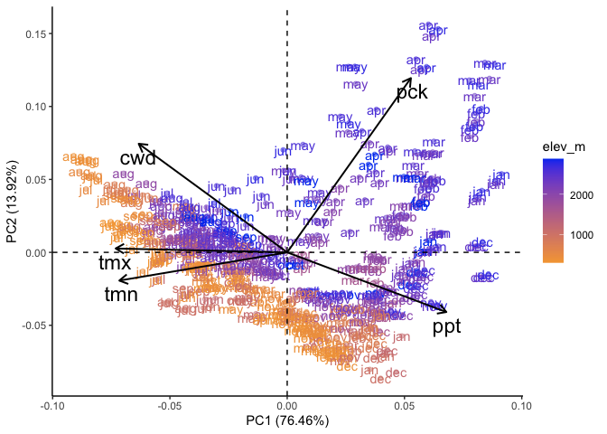<!-- -->

``` r
#as I suspected from the raw PC figure, high elev pop cliamte is most similar to low elev climate in the summer months 
#hard to see differences between recent and historical with this fig though
```


``` r
mos_flint_locs.pc_avg %>% 
  mutate(group=str_c(parent.pop,elev_m, month))  %>%
  ggplot(aes(x=PC1, y=PC2, shape=TimePd, color=elev_m)) +
  scale_colour_gradient(low = "#F5A540", high = "#0043F0") +
  geom_point() +
  geom_path(aes(group=group),arrow = arrow(length=unit(5, "points")))
```

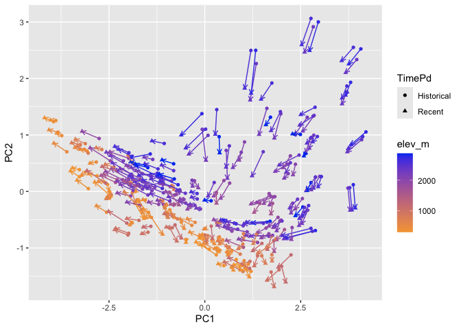<!-- -->

``` r
#high elev climate seems to be shifting to be more similar to low elev 
#hard to see which months though 
```

## Avg across years and months (Flint)

### Calculate avgs


``` r
flint_all_year_recent_avgs <- flint_all_year_recent %>% 
  group_by(parent.pop, elevation.group, elev_m, Lat, Long) %>% 
  summarise_at(c("cwd",  "pck", "ppt", "tmn", "tmx"), c(mean), na.rm = TRUE) %>% 
  mutate(TimePd = "Recent") 
flint_all_year_recent_avgs
```

```
## # A tibble: 23 × 11
## # Groups:   parent.pop, elevation.group, elev_m, Lat [23]
##    parent.pop elevation.group elev_m   Lat  Long   cwd     pck   ppt    tmn
##    <chr>      <chr>            <dbl> <dbl> <dbl> <dbl>   <dbl> <dbl>  <dbl>
##  1 BH         Low               511.  37.4 -120.  75.9   0      48.5  8.93 
##  2 CC         Low               313   39.6 -121.  59.9   0      84.3 10.0  
##  3 CP2        High             2244.  38.7 -120.  62.9 218.    107.   1.18 
##  4 CP3        High             2266.  38.7 -120.  46.2 236.    103.   0.529
##  5 DPR        Mid              1019.  39.2 -121.  27.5   7.63  121.   7.89 
##  6 FR         Mid               787   40.0 -121.  75.5  14.1    84.9  5.70 
##  7 IH         Low               454.  39.1 -121.  49.3   0.167  89.2  8.68 
##  8 LV1        High             2593.  40.5 -122.  49.8 441.    146.  -1.36 
##  9 LV3        High             2354.  40.5 -122.  40.9 436.    144.  -1.37 
## 10 LVTR1      High             2741.  40.5 -122.  52.1 454.    151.  -1.57 
## # ℹ 13 more rows
## # ℹ 2 more variables: tmx <dbl>, TimePd <chr>
```

``` r
flint_all_year_historical_avgs <- flint_all_year_historical %>% 
  group_by(parent.pop, elevation.group, elev_m, Lat, Long) %>% 
  summarise_at(c("cwd", "pck", "ppt", "tmn", "tmx"), c(mean), na.rm = TRUE) %>% 
  mutate(TimePd = "Historical")
flint_all_year_historical_avgs
```

```
## # A tibble: 23 × 11
## # Groups:   parent.pop, elevation.group, elev_m, Lat [23]
##    parent.pop elevation.group elev_m   Lat  Long   cwd      pck   ppt    tmn
##    <chr>      <chr>            <dbl> <dbl> <dbl> <dbl>    <dbl> <dbl>  <dbl>
##  1 BH         Low               511.  37.4 -120.  74.5   0.0195  48.3  7.74 
##  2 CC         Low               313   39.6 -121.  59.7   0.0793  81.9  8.90 
##  3 CP2        High             2244.  38.7 -120.  60.4 265.     110.  -0.305
##  4 CP3        High             2266.  38.7 -120.  43.8 282.     106.  -0.852
##  5 DPR        Mid              1019.  39.2 -121.  26.5  20.5    120.   6.23 
##  6 FR         Mid               787   40.0 -121.  74.0  19.2     84.2  4.54 
##  7 IH         Low               454.  39.1 -121.  50.2   1.47    88.0  7.68 
##  8 LV1        High             2593.  40.5 -122.  46.6 510.     149.  -3.50 
##  9 LV3        High             2354.  40.5 -122.  38.0 503.     147.  -3.51 
## 10 LVTR1      High             2741.  40.5 -122.  49.3 529.     155.  -3.64 
## # ℹ 13 more rows
## # ℹ 2 more variables: tmx <dbl>, TimePd <chr>
```

``` r
flint_all_year_avgs <- bind_rows(flint_all_year_recent_avgs, flint_all_year_historical_avgs) #combine into 1 dataframe 
head(flint_all_year_avgs)
```

```
## # A tibble: 6 × 11
## # Groups:   parent.pop, elevation.group, elev_m, Lat [6]
##   parent.pop elevation.group elev_m   Lat  Long   cwd    pck   ppt    tmn   tmx
##   <chr>      <chr>            <dbl> <dbl> <dbl> <dbl>  <dbl> <dbl>  <dbl> <dbl>
## 1 BH         Low               511.  37.4 -120.  75.9   0     48.5  8.93   23.6
## 2 CC         Low               313   39.6 -121.  59.9   0     84.3 10.0    23.3
## 3 CP2        High             2244.  38.7 -120.  62.9 218.   107.   1.18   13.4
## 4 CP3        High             2266.  38.7 -120.  46.2 236.   103.   0.529  12.6
## 5 DPR        Mid              1019.  39.2 -121.  27.5   7.63 121.   7.89   20.2
## 6 FR         Mid               787   40.0 -121.  75.5  14.1   84.9  5.70   20.1
## # ℹ 1 more variable: TimePd <chr>
```

``` r
tail(flint_all_year_avgs)
```

```
## # A tibble: 6 × 11
## # Groups:   parent.pop, elevation.group, elev_m, Lat [6]
##   parent.pop elevation.group elev_m   Lat  Long   cwd   pck   ppt   tmn   tmx
##   <chr>      <chr>            <dbl> <dbl> <dbl> <dbl> <dbl> <dbl> <dbl> <dbl>
## 1 WR         Mid              1158   39.3 -121.  42.1  49.7 133.   5.22 18.6 
## 2 WV         Mid               749.  40.7 -123.  43.5  36.5  84.2  3.96 18.9 
## 3 YO11       High             2872.  37.9 -119.  54.3 203.   66.6 -4.69  9.69
## 4 YO4        High             2158.  37.8 -120.  53.0 151.   94.6  1.07 13.6 
## 5 YO7        High             2470.  37.8 -120.  50.3 268.  101.  -1.95 11.7 
## 6 YO8        High             2591.  37.8 -119.  64.7 283.  100.  -2.65 11.3 
## # ℹ 1 more variable: TimePd <chr>
```

``` r
write_csv(flint_all_year_avgs, "../output/Climate/fullyear_FlintAvgs.csv")
```

### Correlations - Recent + Historical


``` r
#normalize the data
climate_normalized_flint_all_year_avgs <- flint_all_year_avgs %>% ungroup() %>% 
  select(cwd:tmx) %>% scale() #normalize the data so they're all on the same scale
head(climate_normalized_flint_all_year_avgs)
```

```
##             cwd        pck        ppt        tmn        tmx
## [1,]  1.7790598 -0.9369271 -1.9271329  1.4162500  1.6143182
## [2,]  0.4161489 -0.9369271 -0.5695144  1.6748172  1.5523965
## [3,]  0.6731748  0.4308788  0.3063371 -0.3939148 -0.5910384
## [4,] -0.7522156  0.5455874  0.1339086 -0.5465746 -0.7574533
## [5,] -2.3484072 -0.8889912  0.8255485  1.1726159  0.8921879
## [6,]  1.7498763 -0.8481610 -0.5468143  0.6627956  0.8642088
```

``` r
cor.norm = cor(climate_normalized_flint_all_year_avgs) #test correlations among the traits
corrplot(cor.norm)
```

<!-- -->

``` r
#tmn and tmx highly correlated, consider removing one (98%)
#tmx and pck highly neg correlated (-85%)
#tmn and pck highly neg correlated (-86%)
```

### PCA - Recent + Historical


``` r
#flint_all_year_avgs[c(8:12)]
avgs_flint.pc = prcomp(flint_all_year_avgs[c(6:10)], scale = TRUE, center = TRUE)

str(avgs_flint.pc)
```

```
## List of 5
##  $ sdev    : num [1:5] 1.835 1.081 0.603 0.294 0.123
##  $ rotation: num [1:5, 1:5] -0.259 0.514 0.419 -0.494 -0.5 ...
##   ..- attr(*, "dimnames")=List of 2
##   .. ..$ : chr [1:5] "cwd" "pck" "ppt" "tmn" ...
##   .. ..$ : chr [1:5] "PC1" "PC2" "PC3" "PC4" ...
##  $ center  : Named num [1:5] 55.04 149.17 99.37 2.87 16.13
##   ..- attr(*, "names")= chr [1:5] "cwd" "pck" "ppt" "tmn" ...
##  $ scale   : Named num [1:5] 11.71 159.21 26.4 4.28 4.61
##   ..- attr(*, "names")= chr [1:5] "cwd" "pck" "ppt" "tmn" ...
##  $ x       : num [1:46, 1:5] -3.256 -2.43 0.665 1.18 -0.527 ...
##   ..- attr(*, "dimnames")=List of 2
##   .. ..$ : NULL
##   .. ..$ : chr [1:5] "PC1" "PC2" "PC3" "PC4" ...
##  - attr(*, "class")= chr "prcomp"
```

plot % Variance Explained

``` r
summary(avgs_flint.pc)
```

```
## Importance of components:
##                           PC1    PC2     PC3     PC4     PC5
## Standard deviation     1.8347 1.0811 0.60294 0.29416 0.12284
## Proportion of Variance 0.6732 0.2337 0.07271 0.01731 0.00302
## Cumulative Proportion  0.6732 0.9070 0.97968 0.99698 1.00000
```

``` r
tibble(PC=str_c("PC",str_pad(1:5,2,pad="0")),
       percent_var=avgs_flint.pc$sdev[1:5]^2/sum(avgs_flint.pc$sdev^2)*100) %>%
  ggplot(aes(x=PC, y=percent_var)) +
  geom_col() +
  ggtitle("Percent Variance Explained")
```

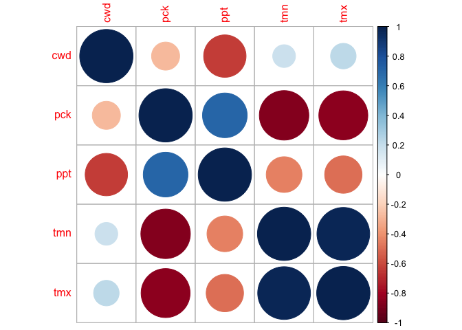<!-- -->

Combine PCs with metadata

``` r
avgs_flint.pc.dat = data.frame(avgs_flint.pc$x)

avgs_flint_locs.pc = cbind(flint_all_year_avgs, avgs_flint.pc.dat)

avgs_flint_loadings = data.frame(varnames=rownames(avgs_flint.pc$rotation), avgs_flint.pc$rotation)
avgs_flint_loadings
```

```
##     varnames        PC1        PC2       PC3         PC4         PC5
## cwd      cwd -0.2591518 -0.7454811 0.5757874 -0.21277170  0.01718615
## pck      pck  0.5135783 -0.1271183 0.3488679  0.74801246 -0.19709611
## ppt      ppt  0.4191904  0.4644527 0.6153228 -0.46247584  0.12671645
## tmn      tmn -0.4935375  0.3496855 0.2795070  0.07237416 -0.74214457
## tmx      tmx -0.4997778  0.3001710 0.3000230  0.41962322  0.62771183
```


``` r
autoplot(avgs_flint.pc, data = flint_all_year_avgs,
         colour='elev_m', alpha=0.5,
         label=TRUE, label.label="parent.pop",
         loadings=TRUE, loadings.colour='black', loadings.linewidth = 0.7,
         loadings.label = TRUE, loadings.label.size=6, loadings.label.colour="black", 
         loadings.label.vjust = -0.2, loadings.label.repel=TRUE) +
   scale_colour_gradient(low = "#F5A540", high = "#0043F0") +
  geom_vline(xintercept = 0, linetype="dashed") + geom_hline(yintercept = 0, linetype="dashed") +
  theme_classic()
```

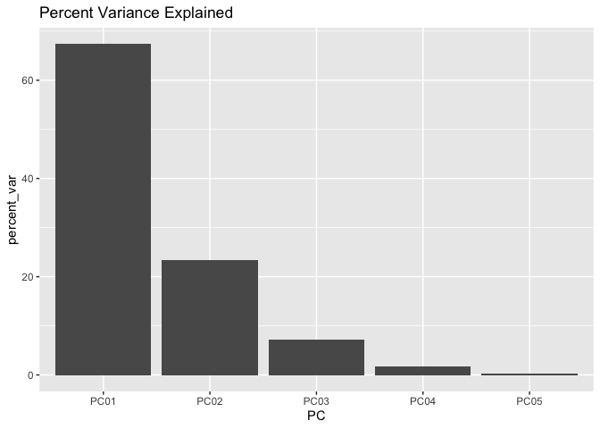<!-- -->


``` r
avgs_flint_locs.pc_avg <- avgs_flint_locs.pc %>%
  group_by(parent.pop, elev_m, TimePd) %>%
  summarise(across(.cols=starts_with("PC"), .fns = mean)) %>%
  ungroup()
```

```
## `summarise()` has grouped output by 'parent.pop', 'elev_m'. You can override
## using the `.groups` argument.
```

``` r
avgs_flint_locs.pc_avg
```

```
## # A tibble: 46 × 9
##    parent.pop elev_m TimePd          pck    PC1    PC2    PC3     PC4     PC5
##    <chr>       <dbl> <chr>         <dbl>  <dbl>  <dbl>  <dbl>   <dbl>   <dbl>
##  1 BH           511. Historical   0.0195 -3.02  -1.18   0.202  0.544   0.0523
##  2 BH           511. Recent       0      -3.26  -1.12   0.392  0.592  -0.0667
##  3 CC           313  Historical   0.0793 -2.29   0.454  0.331  0.244  -0.0103
##  4 CC           313  Recent       0      -2.43   0.596  0.496  0.247  -0.149 
##  5 CP2         2244. Historical 265.      1.18  -0.743  0.321 -0.123  -0.0274
##  6 CP2         2244. Recent     218.      0.665 -0.729  0.439 -0.239  -0.113 
##  7 CP3         2266. Historical 282.      1.68   0.137 -0.635  0.250  -0.0993
##  8 CP3         2266. Recent     236.      1.18   0.135 -0.540  0.149  -0.173 
##  9 DPR         1019. Historical  20.5    -0.221  2.80  -0.744 -0.0746  0.121 
## 10 DPR         1019. Recent       7.63   -0.527  2.92  -0.559 -0.0878 -0.0707
## # ℹ 36 more rows
```


``` r
avgs_flint_locs.pc_avg %>% 
  ggplot(aes(x=PC1, y=PC2, shape=TimePd, color=elev_m)) +
  scale_colour_gradient(low = "#F5A540", high = "#0043F0") +
  geom_point() +
  facet_wrap(~TimePd) +
  coord_fixed(ratio = 1.5)
```

<!-- -->


``` r
avgs_flint_locs.pc_avg %>% 
  mutate(group=str_c(parent.pop,elev_m))  %>%
  ggplot(aes(x=PC1, y=PC2, shape=TimePd, color=elev_m)) +
  scale_colour_gradient(low = "#F5A540", high = "#0043F0") +
  geom_point(size=2, alpha=0.7) +
  geom_vline(xintercept = 0, linetype="dashed") + geom_hline(yintercept = 0, linetype="dashed") +
  geom_path(aes(group=group),arrow = arrow(length=unit(5, "points")), linewidth = .8)
```

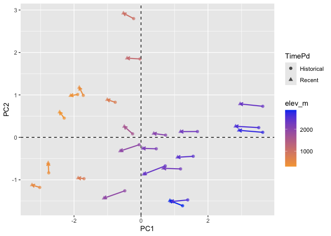<!-- -->

``` r
avgs_flint_locs.pc_avg %>% 
  mutate(group=str_c(parent.pop,elev_m))  %>%
  ggplot(aes(x=PC1, y=PC2, shape=TimePd, color=elev_m)) +
  scale_colour_gradient(low = "#F5A540", high = "#0043F0") +
  geom_point(size=2, alpha=0.7) +
  geom_text_repel(aes(label = parent.pop)) +
  geom_vline(xintercept = 0, linetype="dashed") + geom_hline(yintercept = 0, linetype="dashed")  +
  geom_path(aes(group=group),arrow = arrow(length=unit(5, "points")), linewidth = .8)
```

<!-- -->

``` r
#high elev climate seems to be shifting to be more similar to low elev 
```

## Avg across years and months (Flint + bioclim)

### Calculate avgs


``` r
bioclim_all_year_recent_avgs <- bioclim_all_year_recent %>% 
  group_by(parent.pop, elevation.group, elev_m, Lat, Long) %>% 
  summarise_at(c("ann_tmean", "mean_diurnal_range", "temp_seasonality", "temp_ann_range",
                 "tmean_wettest_quarter", "tmean_driest_quarter", "ann_ppt",
                 "ppt_seasonality","ppt_warmest_quarter", "ppt_coldest_quarter"),
               c(mean), na.rm = TRUE) %>% 
  mutate(TimePd = "Recent") 
bioclim_all_year_recent_avgs
```

```
## # A tibble: 23 × 16
## # Groups:   parent.pop, elevation.group, elev_m, Lat [23]
##    parent.pop elevation.group elev_m   Lat  Long ann_tmean mean_diurnal_range
##    <chr>      <chr>            <dbl> <dbl> <dbl>     <dbl>              <dbl>
##  1 BH         Low               511.  37.4 -120.     16.2                14.6
##  2 CC         Low               313   39.6 -121.     16.7                13.2
##  3 CP2        High             2244.  38.7 -120.      7.30               12.2
##  4 CP3        High             2266.  38.7 -120.      6.59               12.1
##  5 DPR        Mid              1019.  39.2 -121.     14.1                12.4
##  6 FR         Mid               787   40.0 -121.     12.9                14.4
##  7 IH         Low               454.  39.1 -121.     15.4                13.5
##  8 LV1        High             2593.  40.5 -122.      4.93               12.6
##  9 LV3        High             2354.  40.5 -122.      4.94               12.6
## 10 LVTR1      High             2741.  40.5 -122.      4.78               12.7
## # ℹ 13 more rows
## # ℹ 9 more variables: temp_seasonality <dbl>, temp_ann_range <dbl>,
## #   tmean_wettest_quarter <dbl>, tmean_driest_quarter <dbl>, ann_ppt <dbl>,
## #   ppt_seasonality <dbl>, ppt_warmest_quarter <dbl>,
## #   ppt_coldest_quarter <dbl>, TimePd <chr>
```

``` r
bioclim_all_year_historical_avgs <- bioclim_all_year_historical %>% 
  group_by(parent.pop, elevation.group, elev_m, Lat, Long) %>% 
  summarise_at(c("ann_tmean", "mean_diurnal_range", "temp_seasonality", "temp_ann_range",
                 "tmean_wettest_quarter", "tmean_driest_quarter", "ann_ppt",
                 "ppt_seasonality","ppt_warmest_quarter", "ppt_coldest_quarter"),
               c(mean), na.rm = TRUE) %>% 
  mutate(TimePd = "Historical") 
bioclim_all_year_historical_avgs
```

```
## # A tibble: 23 × 16
## # Groups:   parent.pop, elevation.group, elev_m, Lat [23]
##    parent.pop elevation.group elev_m   Lat  Long ann_tmean mean_diurnal_range
##    <chr>      <chr>            <dbl> <dbl> <dbl>     <dbl>              <dbl>
##  1 BH         Low               511.  37.4 -120.     15.3                15.2
##  2 CC         Low               313   39.6 -121.     15.9                14.0
##  3 CP2        High             2244.  38.7 -120.      6.11               12.8
##  4 CP3        High             2266.  38.7 -120.      5.45               12.6
##  5 DPR        Mid              1019.  39.2 -121.     13.0                13.5
##  6 FR         Mid               787   40.0 -121.     12.3                15.6
##  7 IH         Low               454.  39.1 -121.     14.8                14.2
##  8 LV1        High             2593.  40.5 -122.      3.40               13.8
##  9 LV3        High             2354.  40.5 -122.      3.40               13.8
## 10 LVTR1      High             2741.  40.5 -122.      3.25               13.8
## # ℹ 13 more rows
## # ℹ 9 more variables: temp_seasonality <dbl>, temp_ann_range <dbl>,
## #   tmean_wettest_quarter <dbl>, tmean_driest_quarter <dbl>, ann_ppt <dbl>,
## #   ppt_seasonality <dbl>, ppt_warmest_quarter <dbl>,
## #   ppt_coldest_quarter <dbl>, TimePd <chr>
```

``` r
bioclim_all_year_avgs <- bind_rows(bioclim_all_year_recent_avgs, bioclim_all_year_historical_avgs) #combine into 1 dataframe 
head(bioclim_all_year_avgs)
```

```
## # A tibble: 6 × 16
## # Groups:   parent.pop, elevation.group, elev_m, Lat [6]
##   parent.pop elevation.group elev_m   Lat  Long ann_tmean mean_diurnal_range
##   <chr>      <chr>            <dbl> <dbl> <dbl>     <dbl>              <dbl>
## 1 BH         Low               511.  37.4 -120.     16.2                14.6
## 2 CC         Low               313   39.6 -121.     16.7                13.2
## 3 CP2        High             2244.  38.7 -120.      7.30               12.2
## 4 CP3        High             2266.  38.7 -120.      6.59               12.1
## 5 DPR        Mid              1019.  39.2 -121.     14.1                12.4
## 6 FR         Mid               787   40.0 -121.     12.9                14.4
## # ℹ 9 more variables: temp_seasonality <dbl>, temp_ann_range <dbl>,
## #   tmean_wettest_quarter <dbl>, tmean_driest_quarter <dbl>, ann_ppt <dbl>,
## #   ppt_seasonality <dbl>, ppt_warmest_quarter <dbl>,
## #   ppt_coldest_quarter <dbl>, TimePd <chr>
```

``` r
tail(bioclim_all_year_avgs)
```

```
## # A tibble: 6 × 16
## # Groups:   parent.pop, elevation.group, elev_m, Lat [6]
##   parent.pop elevation.group elev_m   Lat  Long ann_tmean mean_diurnal_range
##   <chr>      <chr>            <dbl> <dbl> <dbl>     <dbl>              <dbl>
## 1 WR         Mid              1158   39.3 -121.     11.9                13.3
## 2 WV         Mid               749.  40.7 -123.     11.4                14.9
## 3 YO11       High             2872.  37.9 -119.      2.50               14.4
## 4 YO4        High             2158.  37.8 -120.      7.35               12.6
## 5 YO7        High             2470.  37.8 -120.      4.85               13.6
## 6 YO8        High             2591.  37.8 -119.      4.31               13.9
## # ℹ 9 more variables: temp_seasonality <dbl>, temp_ann_range <dbl>,
## #   tmean_wettest_quarter <dbl>, tmean_driest_quarter <dbl>, ann_ppt <dbl>,
## #   ppt_seasonality <dbl>, ppt_warmest_quarter <dbl>,
## #   ppt_coldest_quarter <dbl>, TimePd <chr>
```

``` r
write_csv(bioclim_all_year_avgs, "../output/Climate/fullyear_BioClimAvgs.csv")
```

Merge with flint

``` r
bioclim_flint_all_year_avgs <- full_join(flint_all_year_avgs, bioclim_all_year_avgs) %>% 
  select(TimePd, parent.pop:ppt_coldest_quarter)
```

```
## Joining with `by = join_by(parent.pop, elevation.group, elev_m, Lat, Long,
## TimePd)`
```

``` r
head(bioclim_flint_all_year_avgs)
```

```
## # A tibble: 6 × 21
## # Groups:   parent.pop, elevation.group, elev_m, Lat [6]
##   TimePd parent.pop elevation.group elev_m   Lat  Long   cwd    pck   ppt    tmn
##   <chr>  <chr>      <chr>            <dbl> <dbl> <dbl> <dbl>  <dbl> <dbl>  <dbl>
## 1 Recent BH         Low               511.  37.4 -120.  75.9   0     48.5  8.93 
## 2 Recent CC         Low               313   39.6 -121.  59.9   0     84.3 10.0  
## 3 Recent CP2        High             2244.  38.7 -120.  62.9 218.   107.   1.18 
## 4 Recent CP3        High             2266.  38.7 -120.  46.2 236.   103.   0.529
## 5 Recent DPR        Mid              1019.  39.2 -121.  27.5   7.63 121.   7.89 
## 6 Recent FR         Mid               787   40.0 -121.  75.5  14.1   84.9  5.70 
## # ℹ 11 more variables: tmx <dbl>, ann_tmean <dbl>, mean_diurnal_range <dbl>,
## #   temp_seasonality <dbl>, temp_ann_range <dbl>, tmean_wettest_quarter <dbl>,
## #   tmean_driest_quarter <dbl>, ann_ppt <dbl>, ppt_seasonality <dbl>,
## #   ppt_warmest_quarter <dbl>, ppt_coldest_quarter <dbl>
```


### Correlations - Recent + Historical


``` r
#normalize the data
climate_normalized_bioclim_flint_all_year_avgs <- bioclim_flint_all_year_avgs %>% ungroup() %>% 
  select(cwd:ppt_coldest_quarter) %>% scale() #normalize the data so they're all on the same scale
head(climate_normalized_bioclim_flint_all_year_avgs)
```

```
##             cwd        pck        ppt        tmn        tmx  ann_tmean
## [1,]  1.7790598 -0.9369271 -1.9271329  1.4162500  1.6143182  1.5269288
## [2,]  0.4161489 -0.9369271 -0.5695144  1.6748172  1.5523965  1.6198530
## [3,]  0.6731748  0.4308788  0.3063371 -0.3939148 -0.5910384 -0.4987120
## [4,] -0.7522156  0.5455874  0.1339086 -0.5465746 -0.7574533 -0.6593443
## [5,] -2.3484072 -0.8889912  0.8255485  1.1726159  0.8921879  1.0326671
## [6,]  1.7498763 -0.8481610 -0.5468143  0.6627956  0.8642088  0.7712456
##      mean_diurnal_range temp_seasonality temp_ann_range tmean_wettest_quarter
## [1,]         1.42346650        1.2431992      1.3502766             1.5358428
## [2,]        -0.01787684       -0.3195692     -0.4915653             1.6704744
## [3,]        -1.07342189        0.7586056     -0.6626795            -0.5511572
## [4,]        -1.19063116        0.9351151     -0.6489216            -0.7298089
## [5,]        -0.94131337        0.9380987     -0.7601315             1.0790586
## [6,]         1.18476226        1.9268788      1.6833329             0.7071180
##      tmean_driest_quarter    ann_ppt ppt_seasonality ppt_warmest_quarter
## [1,]            1.4637450 -1.9271329       1.9941694         -1.78905866
## [2,]            1.5914999 -0.5695144       1.0776451         -1.03131478
## [3,]           -0.4363857  0.3063371      -0.3220227          0.20009083
## [4,]           -0.5883683  0.1339086      -0.5275228          0.04729964
## [5,]            1.0222617  0.8255485       0.8960187          0.17830337
## [6,]            0.7797860 -0.5468143       0.8123840         -0.64329293
##      ppt_coldest_quarter
## [1,]          -2.0039230
## [2,]          -0.3197417
## [3,]           0.4145077
## [4,]           0.1808290
## [5,]           1.3161236
## [6,]          -0.3474686
```

``` r
cor.norm = cor(climate_normalized_bioclim_flint_all_year_avgs) #test correlations among the traits
cor.norm
```

```
##                               cwd        pck        ppt        tmn        tmx
## cwd                    1.00000000 -0.2780680 -0.6329780  0.1828623  0.2297010
## pck                   -0.27806797  1.0000000  0.7034222 -0.8628324 -0.8452614
## ppt                   -0.63297797  0.7034222  1.0000000 -0.4483975 -0.4907665
## tmn                    0.18286234 -0.8628324 -0.4483975  1.0000000  0.9790509
## tmx                    0.22970105 -0.8452614 -0.4907665  0.9790509  1.0000000
## ann_tmean              0.20823385 -0.8582247 -0.4728396  0.9943551  0.9951286
## mean_diurnal_range     0.28522702 -0.2078148 -0.3536545  0.2380626  0.4308371
## temp_seasonality       0.07730241 -0.4477296 -0.2815354  0.3543016  0.3519229
## temp_ann_range         0.21552119 -0.1360489 -0.2723751  0.1446626  0.3280177
## tmean_wettest_quarter  0.20911938 -0.8353915 -0.4585806  0.9895808  0.9909690
## tmean_driest_quarter   0.19584414 -0.8551205 -0.4591884  0.9928326  0.9945938
## ann_ppt               -0.63297797  0.7034222  1.0000000 -0.4483975 -0.4907665
## ppt_seasonality        0.38798121 -0.7395563 -0.5777049  0.6728644  0.6132274
## ppt_warmest_quarter   -0.54614765  0.7987717  0.9304120 -0.5737558 -0.5816084
## ppt_coldest_quarter   -0.63867804  0.5563631  0.9589675 -0.3306635 -0.4044563
##                        ann_tmean mean_diurnal_range temp_seasonality
## cwd                    0.2082339         0.28522702       0.07730241
## pck                   -0.8582247        -0.20781481      -0.44772959
## ppt                   -0.4728396        -0.35365447      -0.28153537
## tmn                    0.9943551         0.23806263       0.35430161
## tmx                    0.9951286         0.43083713       0.35192289
## ann_tmean              1.0000000         0.33977193       0.35492981
## mean_diurnal_range     0.3397719         1.00000000       0.10840393
## temp_seasonality       0.3549298         0.10840393       1.00000000
## temp_ann_range         0.2409711         0.92350109       0.38092998
## tmean_wettest_quarter  0.9955209         0.34109023       0.30615884
## tmean_driest_quarter   0.9989842         0.34396823       0.36039125
## ann_ppt               -0.4728396        -0.35365447      -0.28153537
## ppt_seasonality        0.6453348        -0.05704791       0.30106778
## ppt_warmest_quarter   -0.5808724        -0.23138089      -0.39074400
## ppt_coldest_quarter   -0.3708599        -0.46375367      -0.17120317
##                       temp_ann_range tmean_wettest_quarter tmean_driest_quarter
## cwd                        0.2155212             0.2091194            0.1958441
## pck                       -0.1360489            -0.8353915           -0.8551205
## ppt                       -0.2723751            -0.4585806           -0.4591884
## tmn                        0.1446626             0.9895808            0.9928326
## tmx                        0.3280177             0.9909690            0.9945938
## ann_tmean                  0.2409711             0.9955209            0.9989842
## mean_diurnal_range         0.9235011             0.3410902            0.3439682
## temp_seasonality           0.3809300             0.3061588            0.3603912
## temp_ann_range             1.0000000             0.2346534            0.2488111
## tmean_wettest_quarter      0.2346534             1.0000000            0.9933283
## tmean_driest_quarter       0.2488111             0.9933283            1.0000000
## ann_ppt                   -0.2723751            -0.4585806           -0.4591884
## ppt_seasonality           -0.1353840             0.6411984            0.6300314
## ppt_warmest_quarter       -0.1449073            -0.5508083           -0.5684973
## ppt_coldest_quarter       -0.3858198            -0.3695921           -0.3578750
##                          ann_ppt ppt_seasonality ppt_warmest_quarter
## cwd                   -0.6329780      0.38798121          -0.5461477
## pck                    0.7034222     -0.73955630           0.7987717
## ppt                    1.0000000     -0.57770494           0.9304120
## tmn                   -0.4483975      0.67286445          -0.5737558
## tmx                   -0.4907665      0.61322742          -0.5816084
## ann_tmean             -0.4728396      0.64533481          -0.5808724
## mean_diurnal_range    -0.3536545     -0.05704791          -0.2313809
## temp_seasonality      -0.2815354      0.30106778          -0.3907440
## temp_ann_range        -0.2723751     -0.13538402          -0.1449073
## tmean_wettest_quarter -0.4585806      0.64119838          -0.5508083
## tmean_driest_quarter  -0.4591884      0.63003144          -0.5684973
## ann_ppt                1.0000000     -0.57770494           0.9304120
## ppt_seasonality       -0.5777049      1.00000000          -0.7323144
## ppt_warmest_quarter    0.9304120     -0.73231438           1.0000000
## ppt_coldest_quarter    0.9589675     -0.38824905           0.7989232
##                       ppt_coldest_quarter
## cwd                            -0.6386780
## pck                             0.5563631
## ppt                             0.9589675
## tmn                            -0.3306635
## tmx                            -0.4044563
## ann_tmean                      -0.3708599
## mean_diurnal_range             -0.4637537
## temp_seasonality               -0.1712032
## temp_ann_range                 -0.3858198
## tmean_wettest_quarter          -0.3695921
## tmean_driest_quarter           -0.3578750
## ann_ppt                         0.9589675
## ppt_seasonality                -0.3882491
## ppt_warmest_quarter             0.7989232
## ppt_coldest_quarter             1.0000000
```

``` r
corrplot(cor.norm)
```

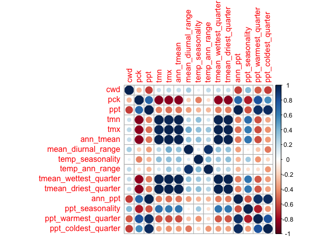<!-- -->

``` r
#tmn, tmx, tmean_wettest_quarter, tmean_driest_quarter and ann_tmean all highly correlated (97-99%) - only keep ann_tmean 
#temp_ann_range and mean_diurnal range 92% correlated - keep temp_ann_range 
#ann_ppt and ppt 100% correlated (ppt = avg across monts, ann_ppt = avg of the total ppt in a year) - only keep ann_ppt 
#ppt_warmest and coldest quarter highly correlated with ann_ppt and ppt - take both out 
```

### PCA - Recent + Historical


``` r
all_bioclim_flint_avgs.pc = prcomp(bioclim_flint_all_year_avgs[c(7:8, 12, 14:15, 18:19)], scale = TRUE, center = TRUE)
str(all_bioclim_flint_avgs.pc)
```

```
## List of 5
##  $ sdev    : num [1:7] 1.875 1.116 1.045 0.76 0.568 ...
##  $ rotation: num [1:7, 1:7] -0.29 0.49 -0.439 -0.283 -0.161 ...
##   ..- attr(*, "dimnames")=List of 2
##   .. ..$ : chr [1:7] "cwd" "pck" "ann_tmean" "temp_seasonality" ...
##   .. ..$ : chr [1:7] "PC1" "PC2" "PC3" "PC4" ...
##  $ center  : Named num [1:7] 55 149.2 9.5 672.6 32.3 ...
##   ..- attr(*, "names")= chr [1:7] "cwd" "pck" "ann_tmean" "temp_seasonality" ...
##  $ scale   : Named num [1:7] 11.71 159.21 4.42 20.33 1.16 ...
##   ..- attr(*, "names")= chr [1:7] "cwd" "pck" "ann_tmean" "temp_seasonality" ...
##  $ x       : num [1:46, 1:7] -3.916 -1.834 0.4 0.899 -0.372 ...
##   ..- attr(*, "dimnames")=List of 2
##   .. ..$ : NULL
##   .. ..$ : chr [1:7] "PC1" "PC2" "PC3" "PC4" ...
##  - attr(*, "class")= chr "prcomp"
```

plot % Variance Explained

``` r
summary(all_bioclim_flint_avgs.pc)
```

```
## Importance of components:
##                           PC1    PC2   PC3     PC4     PC5     PC6    PC7
## Standard deviation     1.8747 1.1159 1.045 0.76010 0.56770 0.44229 0.2291
## Proportion of Variance 0.5021 0.1779 0.156 0.08254 0.04604 0.02795 0.0075
## Cumulative Proportion  0.5021 0.6800 0.836 0.91852 0.96456 0.99250 1.0000
```

``` r
tibble(PC=str_c("PC",str_pad(1:7,2,pad="0")),
       percent_var=all_bioclim_flint_avgs.pc$sdev[1:7]^2/sum(all_bioclim_flint_avgs.pc$sdev^2)*100) %>%
  ggplot(aes(x=PC, y=percent_var)) +
  geom_col() +
  ggtitle("Percent Variance Explained")
```

<!-- -->

Combine PCs with metadata

``` r
all_bioclim_flint_avgs.pc.dat = data.frame(all_bioclim_flint_avgs.pc$x)

all_bioclim_flint_avgs_locs.pc = cbind(bioclim_flint_all_year_avgs, all_bioclim_flint_avgs.pc.dat)

all_bioclim_flint_avgs_loadings = data.frame(varnames=rownames(all_bioclim_flint_avgs.pc$rotation), all_bioclim_flint_avgs.pc$rotation)
all_bioclim_flint_avgs_loadings
```

```
##                          varnames        PC1         PC2         PC3        PC4
## cwd                           cwd -0.2898864 -0.02676872 -0.73667883 -0.1856448
## pck                           pck  0.4900675 -0.13142426 -0.22694125 -0.1631580
## ann_tmean               ann_tmean -0.4392404  0.06204467  0.31429575  0.4904205
## temp_seasonality temp_seasonality -0.2830725 -0.43314373  0.39948527 -0.7238292
## temp_ann_range     temp_ann_range -0.1609715 -0.79415686 -0.09367768  0.3661464
## ann_ppt                   ann_ppt  0.4401114  0.01021604  0.36670730  0.0230377
## ppt_seasonality   ppt_seasonality -0.4279342  0.39969811  0.06466770 -0.1997011
##                         PC5         PC6         PC7
## cwd              0.46495387  0.32540195 -0.12657430
## pck              0.25701236 -0.26573980  0.72647483
## ann_tmean        0.35040691  0.29949537  0.50143963
## temp_seasonality 0.05162574  0.17706614  0.12133280
## temp_ann_range   0.09186060 -0.40673086 -0.16338912
## ann_ppt          0.71035044  0.06448712 -0.40303379
## ppt_seasonality  0.28156030 -0.72997086 -0.03029315
```


``` r
autoplot(all_bioclim_flint_avgs.pc, data = bioclim_flint_all_year_avgs,
         colour='elev_m', alpha=0.5,
         label=TRUE, label.label="parent.pop",
         loadings=TRUE, loadings.colour='black', loadings.linewidth = 0.7,
         loadings.label = TRUE, loadings.label.size=6, loadings.label.colour="black", 
         loadings.label.vjust = -0.2, loadings.label.repel=TRUE) +
   scale_colour_gradient(low = "#F5A540", high = "#0043F0") +
  geom_vline(xintercept = 0, linetype="dashed") + geom_hline(yintercept = 0, linetype="dashed") +
  theme_classic()
```

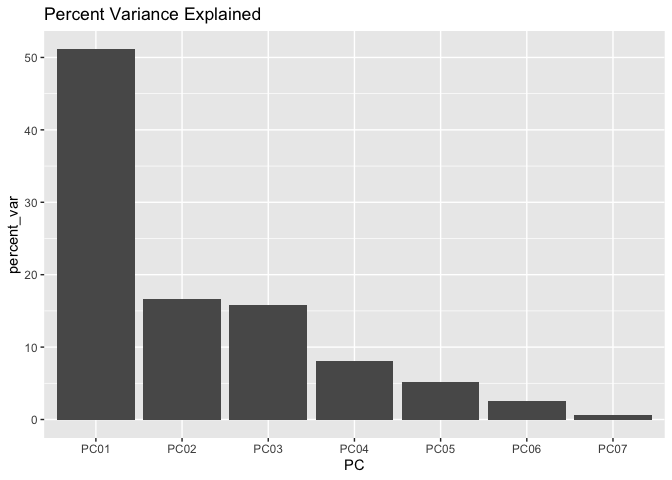<!-- -->


``` r
autoplot(all_bioclim_flint_avgs.pc, data = bioclim_flint_all_year_avgs,
         x=1, y=3,
         colour='elev_m', alpha=0.5,
         label=TRUE, label.label="parent.pop",
         loadings=TRUE, loadings.colour='black', loadings.linewidth = 0.7,
         loadings.label = TRUE, loadings.label.size=6, loadings.label.colour="black", 
         loadings.label.vjust = -0.2, loadings.label.repel=TRUE) +
   scale_colour_gradient(low = "#F5A540", high = "#0043F0") +
  geom_vline(xintercept = 0, linetype="dashed") + geom_hline(yintercept = 0, linetype="dashed") +
  theme_classic()
```

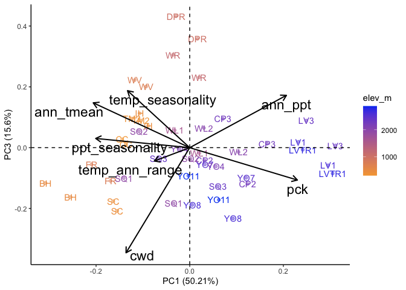<!-- -->

``` r
autoplot(all_bioclim_flint_avgs.pc, data = bioclim_flint_all_year_avgs,
         x=4, y=5,
         colour='elev_m', alpha=0.5,
         label=TRUE, label.label="parent.pop",
         loadings=TRUE, loadings.colour='black', loadings.linewidth = 0.7,
         loadings.label = TRUE, loadings.label.size=6, loadings.label.colour="black", 
         loadings.label.vjust = -0.2, loadings.label.repel=TRUE) +
   scale_colour_gradient(low = "#F5A540", high = "#0043F0") +
  geom_vline(xintercept = 0, linetype="dashed") + geom_hline(yintercept = 0, linetype="dashed") +
  theme_classic()
```

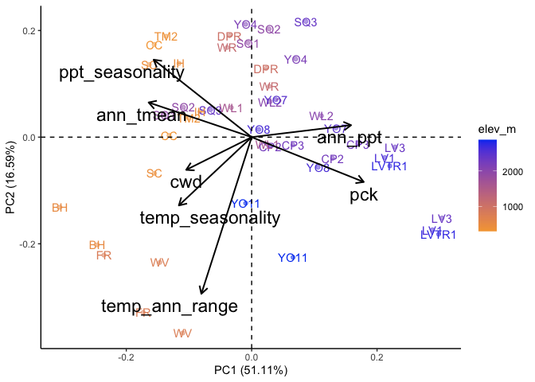<!-- -->


``` r
all_bioclim_flint_avgs_locs.pc_avg <- all_bioclim_flint_avgs_locs.pc %>%
  group_by(parent.pop, elev_m, TimePd) %>%
  summarise(across(.cols=starts_with("PC"), .fns = mean)) %>%
  ungroup()
```

```
## `summarise()` has grouped output by 'parent.pop', 'elev_m'. You can override
## using the `.groups` argument.
```

``` r
all_bioclim_flint_avgs_locs.pc_avg
```

```
## # A tibble: 46 × 11
##    parent.pop elev_m TimePd          pck    PC1     PC2     PC3     PC4     PC5
##    <chr>       <dbl> <chr>         <dbl>  <dbl>   <dbl>   <dbl>   <dbl>   <dbl>
##  1 BH           511. Historical   0.0195 -3.24  -1.24   -1.15    0.450   0.0711
##  2 BH           511. Recent       0      -3.92  -0.663  -0.826  -0.277   0.502 
##  3 CC           313  Historical   0.0793 -1.73  -0.209   0.0714  1.00    0.129 
##  4 CC           313  Recent       0      -1.83   1.17    0.194   0.693   0.358 
##  5 CP2         2244. Historical 265.      1.57  -0.0901 -0.847  -0.102  -0.0564
##  6 CP2         2244. Recent     218.      0.400 -0.0335 -0.294  -1.16    0.354 
##  7 CP3         2266. Historical 282.      2.10  -0.0738  0.0938  0.0213 -0.896 
##  8 CP3         2266. Recent     236.      0.899 -0.192   0.672  -1.08   -0.505 
##  9 DPR         1019. Historical  20.5     0.209  0.392   2.54    0.920  -0.425 
## 10 DPR         1019. Recent       7.63   -0.372  0.808   3.06   -0.0298 -0.141 
## # ℹ 36 more rows
## # ℹ 2 more variables: PC6 <dbl>, PC7 <dbl>
```


``` r
all_bioclim_flint_avgs_locs.pc_avg %>% 
  ggplot(aes(x=PC1, y=PC2, shape=TimePd, color=elev_m)) +
  scale_colour_gradient(low = "#F5A540", high = "#0043F0") +
  geom_point() +
  facet_wrap(~TimePd) +
  coord_fixed(ratio = 1.5)
```

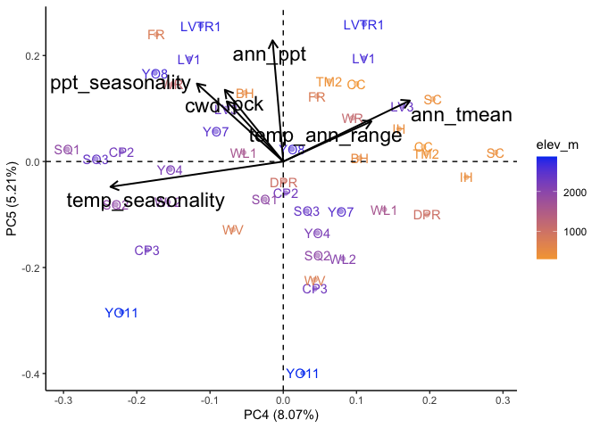<!-- -->


``` r
all_bioclim_flint_avgs_locs.pc_avg %>% 
  mutate(group=str_c(parent.pop,elev_m))  %>%
  ggplot(aes(x=PC1, y=PC2, shape=TimePd, color=elev_m)) +
  scale_colour_gradient(low = "#F5A540", high = "#0043F0") +
  geom_point(size=2, alpha=0.7) +
  geom_vline(xintercept = 0, linetype="dashed") + geom_hline(yintercept = 0, linetype="dashed") +
  geom_path(aes(group=group),arrow = arrow(length=unit(5, "points")), linewidth = .8)
```

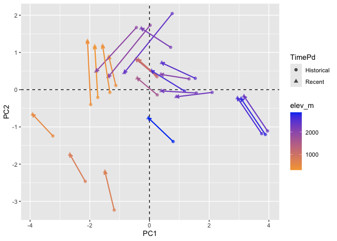<!-- -->

``` r
all_bioclim_flint_avgs_locs.pc_avg %>% 
  mutate(group=str_c(parent.pop,elev_m))  %>%
  ggplot(aes(x=PC1, y=PC2, shape=TimePd, color=elev_m)) +
  scale_colour_gradient(low = "#F5A540", high = "#0043F0") +
  geom_point(size=2, alpha=0.7) +
  geom_text_repel(aes(label = parent.pop)) +
  geom_vline(xintercept = 0, linetype="dashed") + geom_hline(yintercept = 0, linetype="dashed")  +
  geom_path(aes(group=group),arrow = arrow(length=unit(5, "points")), linewidth = .8)
```

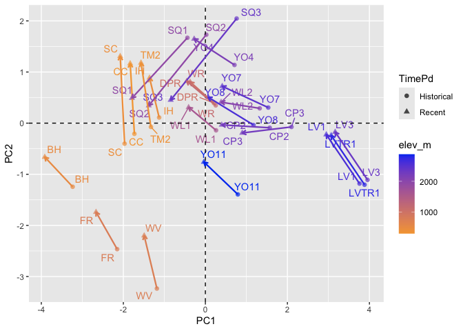<!-- -->

``` r
#high elev climate seems to be shifting to be more similar to low elev 
```
