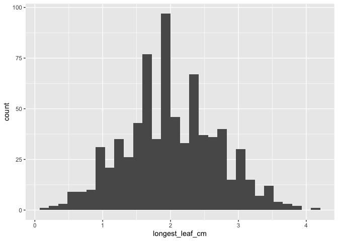
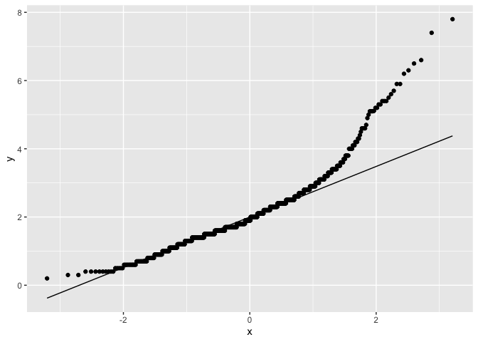
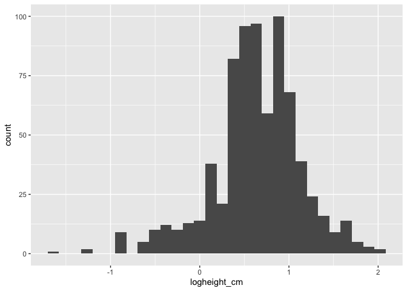
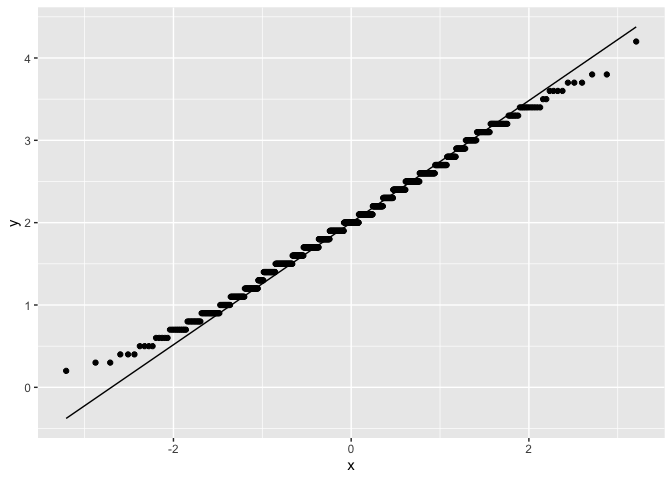
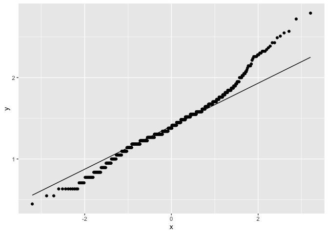
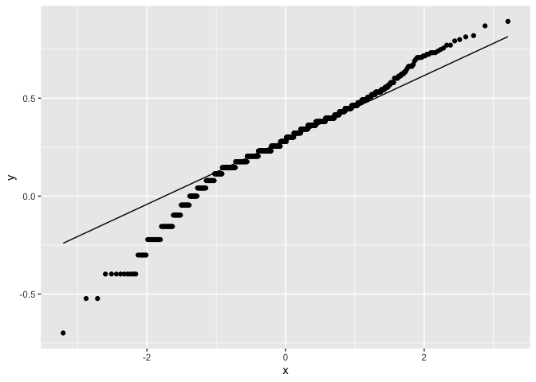
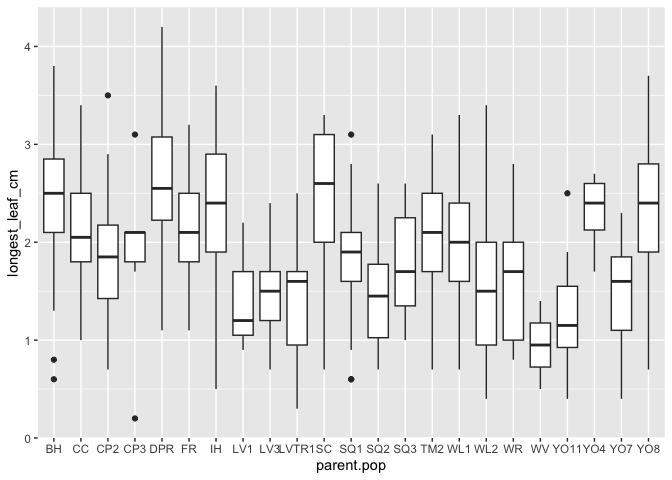
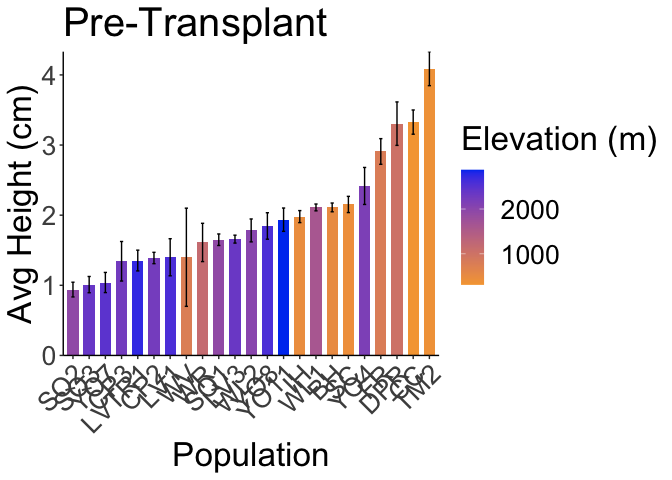

# Analysis of Pre-transplant size

To Do:

-   How predictive is this of survival in the field?
  -   How to do this? Convert death to 0 vs. 1?
  -   Somehow keep the dates and do some sort of survival analysis?


## Relevant Libraries and Functions


```r
library(tidyverse)
```

```
## ── Attaching core tidyverse packages ──────────────────────── tidyverse 2.0.0 ──
## ✔ dplyr     1.1.3     ✔ readr     2.1.4
## ✔ forcats   1.0.0     ✔ stringr   1.5.0
## ✔ ggplot2   3.4.3     ✔ tibble    3.2.1
## ✔ lubridate 1.9.2     ✔ tidyr     1.3.0
## ✔ purrr     1.0.2     
## ── Conflicts ────────────────────────────────────────── tidyverse_conflicts() ──
## ✖ dplyr::filter() masks stats::filter()
## ✖ dplyr::lag()    masks stats::lag()
## ℹ Use the conflicted package (<http://conflicted.r-lib.org/>) to force all conflicts to become errors
```

```r
library(tidymodels)
```

```
## ── Attaching packages ────────────────────────────────────── tidymodels 1.1.1 ──
## ✔ broom        1.0.5     ✔ rsample      1.2.0
## ✔ dials        1.2.0     ✔ tune         1.1.2
## ✔ infer        1.0.5     ✔ workflows    1.1.3
## ✔ modeldata    1.2.0     ✔ workflowsets 1.0.1
## ✔ parsnip      1.1.1     ✔ yardstick    1.2.0
## ✔ recipes      1.0.8     
## ── Conflicts ───────────────────────────────────────── tidymodels_conflicts() ──
## ✖ scales::discard() masks purrr::discard()
## ✖ dplyr::filter()   masks stats::filter()
## ✖ recipes::fixed()  masks stringr::fixed()
## ✖ dplyr::lag()      masks stats::lag()
## ✖ yardstick::spec() masks readr::spec()
## ✖ recipes::step()   masks stats::step()
## • Use suppressPackageStartupMessages() to eliminate package startup messages
```

```r
tidymodels_prefer()
library(lmerTest) #for mixed effect models
```

```
## Loading required package: lme4
## Loading required package: Matrix
## 
## Attaching package: 'Matrix'
## 
## The following objects are masked from 'package:tidyr':
## 
##     expand, pack, unpack
```

```r
conflicted::conflicts_prefer(lmerTest::lmer)
```

```
## [conflicted] Will prefer lmerTest::lmer over any other package.
```

```r
library(broom.mixed) #tidy method for lmerTest
library(emmeans) #for post-hoc pairwise comparisons 
library(naniar) #replaces values with NA
library(corrplot) #plotting correlations 
```

```
## corrplot 0.92 loaded
```

```r
library(rstatix) #performing cor_test
sem <- function(x, na.rm=FALSE) {           #for caclulating standard error
  sd(x,na.rm=na.rm)/sqrt(length(na.omit(x)))
} 

elev_three_palette <- c("#0043F0", "#C9727F", "#F5A540") #colors from Gremer et al 2019
elev_order <- c("High", "Mid", "Low") #for proper arrangement in figures 
```

## Load the pop and location data


```r
#pop info
pops_common_garden <- read_csv("../input/UCD_Data/Pops_for_2022_UCD.csv") #pops included in common garden 
```

```
## Rows: 23 Columns: 11
## ── Column specification ────────────────────────────────────────────────────────
## Delimiter: ","
## chr (5): parent.pop, elevation.group, collection.priority., on.climate.PCA.,...
## dbl (5): phylogroup, maternal.families, approx.number.seeds, UCD.seed.year, ...
## lgl (1): JGI.DNA
## 
## ℹ Use `spec()` to retrieve the full column specification for this data.
## ℹ Specify the column types or set `show_col_types = FALSE` to quiet this message.
```

```r
summary(pops_common_garden)
```

```
##   parent.pop          phylogroup    elevation.group    maternal.families
##  Length:23          Min.   :1.000   Length:23          Min.   : 3.0     
##  Class :character   1st Qu.:2.000   Class :character   1st Qu.:16.5     
##  Mode  :character   Median :4.000   Mode  :character   Median :23.0     
##                     Mean   :4.435                      Mean   :22.7     
##                     3rd Qu.:7.000                      3rd Qu.:29.5     
##                     Max.   :9.000                      Max.   :44.0     
##  approx.number.seeds UCD.seed.year  proposed.WL2.seed.year collection.priority.
##  Min.   : 100.0      Min.   :2014   Min.   :2014           Length:23           
##  1st Qu.: 500.0      1st Qu.:2018   1st Qu.:2020           Class :character    
##  Median : 500.0      Median :2020   Median :2021           Mode  :character    
##  Mean   : 608.7      Mean   :2020   Mean   :2020                               
##  3rd Qu.:1000.0      3rd Qu.:2021   3rd Qu.:2021                               
##  Max.   :1000.0      Max.   :2021   Max.   :2022                               
##  on.climate.PCA.    JGI.DNA           notes          
##  Length:23          Mode:logical   Length:23         
##  Class :character   NA's:23        Class :character  
##  Mode  :character                  Mode  :character  
##                                                      
##                                                      
## 
```

```r
pops_common_garden_nonotes <- pops_common_garden %>% select(parent.pop:elevation.group, UCD.seed.year)
pops_common_garden_nonotes$elevation.group <- str_to_title(pops_common_garden_nonotes$elevation.group)

#extra location info 
pop_loc <- read_csv("../input/Strep_tort_locs.csv")
```

```
## Rows: 54 Columns: 7
## ── Column specification ────────────────────────────────────────────────────────
## Delimiter: ","
## chr (6): Species epithet, Species Code, Site, Site code, Lat, Long
## dbl (1): Elevation (m)
## 
## ℹ Use `spec()` to retrieve the full column specification for this data.
## ℹ Specify the column types or set `show_col_types = FALSE` to quiet this message.
```

```r
unique(pop_loc$`Site code`)
```

```
##  [1] "BH"     "BB"     "CC"     "CP1"    "CP2"    "CP3"    "DP"     "DPR"   
##  [9] "FR"     NA       "HH"     "IH"     "KC1"    "KC2"    "KC3"    "LV1"   
## [17] "LV2"    "LV3"    "LVTR1"  "LVTR2"  "LVTR3"  "SQ1"    "SQ2"    "SQ3"   
## [25] "SHA"    "SC"     "TM1"    "TM2"    "WR"     "WV"     "WL1"    "WL2"   
## [33] "WL3"    "WL4"    "YOSE1"  "YOSE10" "YOSE11" "YOSE12" "YOSE13" "YOSE2" 
## [41] "YOSE3"  "YOSE4"  "YOSE5"  "YOSE6"  "YOSE7"  "YOSE8"  "YOSE9"
```

```r
unique(pops_common_garden_nonotes$parent.pop)
```

```
##  [1] "BH"    "CC"    "CP2"   "CP3"   "DPR"   "FR"    "IH"    "LV1"   "LV3"  
## [10] "LVTR1" "SC"    "SQ1"   "SQ2"   "SQ3"   "TM2"   "WL1"   "WL2"   "WR"   
## [19] "WV"    "YO11"  "YO4"   "YO7"   "YO8"
```

```r
#need to change YOSE to YO
pop_loc_yo <- pop_loc %>% mutate(parent.pop = str_replace(`Site code`, "YOSE(\\d+)", "YO\\1")) %>% select(Lat, Long, elev_m=`Elevation (m)`, parent.pop)
unique(pop_loc_yo$parent.pop)
```

```
##  [1] "BH"    "BB"    "CC"    "CP1"   "CP2"   "CP3"   "DP"    "DPR"   "FR"   
## [10] NA      "HH"    "IH"    "KC1"   "KC2"   "KC3"   "LV1"   "LV2"   "LV3"  
## [19] "LVTR1" "LVTR2" "LVTR3" "SQ1"   "SQ2"   "SQ3"   "SHA"   "SC"    "TM1"  
## [28] "TM2"   "WR"    "WV"    "WL1"   "WL2"   "WL3"   "WL4"   "YO1"   "YO10" 
## [37] "YO11"  "YO12"  "YO13"  "YO2"   "YO3"   "YO4"   "YO5"   "YO6"   "YO7"  
## [46] "YO8"   "YO9"
```

```r
#merge in location info
pop_elev <- left_join(pops_common_garden_nonotes, pop_loc_yo)
```

```
## Joining with `by = join_by(parent.pop)`
```

```r
head(pop_elev)
```

```
## # A tibble: 6 × 7
##   parent.pop phylogroup elevation.group UCD.seed.year Lat      Long       elev_m
##   <chr>           <dbl> <chr>                   <dbl> <chr>    <chr>       <dbl>
## 1 BH                  4 Low                      2021 37.40985 -119.96458   511.
## 2 CC                  7 Low                      2018 39.58597 -121.43311   313 
## 3 CP2                 2 High                     2019 38.66169 -120.13065  2244.
## 4 CP3                 2 High                     2018 38.70649 -120.08797  2266.
## 5 DPR                 5 Mid                      2020 39.22846 -120.81518  1019.
## 6 FR                  7 Mid                      2019 40.01362 -121.18498   787
```

## Load Size Data

```r
ucd_pretransplant_size <- read_csv("../input/UCD_Data/CorrectedCSVs/UCD_garden_size_measurements_20221128_corrected.csv")
```

```
## Warning: One or more parsing issues, call `problems()` on your data frame for details,
## e.g.:
##   dat <- vroom(...)
##   problems(dat)
```

```
## Rows: 2264 Columns: 7
## ── Column specification ────────────────────────────────────────────────────────
## Delimiter: ","
## chr (2): parent.pop, Notes
## dbl (5): mf, rep, germinated?, Height (cm), Longest leaf (cm)
## 
## ℹ Use `spec()` to retrieve the full column specification for this data.
## ℹ Specify the column types or set `show_col_types = FALSE` to quiet this message.
```

```r
head(ucd_pretransplant_size) #includes germinated and non germ plants 
```

```
## # A tibble: 6 × 7
##   parent.pop    mf   rep `germinated?` `Height (cm)` `Longest leaf (cm)` Notes
##   <chr>      <dbl> <dbl>         <dbl>         <dbl>               <dbl> <chr>
## 1 BH             1     1             0            NA                  NA <NA> 
## 2 BH             1     2             0            NA                  NA <NA> 
## 3 BH             1     3             0            NA                  NA <NA> 
## 4 BH             1     4             0            NA                  NA <NA> 
## 5 BH             1     5             0            NA                  NA <NA> 
## 6 BH             1     6             0            NA                  NA <NA>
```

```r
ucd_pretransplant_size_germonly <- ucd_pretransplant_size %>% rename(germ = `germinated?`, height_cm = `Height (cm)`, longest_leaf_cm=`Longest leaf (cm)`) %>% filter(germ==1)
head(ucd_pretransplant_size_germonly)
```

```
## # A tibble: 6 × 7
##   parent.pop    mf   rep  germ height_cm longest_leaf_cm Notes
##   <chr>      <dbl> <dbl> <dbl>     <dbl>           <dbl> <chr>
## 1 BH             1     7     1       1.7             1.9 <NA> 
## 2 BH             1     8     1       1.7             1.6 <NA> 
## 3 BH             1    10     1       1.2             1.5 <NA> 
## 4 BH             2     1     1       1.4             2.7 <NA> 
## 5 BH             2     2     1       1.4             1.3 <NA> 
## 6 BH             2     3     1       1.1             1.7 <NA>
```

```r
tail(ucd_pretransplant_size_germonly)
```

```
## # A tibble: 6 × 7
##   parent.pop    mf   rep  germ height_cm longest_leaf_cm Notes
##   <chr>      <dbl> <dbl> <dbl>     <dbl>           <dbl> <chr>
## 1 YO8            7     2     1       1.9             2   <NA> 
## 2 YO8            7     4     1       1.5             2.9 <NA> 
## 3 YO8            7     6     1       1.6             1.9 <NA> 
## 4 YO8            7     9     1       1.1             0.7 <NA> 
## 5 YO8            7    10     1       1.7             3   <NA> 
## 6 YO8            7    11     1       1.8             2.8 <NA>
```

```r
#merge with pop loc info 
ucd_pretransplant_size_elev <- left_join(ucd_pretransplant_size_germonly, pop_elev)
```

```
## Joining with `by = join_by(parent.pop)`
```

```r
head(ucd_pretransplant_size_elev)
```

```
## # A tibble: 6 × 13
##   parent.pop    mf   rep  germ height_cm longest_leaf_cm Notes phylogroup
##   <chr>      <dbl> <dbl> <dbl>     <dbl>           <dbl> <chr>      <dbl>
## 1 BH             1     7     1       1.7             1.9 <NA>           4
## 2 BH             1     8     1       1.7             1.6 <NA>           4
## 3 BH             1    10     1       1.2             1.5 <NA>           4
## 4 BH             2     1     1       1.4             2.7 <NA>           4
## 5 BH             2     2     1       1.4             1.3 <NA>           4
## 6 BH             2     3     1       1.1             1.7 <NA>           4
## # ℹ 5 more variables: elevation.group <chr>, UCD.seed.year <dbl>, Lat <chr>,
## #   Long <chr>, elev_m <dbl>
```

```r
tail(ucd_pretransplant_size_elev)
```

```
## # A tibble: 6 × 13
##   parent.pop    mf   rep  germ height_cm longest_leaf_cm Notes phylogroup
##   <chr>      <dbl> <dbl> <dbl>     <dbl>           <dbl> <chr>      <dbl>
## 1 YO8            7     2     1       1.9             2   <NA>           1
## 2 YO8            7     4     1       1.5             2.9 <NA>           1
## 3 YO8            7     6     1       1.6             1.9 <NA>           1
## 4 YO8            7     9     1       1.1             0.7 <NA>           1
## 5 YO8            7    10     1       1.7             3   <NA>           1
## 6 YO8            7    11     1       1.8             2.8 <NA>           1
## # ℹ 5 more variables: elevation.group <chr>, UCD.seed.year <dbl>, Lat <chr>,
## #   Long <chr>, elev_m <dbl>
```

```r
##check sample sizes 
ucd_pretransplant_size_elev %>% 
  filter(!is.na(height_cm)) %>% 
  group_by(parent.pop) %>% 
  summarise(samplesize=n()) %>% 
  arrange(samplesize)
```

```
## # A tibble: 23 × 2
##    parent.pop samplesize
##    <chr>           <int>
##  1 WV                  2
##  2 LV1                 3
##  3 YO4                 6
##  4 CP3                 7
##  5 WR                  9
##  6 SQ3                10
##  7 YO8                13
##  8 YO11               14
##  9 LVTR1              15
## 10 YO7                15
## # ℹ 13 more rows
```

```r
#only 2 WV individuals, 3 LV1 individuals  
```

## Summary plots

```r
#Histograms
ucd_pretransplant_size_elev %>% select(height_cm, longest_leaf_cm) %>% 
  names() %>% 
  map(~ggplot(ucd_pretransplant_size_elev, aes_string(x = .)) + 
        geom_histogram())
```

```
## Warning: `aes_string()` was deprecated in ggplot2 3.0.0.
## ℹ Please use tidy evaluation idioms with `aes()`.
## ℹ See also `vignette("ggplot2-in-packages")` for more information.
## This warning is displayed once every 8 hours.
## Call `lifecycle::last_lifecycle_warnings()` to see where this warning was
## generated.
```

```
## [[1]]
```

```
## `stat_bin()` using `bins = 30`. Pick better value with `binwidth`.
```

```
## Warning: Removed 8 rows containing non-finite values (`stat_bin()`).
```

<!-- -->

```
## 
## [[2]]
```

```
## `stat_bin()` using `bins = 30`. Pick better value with `binwidth`.
```

```
## Warning: Removed 10 rows containing non-finite values (`stat_bin()`).
```

<!-- -->

```r
#prints height first then longest leaf 

#qq plots 
ucd_pretransplant_size_elev %>% select(height_cm, longest_leaf_cm) %>% 
  names() %>% 
  map(~ggplot(ucd_pretransplant_size_elev, aes_string(sample = .)) + 
       stat_qq() +
        stat_qq_line())
```

```
## [[1]]
```

```
## Warning: Removed 8 rows containing non-finite values (`stat_qq()`).
```

```
## Warning: Removed 8 rows containing non-finite values (`stat_qq_line()`).
```

<!-- -->

```
## 
## [[2]]
```

```
## Warning: Removed 10 rows containing non-finite values (`stat_qq()`).
```

```
## Warning: Removed 10 rows containing non-finite values (`stat_qq_line()`).
```

<!-- -->

```r
#height is right skewed 
#longest leaf is fairly normal 


#Transformations:
ucd_pretransplant_size_elev_transf <- ucd_pretransplant_size_elev %>% 
  mutate(sheight_cm=sqrt(height_cm), logheight_cm=log(height_cm),log10height_cm=log10(height_cm))

ucd_pretransplant_size_elev_transf %>% select(ends_with("cm"))%>% 
  names() %>% 
  map(~ggplot(ucd_pretransplant_size_elev_transf, aes_string(x = .)) + 
        geom_histogram())
```

```
## [[1]]
```

```
## `stat_bin()` using `bins = 30`. Pick better value with `binwidth`.
```

```
## Warning: Removed 8 rows containing non-finite values (`stat_bin()`).
```

<!-- -->

```
## 
## [[2]]
```

```
## `stat_bin()` using `bins = 30`. Pick better value with `binwidth`.
```

```
## Warning: Removed 10 rows containing non-finite values (`stat_bin()`).
```

<!-- -->

```
## 
## [[3]]
```

```
## `stat_bin()` using `bins = 30`. Pick better value with `binwidth`.
```

```
## Warning: Removed 8 rows containing non-finite values (`stat_bin()`).
```

<!-- -->

```
## 
## [[4]]
```

```
## `stat_bin()` using `bins = 30`. Pick better value with `binwidth`.
```

```
## Warning: Removed 8 rows containing non-finite values (`stat_bin()`).
```

<!-- -->

```
## 
## [[5]]
```

```
## `stat_bin()` using `bins = 30`. Pick better value with `binwidth`.
```

```
## Warning: Removed 8 rows containing non-finite values (`stat_bin()`).
```

<!-- -->

```r
ucd_pretransplant_size_elev_transf %>% select(ends_with("cm")) %>% 
  names() %>% 
  map(~ggplot(ucd_pretransplant_size_elev_transf, aes_string(sample = .)) + 
       stat_qq() +
        stat_qq_line())
```

```
## [[1]]
```

```
## Warning: Removed 8 rows containing non-finite values (`stat_qq()`).
```

```
## Warning: Removed 8 rows containing non-finite values (`stat_qq_line()`).
```

<!-- -->

```
## 
## [[2]]
```

```
## Warning: Removed 10 rows containing non-finite values (`stat_qq()`).
```

```
## Warning: Removed 10 rows containing non-finite values (`stat_qq_line()`).
```

<!-- -->

```
## 
## [[3]]
```

```
## Warning: Removed 8 rows containing non-finite values (`stat_qq()`).
```

```
## Warning: Removed 8 rows containing non-finite values (`stat_qq_line()`).
```

<!-- -->

```
## 
## [[4]]
```

```
## Warning: Removed 8 rows containing non-finite values (`stat_qq()`).
## Removed 8 rows containing non-finite values (`stat_qq_line()`).
```

<!-- -->

```
## 
## [[5]]
```

```
## Warning: Removed 8 rows containing non-finite values (`stat_qq()`).
## Removed 8 rows containing non-finite values (`stat_qq_line()`).
```

<!-- -->

```r
#square root transformation looks better, but not perfect 
```

## Box Plots

```r
ucd_pretransplant_size_elev_transf %>% ggplot(aes(x=parent.pop, y=height_cm)) + geom_boxplot()
```

```
## Warning: Removed 8 rows containing non-finite values (`stat_boxplot()`).
```

<!-- -->

```r
ucd_pretransplant_size_elev_transf %>% ggplot(aes(x=parent.pop, y=longest_leaf_cm)) + geom_boxplot()
```

```
## Warning: Removed 10 rows containing non-finite values (`stat_boxplot()`).
```

<!-- -->

## Calculating means by pop (and elev)


```r
ucd_pretransplant_size_elev_transf_summary <- ucd_pretransplant_size_elev_transf %>% 
  group_by(parent.pop, elev_m) %>% 
  summarise(N_height = sum(!is.na(height_cm)), mean_height_cm = mean(height_cm,na.rm=(TRUE)), 
            sem_height_cm=sem(height_cm, na.rm=(TRUE)), N_length = sum(!is.na(longest_leaf_cm)),
            mean_longest_leaf_cm=mean(longest_leaf_cm, na.rm=(TRUE)), 
            sem_longest_leaf_cm=sem(longest_leaf_cm, na.rm=TRUE)) %>% 
  arrange(elev_m)
```

```
## `summarise()` has grouped output by 'parent.pop'. You can override using the
## `.groups` argument.
```

```r
ucd_pretransplant_size_elev_transf_summary
```

```
## # A tibble: 23 × 8
## # Groups:   parent.pop [23]
##    parent.pop elev_m N_height mean_height_cm sem_height_cm N_length
##    <chr>       <dbl>    <int>          <dbl>         <dbl>    <int>
##  1 CC           313        44           3.33        0.173        44
##  2 TM2          379.       37           4.09        0.242        37
##  3 SC           422.       36           2.15        0.116        36
##  4 IH           454.       49           1.98        0.0857       49
##  5 BH           511.      111           2.11        0.0625      111
##  6 WV           749.        2           1.4         0.7           2
##  7 FR           787        36           2.91        0.183        36
##  8 DPR         1019.       22           3.30        0.310        22
##  9 WR          1158         9           1.61        0.273         9
## 10 WL1         1614.      125           2.11        0.0485      125
## # ℹ 13 more rows
## # ℹ 2 more variables: mean_longest_leaf_cm <dbl>, sem_longest_leaf_cm <dbl>
```

```r
#write_csv(ucd_pretransplant_size_elev_transf_summary, file ="../output/UCD_Traits/pretransplant_size_summary.csv")
```


## Figures of averages

### Avg Height Figure


```r
ucd_pretransplant_size_elev_transf_summary %>% 
  ggplot(aes(x=fct_reorder(parent.pop, mean_height_cm), y=mean_height_cm, fill=elev_m)) +
  geom_col(width = 0.7,position = position_dodge(0.75)) + 
  geom_errorbar(aes(ymin=mean_height_cm-sem_height_cm,ymax=mean_height_cm+sem_height_cm),width=.2, position = 
                  position_dodge(0.75)) +
  scale_y_continuous(expand = c(0, 0)) +
  scale_fill_gradient(low = "#F5A540", high = "#0043F0") +
  labs(fill="Elevation (m)", y="Avg Height (cm)", x="Population", title ="Pre-Transplant") +
   theme_classic() +
  theme(text=element_text(size=25), axis.text.x = element_text(angle = 45,  hjust = 1)) 
```

<!-- -->

```r
#ggsave("../output/UCD_Traits/PreTransplant_Height.png", width = 14, height = 9, units = "in")
```

### Avg Longest Leaf Figure


```r
ucd_pretransplant_size_elev_transf_summary %>% 
  ggplot(aes(x=fct_reorder(parent.pop, mean_longest_leaf_cm), y=mean_longest_leaf_cm, fill=elev_m)) +
  geom_col(width = 0.7,position = position_dodge(0.75)) + 
  geom_errorbar(aes(ymin=mean_longest_leaf_cm-sem_longest_leaf_cm,ymax=mean_longest_leaf_cm+sem_longest_leaf_cm),width=.2, position = 
                  position_dodge(0.75)) +
  scale_y_continuous(expand = c(0, 0)) +
  scale_fill_gradient(low = "#F5A540", high = "#0043F0") +
  labs(fill="Elevation (m)", y="Avg Longest Leaf (cm)", x="Population", title ="Pre-Transplant") +
   theme_classic() +
  theme(text=element_text(size=25), axis.text.x = element_text(angle = 45,  hjust = 1)) 
```

<!-- -->

```r
#ggsave("../output/UCD_Traits/PreTransplant_Longest_Leaf.png", width = 14, height = 9, units = "in")
```

## Mixed Effects Models

```r
names(ucd_pretransplant_size_elev_transf)
```

```
##  [1] "parent.pop"      "mf"              "rep"             "germ"           
##  [5] "height_cm"       "longest_leaf_cm" "Notes"           "phylogroup"     
##  [9] "elevation.group" "UCD.seed.year"   "Lat"             "Long"           
## [13] "elev_m"          "sheight_cm"      "logheight_cm"    "log10height_cm"
```

```r
lmeheight = lmerTest::lmer(sheight_cm ~ (1|parent.pop/mf), data=ucd_pretransplant_size_elev_transf)
summary(lmeheight)
```

```
## Linear mixed model fit by REML. t-tests use Satterthwaite's method [
## lmerModLmerTest]
## Formula: sheight_cm ~ (1 | parent.pop/mf)
##    Data: ucd_pretransplant_size_elev_transf
## 
## REML criterion at convergence: 90.6
## 
## Scaled residuals: 
##     Min      1Q  Median      3Q     Max 
## -3.0951 -0.6517  0.0151  0.5816  3.1265 
## 
## Random effects:
##  Groups        Name        Variance Std.Dev.
##  mf:parent.pop (Intercept) 0.01251  0.1118  
##  parent.pop    (Intercept) 0.06726  0.2593  
##  Residual                  0.05358  0.2315  
## Number of obs: 749, groups:  mf:parent.pop, 133; parent.pop, 23
## 
## Fixed effects:
##             Estimate Std. Error       df t value Pr(>|t|)    
## (Intercept)  1.34937    0.05684 22.56413   23.74   <2e-16 ***
## ---
## Signif. codes:  0 '***' 0.001 '**' 0.01 '*' 0.05 '.' 0.1 ' ' 1
```

```r
ranova(lmeheight) #both pop and mf significant 
```

```
## ANOVA-like table for random-effects: Single term deletions
## 
## Model:
## sheight_cm ~ (1 | mf:parent.pop) + (1 | parent.pop)
##                     npar  logLik     AIC    LRT Df Pr(>Chisq)    
## <none>                 4 -45.292  98.583                         
## (1 | mf:parent.pop)    3 -63.581 133.162 36.579  1  1.466e-09 ***
## (1 | parent.pop)       3 -95.290 196.580 99.997  1  < 2.2e-16 ***
## ---
## Signif. codes:  0 '***' 0.001 '**' 0.01 '*' 0.05 '.' 0.1 ' ' 1
```

```r
VarCorr(lmeheight) %>% #mf = 9.3% of var and pop = 50.4% of var 
  as.data.frame() %>% 
  mutate(var.pct = vcov/sum(vcov)*100)
```

```
##             grp        var1 var2       vcov     sdcor   var.pct
## 1 mf:parent.pop (Intercept) <NA> 0.01250748 0.1118369  9.379892
## 2    parent.pop (Intercept) <NA> 0.06726010 0.2593455 50.441198
## 3      Residual        <NA> <NA> 0.05357599 0.2314649 40.178909
```

```r
lmeheight2 = lmerTest::lmer(sheight_cm ~ elev_m + (1|parent.pop/mf), data=ucd_pretransplant_size_elev_transf)
summary(lmeheight2) #elevation is significant 
```

```
## Linear mixed model fit by REML. t-tests use Satterthwaite's method [
## lmerModLmerTest]
## Formula: sheight_cm ~ elev_m + (1 | parent.pop/mf)
##    Data: ucd_pretransplant_size_elev_transf
## 
## REML criterion at convergence: 96.7
## 
## Scaled residuals: 
##      Min       1Q   Median       3Q      Max 
## -3.09057 -0.64911  0.01999  0.60666  3.11754 
## 
## Random effects:
##  Groups        Name        Variance Std.Dev.
##  mf:parent.pop (Intercept) 0.01256  0.1121  
##  parent.pop    (Intercept) 0.03662  0.1914  
##  Residual                  0.05362  0.2316  
## Number of obs: 749, groups:  mf:parent.pop, 133; parent.pop, 23
## 
## Fixed effects:
##               Estimate Std. Error         df t value Pr(>|t|)    
## (Intercept)  1.678e+00  9.238e-02  1.907e+01  18.165  1.7e-13 ***
## elev_m      -1.988e-04  4.989e-05  1.972e+01  -3.985 0.000745 ***
## ---
## Signif. codes:  0 '***' 0.001 '**' 0.01 '*' 0.05 '.' 0.1 ' ' 1
## 
## Correlation of Fixed Effects:
##        (Intr)
## elev_m -0.883
```

```r
ranova(lmeheight2) #both pop and mf still significant 
```

```
## ANOVA-like table for random-effects: Single term deletions
## 
## Model:
## sheight_cm ~ elev_m + (1 | mf:parent.pop) + (1 | parent.pop)
##                     npar  logLik    AIC    LRT Df Pr(>Chisq)    
## <none>                 5 -48.328 106.66                         
## (1 | mf:parent.pop)    4 -66.678 141.36 36.701  1  1.377e-09 ***
## (1 | parent.pop)       4 -74.688 157.38 52.720  1  3.847e-13 ***
## ---
## Signif. codes:  0 '***' 0.001 '**' 0.01 '*' 0.05 '.' 0.1 ' ' 1
```

```r
lmelength = lmerTest::lmer(longest_leaf_cm ~ (1|parent.pop/mf), data=ucd_pretransplant_size_elev_transf)
summary(lmelength)
```

```
## Linear mixed model fit by REML. t-tests use Satterthwaite's method [
## lmerModLmerTest]
## Formula: longest_leaf_cm ~ (1 | parent.pop/mf)
##    Data: ucd_pretransplant_size_elev_transf
## 
## REML criterion at convergence: 1364.7
## 
## Scaled residuals: 
##     Min      1Q  Median      3Q     Max 
## -3.3616 -0.6184  0.0158  0.6340  2.8894 
## 
## Random effects:
##  Groups        Name        Variance Std.Dev.
##  mf:parent.pop (Intercept) 0.03566  0.1888  
##  parent.pop    (Intercept) 0.14481  0.3805  
##  Residual                  0.31648  0.5626  
## Number of obs: 747, groups:  mf:parent.pop, 133; parent.pop, 23
## 
## Fixed effects:
##             Estimate Std. Error       df t value Pr(>|t|)    
## (Intercept)  1.89506    0.08725 20.76284   21.72 9.36e-16 ***
## ---
## Signif. codes:  0 '***' 0.001 '**' 0.01 '*' 0.05 '.' 0.1 ' ' 1
```

```r
ranova(lmelength) #both pop and mf significant 
```

```
## ANOVA-like table for random-effects: Single term deletions
## 
## Model:
## longest_leaf_cm ~ (1 | mf:parent.pop) + (1 | parent.pop)
##                     npar  logLik    AIC    LRT Df Pr(>Chisq)    
## <none>                 4 -682.33 1372.7                         
## (1 | mf:parent.pop)    3 -689.52 1385.0 14.385  1   0.000149 ***
## (1 | parent.pop)       3 -706.20 1418.4 47.739  1   4.87e-12 ***
## ---
## Signif. codes:  0 '***' 0.001 '**' 0.01 '*' 0.05 '.' 0.1 ' ' 1
```

```r
VarCorr(lmelength) %>% #mf = 7.2% of var and pop = 29.1% of var 
  as.data.frame() %>% 
  mutate(var.pct = vcov/sum(vcov)*100)
```

```
##             grp        var1 var2       vcov     sdcor   var.pct
## 1 mf:parent.pop (Intercept) <NA> 0.03566001 0.1888386  7.175796
## 2    parent.pop (Intercept) <NA> 0.14480685 0.3805349 29.139204
## 3      Residual        <NA> <NA> 0.31648168 0.5625670 63.685000
```

```r
lmelength2 = lmerTest::lmer(longest_leaf_cm ~ elev_m + (1|parent.pop/mf), data=ucd_pretransplant_size_elev_transf)
summary(lmelength2) #elevaition is significant 
```

```
## Linear mixed model fit by REML. t-tests use Satterthwaite's method [
## lmerModLmerTest]
## Formula: longest_leaf_cm ~ elev_m + (1 | parent.pop/mf)
##    Data: ucd_pretransplant_size_elev_transf
## 
## REML criterion at convergence: 1370.1
## 
## Scaled residuals: 
##     Min      1Q  Median      3Q     Max 
## -3.3593 -0.6092  0.0281  0.6325  2.8506 
## 
## Random effects:
##  Groups        Name        Variance Std.Dev.
##  mf:parent.pop (Intercept) 0.03698  0.1923  
##  parent.pop    (Intercept) 0.05992  0.2448  
##  Residual                  0.31769  0.5636  
## Number of obs: 747, groups:  mf:parent.pop, 133; parent.pop, 23
## 
## Fixed effects:
##               Estimate Std. Error         df t value Pr(>|t|)    
## (Intercept)  2.389e+00  1.283e-01  1.282e+01  18.626 1.17e-10 ***
## elev_m      -2.999e-04  7.051e-05  1.423e+01  -4.253 0.000776 ***
## ---
## Signif. codes:  0 '***' 0.001 '**' 0.01 '*' 0.05 '.' 0.1 ' ' 1
## 
## Correlation of Fixed Effects:
##        (Intr)
## elev_m -0.877
```

```r
ranova(lmelength2) #both pop and mf still significant 
```

```
## ANOVA-like table for random-effects: Single term deletions
## 
## Model:
## longest_leaf_cm ~ elev_m + (1 | mf:parent.pop) + (1 | parent.pop)
##                     npar  logLik    AIC    LRT Df Pr(>Chisq)    
## <none>                 5 -685.07 1380.1                         
## (1 | mf:parent.pop)    4 -692.42 1392.8 14.713  1  0.0001252 ***
## (1 | parent.pop)       4 -691.79 1391.6 13.437  1  0.0002467 ***
## ---
## Signif. codes:  0 '***' 0.001 '**' 0.01 '*' 0.05 '.' 0.1 ' ' 1
```


## Load mort/pheno data 

```r
ucdmort <- read_csv("../input/UCD_Data/CorrectedCSVs/Mortality_survey_20230508_corrected.csv")
```

```
## New names:
## Rows: 861 Columns: 9
## ── Column specification
## ──────────────────────────────────────────────────────── Delimiter: "," chr
## (6): block, col, pop, death date, Notes, ...9 dbl (3): row, mf, rep
## ℹ Use `spec()` to retrieve the full column specification for this data. ℹ
## Specify the column types or set `show_col_types = FALSE` to quiet this message.
## • `` -> `...9`
```

```r
head(ucdmort)
```

```
## # A tibble: 6 × 9
##   block   row col   pop       mf   rep `death date` Notes                  ...9 
##   <chr> <dbl> <chr> <chr>  <dbl> <dbl> <chr>        <chr>                  <chr>
## 1 D1        1 A     buffer    NA    NA <NA>         <NA>                   <NA> 
## 2 D1        1 B     buffer    NA    NA <NA>         <NA>                   <NA> 
## 3 D1        2 A     buffer    NA    NA <NA>         <NA>                   <NA> 
## 4 D1        2 B     buffer    NA    NA <NA>         <NA>                   <NA> 
## 5 D1        3 A     WL2        4    11 4/24/23      3/24 meristem broken/… <NA> 
## 6 D1        3 B     CP2       10     4 1/27/23      gone                   <NA>
```

