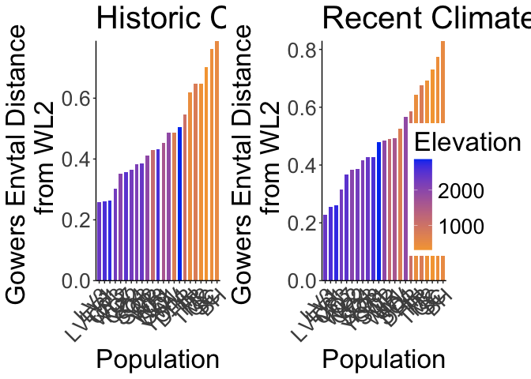
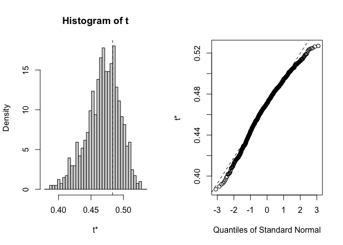
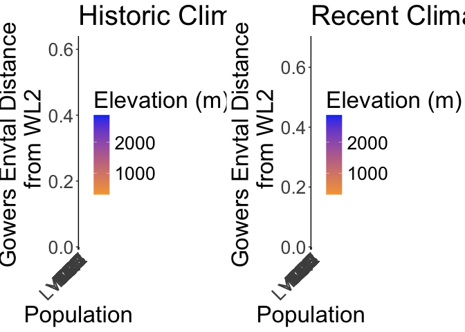
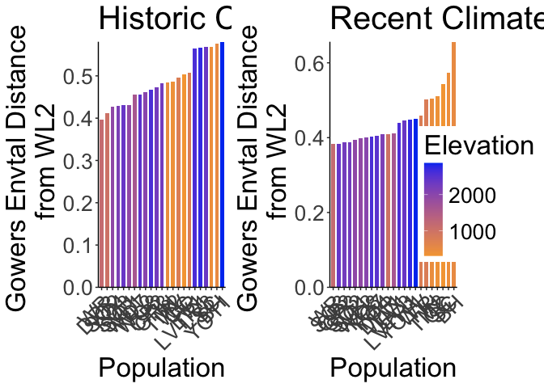
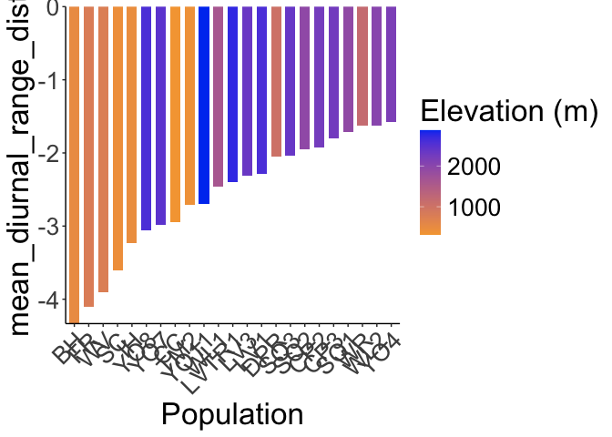
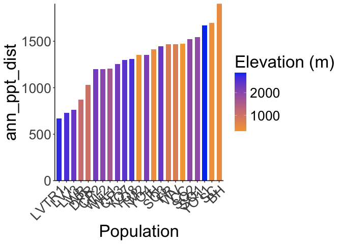
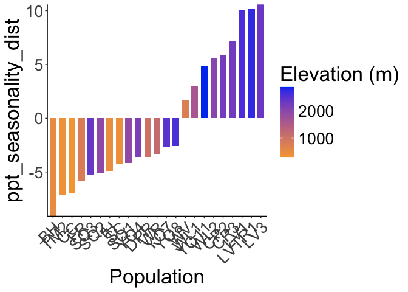
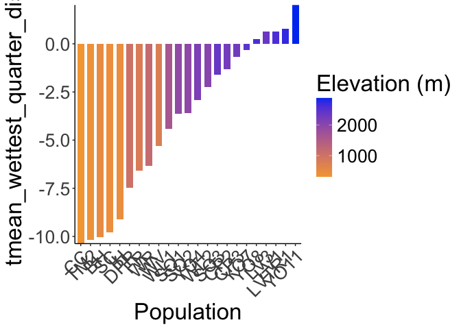
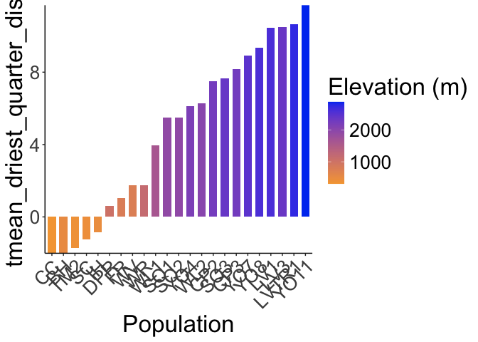
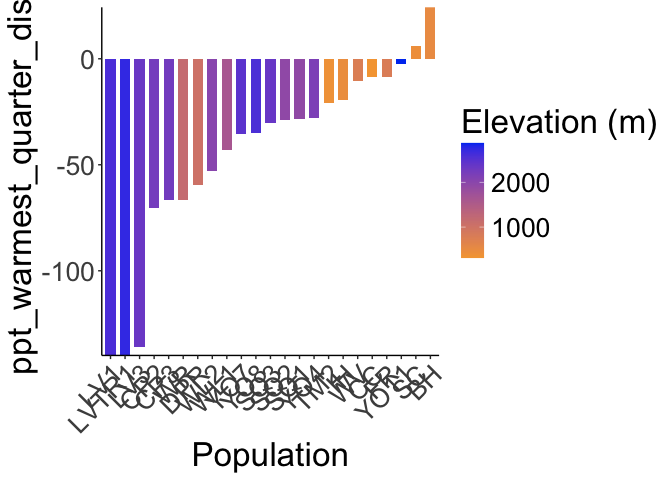

To Do: 
- Change to be full 2023 at WL2
- If do change it to the full year for the garden environment maybe should add in snowpack 


# Climate Distance at the WL2 Garden

Note, there is no air temperature data for WL2 in July 2023!! 
Add data for November and December once we get the data after snowmelt? 
- Reference growth season criteria 

## Relevant Libraries and Functions


``` r
library(raster)
```

```
## Loading required package: sp
```

``` r
library(tidyverse)
```

```
## ── Attaching core tidyverse packages ──────────────────────── tidyverse 2.0.0 ──
## ✔ dplyr     1.1.4     ✔ readr     2.1.5
## ✔ forcats   1.0.0     ✔ stringr   1.5.1
## ✔ ggplot2   3.5.1     ✔ tibble    3.2.1
## ✔ lubridate 1.9.3     ✔ tidyr     1.3.1
## ✔ purrr     1.0.2
```

```
## ── Conflicts ────────────────────────────────────────── tidyverse_conflicts() ──
## ✖ tidyr::extract() masks raster::extract()
## ✖ dplyr::filter()  masks stats::filter()
## ✖ dplyr::lag()     masks stats::lag()
## ✖ dplyr::select()  masks raster::select()
## ℹ Use the conflicted package (<http://conflicted.r-lib.org/>) to force all conflicts to become errors
```

``` r
library(conflicted)
conflicts_prefer(dplyr::select())
```

```
## [conflicted] Will prefer dplyr::select over any other package.
```

``` r
conflicts_prefer(dplyr::filter)
```

```
## [conflicted] Will prefer dplyr::filter over any other package.
```

``` r
library(ggrepel)
library(cowplot)
library(gridExtra)
library(naniar) #replaces values with NA
library(QBMS) #for function calc_biovars to calculate bioclim variables

sem <- function(x, na.rm=FALSE) {
  sd(x,na.rm=na.rm)/sqrt(length(na.omit(x)))
} #standard error function 

get_legend<-function(myggplot){
  tmp <- ggplot_gtable(ggplot_build(myggplot))
  leg <- which(sapply(tmp$grobs, function(x) x$name) == "guide-box")
  legend <- tmp$grobs[[leg]]
  return(legend)
} #legend function for grid_arrange

elev_three_palette <- c("#0043F0", "#C9727F", "#F5A540") #colors from Gremer et al 2019
elev_order <- c("High", "Mid", "Low")
```

## Home Climates

### Flint


``` r
pops_flint_avgs <- read_csv("../output/Climate/fullyear_FlintAvgs.csv")
```

```
## Rows: 46 Columns: 11
## ── Column specification ────────────────────────────────────────────────────────
## Delimiter: ","
## chr (3): parent.pop, elevation.group, TimePd
## dbl (8): elev_m, Lat, Long, cwd, pck, ppt, tmn, tmx
## 
## ℹ Use `spec()` to retrieve the full column specification for this data.
## ℹ Specify the column types or set `show_col_types = FALSE` to quiet this message.
```

``` r
head(pops_flint_avgs)
```

```
## # A tibble: 6 × 11
##   parent.pop elevation.group elev_m   Lat  Long   cwd    pck   ppt    tmn   tmx
##   <chr>      <chr>            <dbl> <dbl> <dbl> <dbl>  <dbl> <dbl>  <dbl> <dbl>
## 1 BH         Low               511.  37.4 -120.  75.9   0     48.5  8.93   23.6
## 2 CC         Low               313   39.6 -121.  59.9   0     84.3 10.0    23.3
## 3 CP2        High             2244.  38.7 -120.  62.9 218.   107.   1.18   13.4
## 4 CP3        High             2266.  38.7 -120.  46.2 236.   103.   0.529  12.6
## 5 DPR        Mid              1019.  39.2 -121.  27.5   7.63 121.   7.89   20.2
## 6 FR         Mid               787   40.0 -121.  75.5  14.1   84.9  5.70   20.1
## # ℹ 1 more variable: TimePd <chr>
```

``` r
unique(pops_flint_avgs$parent.pop) #only home pops
```

```
##  [1] "BH"    "CC"    "CP2"   "CP3"   "DPR"   "FR"    "IH"    "LV1"   "LV3"  
## [10] "LVTR1" "SC"    "SQ1"   "SQ2"   "SQ3"   "TM2"   "WL1"   "WL2"   "WR"   
## [19] "WV"    "YO11"  "YO4"   "YO7"   "YO8"
```

``` r
unique(pops_flint_avgs$TimePd) # recent and historical timeperiod 
```

```
## [1] "Recent"     "Historical"
```

``` r
pops_flint_recent_avgs <- pops_flint_avgs %>% filter(TimePd=="Recent")
head(pops_flint_recent_avgs)
```

```
## # A tibble: 6 × 11
##   parent.pop elevation.group elev_m   Lat  Long   cwd    pck   ppt    tmn   tmx
##   <chr>      <chr>            <dbl> <dbl> <dbl> <dbl>  <dbl> <dbl>  <dbl> <dbl>
## 1 BH         Low               511.  37.4 -120.  75.9   0     48.5  8.93   23.6
## 2 CC         Low               313   39.6 -121.  59.9   0     84.3 10.0    23.3
## 3 CP2        High             2244.  38.7 -120.  62.9 218.   107.   1.18   13.4
## 4 CP3        High             2266.  38.7 -120.  46.2 236.   103.   0.529  12.6
## 5 DPR        Mid              1019.  39.2 -121.  27.5   7.63 121.   7.89   20.2
## 6 FR         Mid               787   40.0 -121.  75.5  14.1   84.9  5.70   20.1
## # ℹ 1 more variable: TimePd <chr>
```

``` r
pops_flint_historic_avgs <-  pops_flint_avgs %>% filter(TimePd=="Historical")
head(pops_flint_historic_avgs)
```

```
## # A tibble: 6 × 11
##   parent.pop elevation.group elev_m   Lat  Long   cwd     pck   ppt    tmn   tmx
##   <chr>      <chr>            <dbl> <dbl> <dbl> <dbl>   <dbl> <dbl>  <dbl> <dbl>
## 1 BH         Low               511.  37.4 -120.  74.5 1.95e-2  48.3  7.74   22.9
## 2 CC         Low               313   39.6 -121.  59.7 7.93e-2  81.9  8.90   22.9
## 3 CP2        High             2244.  38.7 -120.  60.4 2.65e+2 110.  -0.305  12.5
## 4 CP3        High             2266.  38.7 -120.  43.8 2.82e+2 106.  -0.852  11.8
## 5 DPR        Mid              1019.  39.2 -121.  26.5 2.05e+1 120.   6.23   19.7
## 6 FR         Mid               787   40.0 -121.  74.0 1.92e+1  84.2  4.54   20.1
## # ℹ 1 more variable: TimePd <chr>
```

``` r
names(pops_flint_historic_avgs)
```

```
##  [1] "parent.pop"      "elevation.group" "elev_m"          "Lat"            
##  [5] "Long"            "cwd"             "pck"             "ppt"            
##  [9] "tmn"             "tmx"             "TimePd"
```

### BioClim


``` r
pops_bioclim_avgs <-  read_csv("../output/Climate/fullyear_BioClimAvgs.csv") 
```

```
## Rows: 46 Columns: 16
## ── Column specification ────────────────────────────────────────────────────────
## Delimiter: ","
## chr  (3): parent.pop, elevation.group, TimePd
## dbl (13): elev_m, Lat, Long, ann_tmean, mean_diurnal_range, temp_seasonality...
## 
## ℹ Use `spec()` to retrieve the full column specification for this data.
## ℹ Specify the column types or set `show_col_types = FALSE` to quiet this message.
```

``` r
head(pops_bioclim_avgs)
```

```
## # A tibble: 6 × 16
##   parent.pop elevation.group elev_m   Lat  Long ann_tmean mean_diurnal_range
##   <chr>      <chr>            <dbl> <dbl> <dbl>     <dbl>              <dbl>
## 1 BH         Low               511.  37.4 -120.     16.2                14.6
## 2 CC         Low               313   39.6 -121.     16.7                13.2
## 3 CP2        High             2244.  38.7 -120.      7.30               12.2
## 4 CP3        High             2266.  38.7 -120.      6.59               12.1
## 5 DPR        Mid              1019.  39.2 -121.     14.1                12.4
## 6 FR         Mid               787   40.0 -121.     12.9                14.4
## # ℹ 9 more variables: temp_seasonality <dbl>, temp_ann_range <dbl>,
## #   tmean_wettest_quarter <dbl>, tmean_driest_quarter <dbl>, ann_ppt <dbl>,
## #   ppt_seasonality <dbl>, ppt_warmest_quarter <dbl>,
## #   ppt_coldest_quarter <dbl>, TimePd <chr>
```

``` r
unique(pops_bioclim_avgs$parent.pop) #only home pops
```

```
##  [1] "BH"    "CC"    "CP2"   "CP3"   "DPR"   "FR"    "IH"    "LV1"   "LV3"  
## [10] "LVTR1" "SC"    "SQ1"   "SQ2"   "SQ3"   "TM2"   "WL1"   "WL2"   "WR"   
## [19] "WV"    "YO11"  "YO4"   "YO7"   "YO8"
```

``` r
unique(pops_bioclim_avgs$TimePd) # recent and historical timeperiod 
```

```
## [1] "Recent"     "Historical"
```

``` r
pops_bioclim_recent_avgs <- pops_bioclim_avgs %>%  filter(TimePd=="Recent")
head(pops_bioclim_recent_avgs)
```

```
## # A tibble: 6 × 16
##   parent.pop elevation.group elev_m   Lat  Long ann_tmean mean_diurnal_range
##   <chr>      <chr>            <dbl> <dbl> <dbl>     <dbl>              <dbl>
## 1 BH         Low               511.  37.4 -120.     16.2                14.6
## 2 CC         Low               313   39.6 -121.     16.7                13.2
## 3 CP2        High             2244.  38.7 -120.      7.30               12.2
## 4 CP3        High             2266.  38.7 -120.      6.59               12.1
## 5 DPR        Mid              1019.  39.2 -121.     14.1                12.4
## 6 FR         Mid               787   40.0 -121.     12.9                14.4
## # ℹ 9 more variables: temp_seasonality <dbl>, temp_ann_range <dbl>,
## #   tmean_wettest_quarter <dbl>, tmean_driest_quarter <dbl>, ann_ppt <dbl>,
## #   ppt_seasonality <dbl>, ppt_warmest_quarter <dbl>,
## #   ppt_coldest_quarter <dbl>, TimePd <chr>
```

``` r
pops_bioclim_historical_avgs <- pops_bioclim_avgs %>% filter(TimePd=="Historical")
head(pops_bioclim_historical_avgs)
```

```
## # A tibble: 6 × 16
##   parent.pop elevation.group elev_m   Lat  Long ann_tmean mean_diurnal_range
##   <chr>      <chr>            <dbl> <dbl> <dbl>     <dbl>              <dbl>
## 1 BH         Low               511.  37.4 -120.     15.3                15.2
## 2 CC         Low               313   39.6 -121.     15.9                14.0
## 3 CP2        High             2244.  38.7 -120.      6.11               12.8
## 4 CP3        High             2266.  38.7 -120.      5.45               12.6
## 5 DPR        Mid              1019.  39.2 -121.     13.0                13.5
## 6 FR         Mid               787   40.0 -121.     12.3                15.6
## # ℹ 9 more variables: temp_seasonality <dbl>, temp_ann_range <dbl>,
## #   tmean_wettest_quarter <dbl>, tmean_driest_quarter <dbl>, ann_ppt <dbl>,
## #   ppt_seasonality <dbl>, ppt_warmest_quarter <dbl>,
## #   ppt_coldest_quarter <dbl>, TimePd <chr>
```

``` r
names(pops_bioclim_historical_avgs)
```

```
##  [1] "parent.pop"            "elevation.group"       "elev_m"               
##  [4] "Lat"                   "Long"                  "ann_tmean"            
##  [7] "mean_diurnal_range"    "temp_seasonality"      "temp_ann_range"       
## [10] "tmean_wettest_quarter" "tmean_driest_quarter"  "ann_ppt"              
## [13] "ppt_seasonality"       "ppt_warmest_quarter"   "ppt_coldest_quarter"  
## [16] "TimePd"
```

## WL2 Climate Data (July 2023-Oct 2023)

### From Flint (changed this from Magney MetStation)

Per growth season code: Last month = snowpack. \> 70 mm OR pck > 0 and min temp < 0 OR min temp < -5 (moderate freeze)

``` r
WL2_climate <- read_csv("../output/Climate/flint_climate_UCDpops.csv") %>% 
  filter(parent.pop=="WL2_Garden") %>% 
  filter(year==2023) %>% 
  mutate(tavg = (tmn + tmx)/2, t_diurnal = (tmx-tmn))
```

```
## Rows: 38675 Columns: 14
## ── Column specification ────────────────────────────────────────────────────────
## Delimiter: ","
## chr  (3): parent.pop, elevation.group, month
## dbl (11): elev_m, Lat, Long, year, aet, cwd, pck, pet, ppt, tmn, tmx
## 
## ℹ Use `spec()` to retrieve the full column specification for this data.
## ℹ Specify the column types or set `show_col_types = FALSE` to quiet this message.
```

``` r
head(WL2_climate)
```

```
## # A tibble: 6 × 16
##   parent.pop elevation.group elev_m   Lat  Long  year month    aet   cwd    pck
##   <chr>      <chr>            <dbl> <dbl> <dbl> <dbl> <chr>  <dbl> <dbl>  <dbl>
## 1 WL2_Garden High              2020  38.8 -120.  2023 apr    41.5   46.4 1787. 
## 2 WL2_Garden High              2020  38.8 -120.  2023 aug   106.    43.8    0  
## 3 WL2_Garden High              2020  38.8 -120.  2023 dec     2.78  24.6   16.9
## 4 WL2_Garden High              2020  38.8 -120.  2023 feb     8.62  22.4 1422. 
## 5 WL2_Garden High              2020  38.8 -120.  2023 jan     7.23  16.4 1208. 
## 6 WL2_Garden High              2020  38.8 -120.  2023 jul    75.7  100.     0  
## # ℹ 6 more variables: pet <dbl>, ppt <dbl>, tmn <dbl>, tmx <dbl>, tavg <dbl>,
## #   t_diurnal <dbl>
```

``` r
summary(WL2_climate)
```

```
##   parent.pop        elevation.group        elev_m          Lat       
##  Length:12          Length:12          Min.   :2020   Min.   :38.83  
##  Class :character   Class :character   1st Qu.:2020   1st Qu.:38.83  
##  Mode  :character   Mode  :character   Median :2020   Median :38.83  
##                                        Mean   :2020   Mean   :38.83  
##                                        3rd Qu.:2020   3rd Qu.:38.83  
##                                        Max.   :2020   Max.   :38.83  
##       Long             year         month                aet        
##  Min.   :-120.3   Min.   :2023   Length:12          Min.   :  2.78  
##  1st Qu.:-120.3   1st Qu.:2023   Class :character   1st Qu.:  6.98  
##  Median :-120.3   Median :2023   Mode  :character   Median : 37.69  
##  Mean   :-120.3   Mean   :2023                      Mean   : 44.95  
##  3rd Qu.:-120.3   3rd Qu.:2023                      3rd Qu.: 78.27  
##  Max.   :-120.3   Max.   :2023                      Max.   :115.16  
##       cwd              pck              pet              ppt        
##  Min.   : 14.83   Min.   :   0.0   Min.   : 23.60   Min.   :  0.01  
##  1st Qu.: 24.06   1st Qu.:   0.0   1st Qu.: 34.08   1st Qu.: 36.49  
##  Median : 38.83   Median : 292.8   Median : 81.55   Median : 68.33  
##  Mean   : 42.14   Mean   : 690.0   Mean   : 87.09   Mean   :161.87  
##  3rd Qu.: 49.56   3rd Qu.:1323.9   3rd Qu.:134.12   3rd Qu.:175.70  
##  Max.   :100.37   Max.   :1986.3   Max.   :176.10   Max.   :604.81  
##       tmn              tmx             tavg          t_diurnal    
##  Min.   :-6.150   Min.   : 2.13   Min.   :-2.010   Min.   : 8.16  
##  1st Qu.:-2.510   1st Qu.: 6.76   1st Qu.: 2.500   1st Qu.: 9.42  
##  Median : 1.540   Median :11.87   Median : 6.660   Median :10.24  
##  Mean   : 2.315   Mean   :12.62   Mean   : 7.465   Mean   :10.30  
##  3rd Qu.: 6.145   3rd Qu.:17.52   3rd Qu.:11.832   3rd Qu.:11.32  
##  Max.   :13.220   Max.   :25.95   Max.   :19.585   Max.   :12.73
```

``` r
WL2_climate_growmos <- WL2_climate %>% 
  filter(month=="jul" | month=="aug" | month=="sep" | month=="oct" |
           month=="nov" | month=="dec") #included Dec as the "last month" per growth season code 

WL2_climate_flint <- WL2_climate %>% #get the means for the variables to compare to home sites 
  summarise(cwd_WL2=mean(cwd),ppt_WL2=mean(ppt), pck_WL2=mean(pck), tmn_WL2=mean(tmn), tmx_WL2=mean(tmx))
WL2_climate_flint
```

```
## # A tibble: 1 × 5
##   cwd_WL2 ppt_WL2 pck_WL2 tmn_WL2 tmx_WL2
##     <dbl>   <dbl>   <dbl>   <dbl>   <dbl>
## 1    42.1    162.    690.    2.32    12.6
```

## WL2 Climate Trends

``` r
WL2_climate$month <- factor(WL2_climate$month, levels = c("jan", "feb", "mar", "apr", "may", "jun", "jul", "aug", "sep", "oct","nov","dec"))

WL2_climate %>% 
  ggplot(aes(x=month,y=cwd)) +
  geom_point()
```

<!-- -->

``` r
WL2_climate %>% 
  ggplot(aes(x=month,y=pck)) +
  geom_point() +
  facet_wrap(~year)
```

<!-- -->

``` r
WL2_climate %>% 
  ggplot(aes(x=month,y=tmx)) +
  geom_point()
```

<!-- -->

``` r
WL2_climate %>% 
  ggplot(aes(x=month,y=tmn)) +
  geom_point()
```

<!-- -->

``` r
WL2_climate %>% 
  ggplot(aes(x=month,y=ppt)) +
  geom_point()
```

<!-- -->


### BioClim

#### Prep

``` r
wl2_bioclim_allyear_prep <- WL2_climate %>% 
  rename(tmin=tmn, tmax=tmx) %>% #rename columns to match what calc_biovars expects
  arrange(parent.pop, year, month)
```

### Calculation

``` r
wl2_bioclim_all_year <- wl2_bioclim_allyear_prep %>% calc_biovars() 
```

#### SUBSET

``` r
wl2_bioclim_all_year_final <- wl2_bioclim_all_year %>% 
  select(ann_tmean_WL2=bio1, mean_diurnal_range_WL2=bio2, 
         temp_seasonality_WL2=bio4, temp_ann_range_WL2=bio7, tmean_wettest_quarter_WL2=bio8,
         tmean_driest_quarter_WL2=bio9, ann_ppt_WL2=bio12, ppt_seasonality_WL2=bio15,
         ppt_warmest_quarter_WL2=bio18, ppt_coldest_quarter_WL2=bio19) 
wl2_bioclim_all_year_final
```

```
##   ann_tmean_WL2 mean_diurnal_range_WL2 temp_seasonality_WL2 temp_ann_range_WL2
## 1      7.465417               10.30083             721.2594               32.1
##   tmean_wettest_quarter_WL2 tmean_driest_quarter_WL2 ann_ppt_WL2
## 1                 -1.256667                 16.93833     1942.41
##   ppt_seasonality_WL2 ppt_warmest_quarter_WL2 ppt_coldest_quarter_WL2
## 1            128.8321                   88.98                  1413.4
```


## Gower's Climate Distance

(1/P) \* SUM ((absolute value(Ai - Bi)) / range(i)) for each variable

-   P = number of environmental variables = 13 (without CWD)

-   Ai = 30 year avg of that variable for the home site

-   Bi = July 2023-Dec 2023 avg of that variable for the WL2 garden

-   Range(i) = maximum - minimum of that variable in the whole data set
    (across sites)

### Combine the flint and bioclim variables 


``` r
WL2_climate_all <- bind_cols(WL2_climate_flint, wl2_bioclim_all_year_final)
dim(WL2_climate_all)
```

```
## [1]  1 15
```

``` r
home_climates_all_recent <- left_join(pops_flint_recent_avgs, pops_bioclim_recent_avgs)
```

```
## Joining with `by = join_by(parent.pop, elevation.group, elev_m, Lat, Long,
## TimePd)`
```

``` r
home_climates_all_historic <- left_join(pops_flint_historic_avgs, pops_bioclim_historical_avgs)
```

```
## Joining with `by = join_by(parent.pop, elevation.group, elev_m, Lat, Long,
## TimePd)`
```

``` r
WL2_home_climate_recent <- bind_cols(WL2_climate_all, home_climates_all_recent)
summary(WL2_home_climate_recent)
```

```
##     cwd_WL2         ppt_WL2         pck_WL2       tmn_WL2         tmx_WL2     
##  Min.   :42.14   Min.   :161.9   Min.   :690   Min.   :2.315   Min.   :12.62  
##  1st Qu.:42.14   1st Qu.:161.9   1st Qu.:690   1st Qu.:2.315   1st Qu.:12.62  
##  Median :42.14   Median :161.9   Median :690   Median :2.315   Median :12.62  
##  Mean   :42.14   Mean   :161.9   Mean   :690   Mean   :2.315   Mean   :12.62  
##  3rd Qu.:42.14   3rd Qu.:161.9   3rd Qu.:690   3rd Qu.:2.315   3rd Qu.:12.62  
##  Max.   :42.14   Max.   :161.9   Max.   :690   Max.   :2.315   Max.   :12.62  
##  ann_tmean_WL2   mean_diurnal_range_WL2 temp_seasonality_WL2 temp_ann_range_WL2
##  Min.   :7.465   Min.   :10.3           Min.   :721.3        Min.   :32.1      
##  1st Qu.:7.465   1st Qu.:10.3           1st Qu.:721.3        1st Qu.:32.1      
##  Median :7.465   Median :10.3           Median :721.3        Median :32.1      
##  Mean   :7.465   Mean   :10.3           Mean   :721.3        Mean   :32.1      
##  3rd Qu.:7.465   3rd Qu.:10.3           3rd Qu.:721.3        3rd Qu.:32.1      
##  Max.   :7.465   Max.   :10.3           Max.   :721.3        Max.   :32.1      
##  tmean_wettest_quarter_WL2 tmean_driest_quarter_WL2  ann_ppt_WL2  
##  Min.   :-1.257            Min.   :16.94            Min.   :1942  
##  1st Qu.:-1.257            1st Qu.:16.94            1st Qu.:1942  
##  Median :-1.257            Median :16.94            Median :1942  
##  Mean   :-1.257            Mean   :16.94            Mean   :1942  
##  3rd Qu.:-1.257            3rd Qu.:16.94            3rd Qu.:1942  
##  Max.   :-1.257            Max.   :16.94            Max.   :1942  
##  ppt_seasonality_WL2 ppt_warmest_quarter_WL2 ppt_coldest_quarter_WL2
##  Min.   :128.8       Min.   :88.98           Min.   :1413           
##  1st Qu.:128.8       1st Qu.:88.98           1st Qu.:1413           
##  Median :128.8       Median :88.98           Median :1413           
##  Mean   :128.8       Mean   :88.98           Mean   :1413           
##  3rd Qu.:128.8       3rd Qu.:88.98           3rd Qu.:1413           
##  Max.   :128.8       Max.   :88.98           Max.   :1413           
##   parent.pop        elevation.group        elev_m            Lat       
##  Length:23          Length:23          Min.   : 313.0   Min.   :36.56  
##  Class :character   Class :character   1st Qu.: 767.9   1st Qu.:37.81  
##  Mode  :character   Mode  :character   Median :1934.5   Median :38.79  
##                                        Mean   :1649.7   Mean   :38.74  
##                                        3rd Qu.:2363.4   3rd Qu.:39.59  
##                                        Max.   :2872.3   Max.   :40.74  
##       Long             cwd             pck              ppt        
##  Min.   :-123.0   Min.   :27.53   Min.   :  0.00   Min.   : 48.50  
##  1st Qu.:-121.3   1st Qu.:49.57   1st Qu.: 10.88   1st Qu.: 84.64  
##  Median :-120.3   Median :55.94   Median : 65.18   Median : 94.31  
##  Mean   :-120.4   Mean   :56.19   Mean   :136.70   Mean   : 99.04  
##  3rd Qu.:-119.7   3rd Qu.:61.78   3rd Qu.:225.93   3rd Qu.:107.40  
##  Max.   :-118.8   Max.   :75.87   Max.   :453.99   Max.   :151.23  
##       tmn                tmx           TimePd            ann_tmean     
##  Min.   :-2.57564   Min.   :10.42   Length:23          Min.   : 3.923  
##  1st Qu.:-0.05428   1st Qu.:12.65   Class :character   1st Qu.: 6.298  
##  Median : 3.41272   Median :15.68   Mode  :character   Median : 9.545  
##  Mean   : 3.61545   Mean   :16.50                      Mean   :10.059  
##  3rd Qu.: 7.50051   3rd Qu.:20.18                      3rd Qu.:13.572  
##  Max.   :10.03667   Max.   :23.57                      Max.   :16.660  
##  mean_diurnal_range temp_seasonality temp_ann_range  tmean_wettest_quarter
##  Min.   :11.88      Min.   :647.3    Min.   :30.67   Min.   :-1.6558      
##  1st Qu.:12.25      1st Qu.:666.4    1st Qu.:31.55   1st Qu.: 0.2719      
##  Median :12.71      Median :686.0    Median :31.74   Median : 3.4503      
##  Mean   :12.89      Mean   :681.9    Mean   :31.99   Mean   : 3.9105      
##  3rd Qu.:13.33      3rd Qu.:694.1    3rd Qu.:32.06   3rd Qu.: 7.3811      
##  Max.   :14.64      Max.   :719.8    Max.   :34.27   Max.   :10.3001      
##  tmean_driest_quarter    ann_ppt     ppt_seasonality ppt_warmest_quarter
##  Min.   : 6.672       Min.   : 582   Min.   :108.1   Min.   : 47.65     
##  1st Qu.: 9.622       1st Qu.:1016   1st Qu.:115.0   1st Qu.: 91.04     
##  Median :12.628       Median :1132   Median :122.9   Median :100.25     
##  Mean   :13.267       Mean   :1188   Mean   :119.7   Mean   :110.72     
##  3rd Qu.:16.829       3rd Qu.:1289   3rd Qu.:123.9   3rd Qu.:125.81     
##  Max.   :19.894       Max.   :1815   Max.   :130.2   Max.   :187.23     
##  ppt_coldest_quarter
##  Min.   :329.3      
##  1st Qu.:550.5      
##  Median :622.8      
##  Mean   :620.1      
##  3rd Qu.:656.0      
##  Max.   :860.6
```

``` r
WL2_home_climate_historic <- bind_cols(WL2_climate_all, home_climates_all_historic)
summary(WL2_home_climate_historic)
```

```
##     cwd_WL2         ppt_WL2         pck_WL2       tmn_WL2         tmx_WL2     
##  Min.   :42.14   Min.   :161.9   Min.   :690   Min.   :2.315   Min.   :12.62  
##  1st Qu.:42.14   1st Qu.:161.9   1st Qu.:690   1st Qu.:2.315   1st Qu.:12.62  
##  Median :42.14   Median :161.9   Median :690   Median :2.315   Median :12.62  
##  Mean   :42.14   Mean   :161.9   Mean   :690   Mean   :2.315   Mean   :12.62  
##  3rd Qu.:42.14   3rd Qu.:161.9   3rd Qu.:690   3rd Qu.:2.315   3rd Qu.:12.62  
##  Max.   :42.14   Max.   :161.9   Max.   :690   Max.   :2.315   Max.   :12.62  
##  ann_tmean_WL2   mean_diurnal_range_WL2 temp_seasonality_WL2 temp_ann_range_WL2
##  Min.   :7.465   Min.   :10.3           Min.   :721.3        Min.   :32.1      
##  1st Qu.:7.465   1st Qu.:10.3           1st Qu.:721.3        1st Qu.:32.1      
##  Median :7.465   Median :10.3           Median :721.3        Median :32.1      
##  Mean   :7.465   Mean   :10.3           Mean   :721.3        Mean   :32.1      
##  3rd Qu.:7.465   3rd Qu.:10.3           3rd Qu.:721.3        3rd Qu.:32.1      
##  Max.   :7.465   Max.   :10.3           Max.   :721.3        Max.   :32.1      
##  tmean_wettest_quarter_WL2 tmean_driest_quarter_WL2  ann_ppt_WL2  
##  Min.   :-1.257            Min.   :16.94            Min.   :1942  
##  1st Qu.:-1.257            1st Qu.:16.94            1st Qu.:1942  
##  Median :-1.257            Median :16.94            Median :1942  
##  Mean   :-1.257            Mean   :16.94            Mean   :1942  
##  3rd Qu.:-1.257            3rd Qu.:16.94            3rd Qu.:1942  
##  Max.   :-1.257            Max.   :16.94            Max.   :1942  
##  ppt_seasonality_WL2 ppt_warmest_quarter_WL2 ppt_coldest_quarter_WL2
##  Min.   :128.8       Min.   :88.98           Min.   :1413           
##  1st Qu.:128.8       1st Qu.:88.98           1st Qu.:1413           
##  Median :128.8       Median :88.98           Median :1413           
##  Mean   :128.8       Mean   :88.98           Mean   :1413           
##  3rd Qu.:128.8       3rd Qu.:88.98           3rd Qu.:1413           
##  Max.   :128.8       Max.   :88.98           Max.   :1413           
##   parent.pop        elevation.group        elev_m            Lat       
##  Length:23          Length:23          Min.   : 313.0   Min.   :36.56  
##  Class :character   Class :character   1st Qu.: 767.9   1st Qu.:37.81  
##  Mode  :character   Mode  :character   Median :1934.5   Median :38.79  
##                                        Mean   :1649.7   Mean   :38.74  
##                                        3rd Qu.:2363.4   3rd Qu.:39.59  
##                                        Max.   :2872.3   Max.   :40.74  
##       Long             cwd             pck                ppt        
##  Min.   :-123.0   Min.   :26.47   Min.   :  0.0195   Min.   : 48.25  
##  1st Qu.:-121.3   1st Qu.:47.93   1st Qu.: 19.8433   1st Qu.: 84.22  
##  Median :-120.3   Median :52.70   Median : 86.8927   Median : 94.60  
##  Mean   :-120.4   Mean   :53.88   Mean   :161.6397   Mean   : 99.71  
##  3rd Qu.:-119.7   3rd Qu.:60.04   3rd Qu.:266.3463   3rd Qu.:107.97  
##  Max.   :-118.8   Max.   :74.53   Max.   :529.1297   Max.   :154.83  
##       tmn              tmx            TimePd            ann_tmean     
##  Min.   :-4.694   Min.   : 9.685   Length:23          Min.   : 2.496  
##  1st Qu.:-1.402   1st Qu.:11.708   Class :character   1st Qu.: 5.153  
##  Median : 2.027   Median :14.359   Mode  :character   Median : 8.193  
##  Mean   : 2.121   Mean   :15.762                      Mean   : 8.942  
##  3rd Qu.: 5.722   3rd Qu.:19.896                      3rd Qu.:12.640  
##  Max.   : 8.898   Max.   :22.948                      Max.   :15.919  
##  mean_diurnal_range temp_seasonality temp_ann_range  tmean_wettest_quarter
##  Min.   :12.18      Min.   :638.7    Min.   :30.59   Min.   :-3.350       
##  1st Qu.:12.73      1st Qu.:650.4    1st Qu.:31.66   1st Qu.:-0.519       
##  Median :13.79      Median :662.1    Median :32.53   Median : 2.350       
##  Mean   :13.64      Mean   :663.3    Mean   :32.64   Mean   : 3.045       
##  3rd Qu.:14.10      3rd Qu.:671.7    3rd Qu.:33.30   3rd Qu.: 6.087       
##  Max.   :15.56      Max.   :718.9    Max.   :35.29   Max.   : 9.625       
##  tmean_driest_quarter    ann_ppt     ppt_seasonality ppt_warmest_quarter
##  Min.   : 5.388       Min.   : 579   Min.   :104.4   Min.   : 64.71     
##  1st Qu.: 8.519       1st Qu.:1011   1st Qu.:108.1   1st Qu.:103.40     
##  Median :11.322       Median :1135   Median :115.8   Median :117.04     
##  Mean   :12.303       Mean   :1197   Mean   :114.0   Mean   :129.93     
##  3rd Qu.:16.264       3rd Qu.:1296   3rd Qu.:118.9   3rd Qu.:148.38     
##  Max.   :19.303       Max.   :1858   Max.   :122.8   Max.   :228.91     
##  ppt_coldest_quarter
##  Min.   :285.3      
##  1st Qu.:511.0      
##  Median :581.0      
##  Mean   :579.6      
##  3rd Qu.:627.3      
##  Max.   :802.3
```

### Figure out the range for each variable 


``` r
WL2_range_prep <- WL2_climate_all %>% 
  mutate(parent.pop="WL2_Garden") %>% 
  rename_with(~str_remove(., "_WL2"), everything())
```


#### Recent

``` r
range_merge_recent <- bind_rows(home_climates_all_recent, WL2_range_prep)
names(range_merge_recent)
```

```
##  [1] "parent.pop"            "elevation.group"       "elev_m"               
##  [4] "Lat"                   "Long"                  "cwd"                  
##  [7] "pck"                   "ppt"                   "tmn"                  
## [10] "tmx"                   "TimePd"                "ann_tmean"            
## [13] "mean_diurnal_range"    "temp_seasonality"      "temp_ann_range"       
## [16] "tmean_wettest_quarter" "tmean_driest_quarter"  "ann_ppt"              
## [19] "ppt_seasonality"       "ppt_warmest_quarter"   "ppt_coldest_quarter"
```

``` r
summary(range_merge_recent)
```

```
##   parent.pop        elevation.group        elev_m            Lat       
##  Length:24          Length:24          Min.   : 313.0   Min.   :36.56  
##  Class :character   Class :character   1st Qu.: 767.9   1st Qu.:37.81  
##  Mode  :character   Mode  :character   Median :1934.5   Median :38.79  
##                                        Mean   :1649.7   Mean   :38.74  
##                                        3rd Qu.:2363.4   3rd Qu.:39.59  
##                                        Max.   :2872.3   Max.   :40.74  
##                                        NA's   :1        NA's   :1      
##       Long             cwd             pck              ppt        
##  Min.   :-123.0   Min.   :27.53   Min.   :  0.00   Min.   : 48.50  
##  1st Qu.:-121.3   1st Qu.:48.54   1st Qu.: 12.51   1st Qu.: 84.79  
##  Median :-120.3   Median :55.85   Median : 98.42   Median : 96.24  
##  Mean   :-120.4   Mean   :55.61   Mean   :159.76   Mean   :101.65  
##  3rd Qu.:-119.7   3rd Qu.:61.21   3rd Qu.:234.57   3rd Qu.:110.89  
##  Max.   :-118.8   Max.   :75.87   Max.   :690.04   Max.   :161.87  
##  NA's   :1                                                         
##       tmn               tmx           TimePd            ann_tmean     
##  Min.   :-2.5756   Min.   :10.42   Length:24          Min.   : 3.923  
##  1st Qu.: 0.2372   1st Qu.:12.64   Class :character   1st Qu.: 6.442  
##  Median : 3.0166   Median :15.11   Mode  :character   Median : 9.056  
##  Mean   : 3.5613   Mean   :16.34                      Mean   : 9.951  
##  3rd Qu.: 7.3072   3rd Qu.:20.15                      3rd Qu.:13.326  
##  Max.   :10.0367   Max.   :23.57                      Max.   :16.660  
##                                                                       
##  mean_diurnal_range temp_seasonality temp_ann_range  tmean_wettest_quarter
##  Min.   :10.30      Min.   :647.3    Min.   :30.67   Min.   :-1.65583     
##  1st Qu.:12.20      1st Qu.:666.6    1st Qu.:31.55   1st Qu.:-0.08265     
##  Median :12.66      Median :686.7    Median :31.75   Median : 2.98958     
##  Mean   :12.78      Mean   :683.5    Mean   :31.99   Mean   : 3.69517     
##  3rd Qu.:13.31      3rd Qu.:696.5    3rd Qu.:32.10   3rd Qu.: 7.12926     
##  Max.   :14.64      Max.   :721.3    Max.   :34.27   Max.   :10.30006     
##                                                                           
##  tmean_driest_quarter    ann_ppt     ppt_seasonality ppt_warmest_quarter
##  Min.   : 6.672       Min.   : 582   Min.   :108.1   Min.   : 47.65     
##  1st Qu.: 9.889       1st Qu.:1017   1st Qu.:115.0   1st Qu.: 89.52     
##  Median :12.795       Median :1155   Median :123.1   Median : 99.21     
##  Mean   :13.420       Mean   :1220   Mean   :120.1   Mean   :109.81     
##  3rd Qu.:17.041       3rd Qu.:1331   3rd Qu.:124.0   3rd Qu.:124.94     
##  Max.   :19.894       Max.   :1942   Max.   :130.2   Max.   :187.23     
##                                                                         
##  ppt_coldest_quarter
##  Min.   : 329.3     
##  1st Qu.: 551.7     
##  Median : 623.5     
##  Mean   : 653.2     
##  3rd Qu.: 686.4     
##  Max.   :1413.4     
## 
```

``` r
unique(range_merge_recent$parent.pop)
```

```
##  [1] "BH"         "CC"         "CP2"        "CP3"        "DPR"       
##  [6] "FR"         "IH"         "LV1"        "LV3"        "LVTR1"     
## [11] "SC"         "SQ1"        "SQ2"        "SQ3"        "TM2"       
## [16] "WL1"        "WL2"        "WR"         "WV"         "YO11"      
## [21] "YO4"        "YO7"        "YO8"        "WL2_Garden"
```

``` r
WL2_home_climate_ranges_recent <- range_merge_recent %>% 
  summarise(cwd_range=max(cwd)-min(cwd),
            pck_range=max(pck)-min(pck),
            ppt_range=max(ppt)-min(ppt), 
            tmn_range=max(tmn)-min(tmn), 
            tmx_range=max(tmx)-min(tmx), 
            ann_tmean_range=max(ann_tmean)-min(ann_tmean),
            mean_diurnal_range_range=max(mean_diurnal_range)-min(mean_diurnal_range),
            temp_seasonality_range=max(temp_seasonality)-min(temp_seasonality),
            temp_ann_range_range=max(temp_ann_range)-min(temp_ann_range),
            tmean_wettest_quarter_range=max(tmean_wettest_quarter)-min(tmean_wettest_quarter),
            tmean_driest_quarter_range=max(tmean_driest_quarter)-min(tmean_driest_quarter),
            ann_ppt_range=max(ann_ppt)-min(ann_ppt), 
            ppt_seasonality_range=max(ppt_seasonality)-min(ppt_seasonality),
            ppt_warmest_quarter_range=max(ppt_warmest_quarter)-min(ppt_warmest_quarter), 
            ppt_coldest_quarter_range=max(ppt_coldest_quarter)-min(ppt_coldest_quarter))
WL2_home_climate_ranges_recent
```

```
## # A tibble: 1 × 15
##   cwd_range pck_range ppt_range tmn_range tmx_range ann_tmean_range
##       <dbl>     <dbl>     <dbl>     <dbl>     <dbl>           <dbl>
## 1      48.3      690.      113.      12.6      13.1            12.7
## # ℹ 9 more variables: mean_diurnal_range_range <dbl>,
## #   temp_seasonality_range <dbl>, temp_ann_range_range <dbl>,
## #   tmean_wettest_quarter_range <dbl>, tmean_driest_quarter_range <dbl>,
## #   ann_ppt_range <dbl>, ppt_seasonality_range <dbl>,
## #   ppt_warmest_quarter_range <dbl>, ppt_coldest_quarter_range <dbl>
```

``` r
WL2_home_climate_with_ranges_recent <- bind_cols(WL2_home_climate_recent, WL2_home_climate_ranges_recent)
names(WL2_home_climate_with_ranges_recent)
```

```
##  [1] "cwd_WL2"                     "ppt_WL2"                    
##  [3] "pck_WL2"                     "tmn_WL2"                    
##  [5] "tmx_WL2"                     "ann_tmean_WL2"              
##  [7] "mean_diurnal_range_WL2"      "temp_seasonality_WL2"       
##  [9] "temp_ann_range_WL2"          "tmean_wettest_quarter_WL2"  
## [11] "tmean_driest_quarter_WL2"    "ann_ppt_WL2"                
## [13] "ppt_seasonality_WL2"         "ppt_warmest_quarter_WL2"    
## [15] "ppt_coldest_quarter_WL2"     "parent.pop"                 
## [17] "elevation.group"             "elev_m"                     
## [19] "Lat"                         "Long"                       
## [21] "cwd"                         "pck"                        
## [23] "ppt"                         "tmn"                        
## [25] "tmx"                         "TimePd"                     
## [27] "ann_tmean"                   "mean_diurnal_range"         
## [29] "temp_seasonality"            "temp_ann_range"             
## [31] "tmean_wettest_quarter"       "tmean_driest_quarter"       
## [33] "ann_ppt"                     "ppt_seasonality"            
## [35] "ppt_warmest_quarter"         "ppt_coldest_quarter"        
## [37] "cwd_range"                   "pck_range"                  
## [39] "ppt_range"                   "tmn_range"                  
## [41] "tmx_range"                   "ann_tmean_range"            
## [43] "mean_diurnal_range_range"    "temp_seasonality_range"     
## [45] "temp_ann_range_range"        "tmean_wettest_quarter_range"
## [47] "tmean_driest_quarter_range"  "ann_ppt_range"              
## [49] "ppt_seasonality_range"       "ppt_warmest_quarter_range"  
## [51] "ppt_coldest_quarter_range"
```

#### Historic

``` r
range_merge_historic <- bind_rows(home_climates_all_historic, WL2_range_prep)
names(range_merge_historic)
```

```
##  [1] "parent.pop"            "elevation.group"       "elev_m"               
##  [4] "Lat"                   "Long"                  "cwd"                  
##  [7] "pck"                   "ppt"                   "tmn"                  
## [10] "tmx"                   "TimePd"                "ann_tmean"            
## [13] "mean_diurnal_range"    "temp_seasonality"      "temp_ann_range"       
## [16] "tmean_wettest_quarter" "tmean_driest_quarter"  "ann_ppt"              
## [19] "ppt_seasonality"       "ppt_warmest_quarter"   "ppt_coldest_quarter"
```

``` r
summary(range_merge_historic)
```

```
##   parent.pop        elevation.group        elev_m            Lat       
##  Length:24          Length:24          Min.   : 313.0   Min.   :36.56  
##  Class :character   Class :character   1st Qu.: 767.9   1st Qu.:37.81  
##  Mode  :character   Mode  :character   Median :1934.5   Median :38.79  
##                                        Mean   :1649.7   Mean   :38.74  
##                                        3rd Qu.:2363.4   3rd Qu.:39.59  
##                                        Max.   :2872.3   Max.   :40.74  
##                                        NA's   :1        NA's   :1      
##       Long             cwd             pck                ppt        
##  Min.   :-123.0   Min.   :26.47   Min.   :  0.0195   Min.   : 48.25  
##  1st Qu.:-121.3   1st Qu.:45.90   1st Qu.: 20.1582   1st Qu.: 84.22  
##  Median :-120.3   Median :52.34   Median :119.0351   Median : 97.43  
##  Mean   :-120.4   Mean   :53.39   Mean   :183.6564   Mean   :102.30  
##  3rd Qu.:-119.7   3rd Qu.:59.85   3rd Qu.:271.3576   3rd Qu.:112.57  
##  Max.   :-118.8   Max.   :74.53   Max.   :690.0425   Max.   :161.87  
##  NA's   :1                                                           
##       tmn              tmx            TimePd            ann_tmean     
##  Min.   :-4.694   Min.   : 9.685   Length:24          Min.   : 2.496  
##  1st Qu.:-1.127   1st Qu.:11.735   Class :character   1st Qu.: 5.304  
##  Median : 2.072   Median :14.055   Mode  :character   Median : 7.829  
##  Mean   : 2.129   Mean   :15.631                      Mean   : 8.880  
##  3rd Qu.: 5.469   3rd Qu.:19.792                      3rd Qu.:12.481  
##  Max.   : 8.898   Max.   :22.948                      Max.   :15.919  
##                                                                       
##  mean_diurnal_range temp_seasonality temp_ann_range  tmean_wettest_quarter
##  Min.   :10.30      Min.   :638.7    Min.   :30.59   Min.   :-3.3496      
##  1st Qu.:12.63      1st Qu.:650.8    1st Qu.:31.69   1st Qu.:-0.8509      
##  Median :13.70      Median :662.5    Median :32.45   Median : 2.0060      
##  Mean   :13.50      Mean   :665.7    Mean   :32.61   Mean   : 2.8660      
##  3rd Qu.:14.07      3rd Qu.:671.9    3rd Qu.:33.28   3rd Qu.: 5.9081      
##  Max.   :15.56      Max.   :721.3    Max.   :35.29   Max.   : 9.6246      
##                                                                           
##  tmean_driest_quarter    ann_ppt     ppt_seasonality ppt_warmest_quarter
##  Min.   : 5.388       Min.   : 579   Min.   :104.4   Min.   : 64.71     
##  1st Qu.: 8.670       1st Qu.:1011   1st Qu.:108.3   1st Qu.: 99.10     
##  Median :11.347       Median :1169   Median :115.9   Median :116.95     
##  Mean   :12.496       Mean   :1228   Mean   :114.6   Mean   :128.23     
##  3rd Qu.:16.634       3rd Qu.:1351   3rd Qu.:118.9   3rd Qu.:148.35     
##  Max.   :19.303       Max.   :1942   Max.   :128.8   Max.   :228.91     
##                                                                         
##  ppt_coldest_quarter
##  Min.   : 285.3     
##  1st Qu.: 513.9     
##  Median : 593.2     
##  Mean   : 614.4     
##  3rd Qu.: 659.8     
##  Max.   :1413.4     
## 
```

``` r
WL2_home_climate_ranges_historic <- range_merge_historic %>% 
  summarise(cwd_range=max(cwd)-min(cwd),
            pck_range=max(pck)-min(pck),
            ppt_range=max(ppt)-min(ppt), 
            tmn_range=max(tmn)-min(tmn), 
            tmx_range=max(tmx)-min(tmx), 
            ann_tmean_range=max(ann_tmean)-min(ann_tmean),
            mean_diurnal_range_range=max(mean_diurnal_range)-min(mean_diurnal_range),
            temp_seasonality_range=max(temp_seasonality)-min(temp_seasonality),
            temp_ann_range_range=max(temp_ann_range)-min(temp_ann_range),
            tmean_wettest_quarter_range=max(tmean_wettest_quarter)-min(tmean_wettest_quarter),
            tmean_driest_quarter_range=max(tmean_driest_quarter)-min(tmean_driest_quarter),
            ann_ppt_range=max(ann_ppt)-min(ann_ppt), 
            ppt_seasonality_range=max(ppt_seasonality)-min(ppt_seasonality),
            ppt_warmest_quarter_range=max(ppt_warmest_quarter)-min(ppt_warmest_quarter), 
            ppt_coldest_quarter_range=max(ppt_coldest_quarter)-min(ppt_coldest_quarter))
WL2_home_climate_ranges_historic
```

```
## # A tibble: 1 × 15
##   cwd_range pck_range ppt_range tmn_range tmx_range ann_tmean_range
##       <dbl>     <dbl>     <dbl>     <dbl>     <dbl>           <dbl>
## 1      48.1      690.      114.      13.6      13.3            13.4
## # ℹ 9 more variables: mean_diurnal_range_range <dbl>,
## #   temp_seasonality_range <dbl>, temp_ann_range_range <dbl>,
## #   tmean_wettest_quarter_range <dbl>, tmean_driest_quarter_range <dbl>,
## #   ann_ppt_range <dbl>, ppt_seasonality_range <dbl>,
## #   ppt_warmest_quarter_range <dbl>, ppt_coldest_quarter_range <dbl>
```

``` r
WL2_home_climate_with_ranges_historic <- bind_cols(WL2_home_climate_historic, WL2_home_climate_ranges_historic)
names(WL2_home_climate_with_ranges_historic)
```

```
##  [1] "cwd_WL2"                     "ppt_WL2"                    
##  [3] "pck_WL2"                     "tmn_WL2"                    
##  [5] "tmx_WL2"                     "ann_tmean_WL2"              
##  [7] "mean_diurnal_range_WL2"      "temp_seasonality_WL2"       
##  [9] "temp_ann_range_WL2"          "tmean_wettest_quarter_WL2"  
## [11] "tmean_driest_quarter_WL2"    "ann_ppt_WL2"                
## [13] "ppt_seasonality_WL2"         "ppt_warmest_quarter_WL2"    
## [15] "ppt_coldest_quarter_WL2"     "parent.pop"                 
## [17] "elevation.group"             "elev_m"                     
## [19] "Lat"                         "Long"                       
## [21] "cwd"                         "pck"                        
## [23] "ppt"                         "tmn"                        
## [25] "tmx"                         "TimePd"                     
## [27] "ann_tmean"                   "mean_diurnal_range"         
## [29] "temp_seasonality"            "temp_ann_range"             
## [31] "tmean_wettest_quarter"       "tmean_driest_quarter"       
## [33] "ann_ppt"                     "ppt_seasonality"            
## [35] "ppt_warmest_quarter"         "ppt_coldest_quarter"        
## [37] "cwd_range"                   "pck_range"                  
## [39] "ppt_range"                   "tmn_range"                  
## [41] "tmx_range"                   "ann_tmean_range"            
## [43] "mean_diurnal_range_range"    "temp_seasonality_range"     
## [45] "temp_ann_range_range"        "tmean_wettest_quarter_range"
## [47] "tmean_driest_quarter_range"  "ann_ppt_range"              
## [49] "ppt_seasonality_range"       "ppt_warmest_quarter_range"  
## [51] "ppt_coldest_quarter_range"
```

### Recent Gowers Calc

``` r
gowers_calc_each_var_recent <- WL2_home_climate_with_ranges_recent %>% 
  mutate(cwd_gowers=abs(cwd_WL2-cwd) / cwd_range,
         pck_gowers=abs(pck_WL2-pck) / pck_range,
         ppt_gowers=abs(ppt_WL2 - ppt) / ppt_range,
         tmn_gowers=abs(tmn_WL2 - tmn) / tmn_range,
         tmx_gowers=abs(tmx_WL2 - tmx) / tmx_range,
         ann_tmean_gowers=abs(ann_tmean_WL2 - ann_tmean) / ann_tmean_range,
         mean_diurnal_range_gowers=abs(mean_diurnal_range_WL2 - mean_diurnal_range) / mean_diurnal_range_range,
         temp_seasonality_gowers=abs(temp_seasonality_WL2 - temp_seasonality) / temp_seasonality_range,
         temp_ann_range_gowers=abs(temp_ann_range_WL2 - temp_ann_range) / temp_ann_range_range,
         tmean_wettest_quarter_gowers=abs(tmean_wettest_quarter_WL2 - tmean_wettest_quarter) / tmean_wettest_quarter_range,
         tmean_driest_quarter_gowers=abs(tmean_driest_quarter_WL2 - tmean_driest_quarter) / tmean_driest_quarter_range,
         ann_ppt_gowers=abs(ann_ppt_WL2 - ann_ppt) / ann_ppt_range,
         ppt_seasonality_gowers=abs(ppt_seasonality_WL2 - ppt_seasonality) / ppt_seasonality_range,
         ppt_warmest_quarter_gowers=abs(ppt_warmest_quarter_WL2 - ppt_warmest_quarter) / ppt_warmest_quarter_range,
         ppt_coldest_quarter_gowers=abs(ppt_coldest_quarter_WL2 - ppt_coldest_quarter) / ppt_coldest_quarter_range) %>% 
  dplyr::select(parent.pop, elevation.group, elev_m, ends_with("_gowers"))

WL2_home_climate_with_ranges_recent
```

```
## # A tibble: 23 × 51
##    cwd_WL2 ppt_WL2 pck_WL2 tmn_WL2 tmx_WL2 ann_tmean_WL2 mean_diurnal_range_WL2
##      <dbl>   <dbl>   <dbl>   <dbl>   <dbl>         <dbl>                  <dbl>
##  1    42.1    162.    690.    2.32    12.6          7.47                   10.3
##  2    42.1    162.    690.    2.32    12.6          7.47                   10.3
##  3    42.1    162.    690.    2.32    12.6          7.47                   10.3
##  4    42.1    162.    690.    2.32    12.6          7.47                   10.3
##  5    42.1    162.    690.    2.32    12.6          7.47                   10.3
##  6    42.1    162.    690.    2.32    12.6          7.47                   10.3
##  7    42.1    162.    690.    2.32    12.6          7.47                   10.3
##  8    42.1    162.    690.    2.32    12.6          7.47                   10.3
##  9    42.1    162.    690.    2.32    12.6          7.47                   10.3
## 10    42.1    162.    690.    2.32    12.6          7.47                   10.3
## # ℹ 13 more rows
## # ℹ 44 more variables: temp_seasonality_WL2 <dbl>, temp_ann_range_WL2 <dbl>,
## #   tmean_wettest_quarter_WL2 <dbl>, tmean_driest_quarter_WL2 <dbl>,
## #   ann_ppt_WL2 <dbl>, ppt_seasonality_WL2 <dbl>,
## #   ppt_warmest_quarter_WL2 <dbl>, ppt_coldest_quarter_WL2 <dbl>,
## #   parent.pop <chr>, elevation.group <chr>, elev_m <dbl>, Lat <dbl>,
## #   Long <dbl>, cwd <dbl>, pck <dbl>, ppt <dbl>, tmn <dbl>, tmx <dbl>, …
```

``` r
gowers_calc_each_var_recent
```

```
## # A tibble: 23 × 18
##    parent.pop elevation.group elev_m cwd_gowers pck_gowers ppt_gowers tmn_gowers
##    <chr>      <chr>            <dbl>      <dbl>      <dbl>      <dbl>      <dbl>
##  1 BH         Low               511.     0.698       1         1          0.524 
##  2 CC         Low               313      0.368       1         0.684      0.612 
##  3 CP2        High             2244.     0.430       0.684     0.480      0.0898
##  4 CP3        High             2266.     0.0845      0.658     0.520      0.142 
##  5 DPR        Mid              1019.     0.302       0.989     0.359      0.442 
##  6 FR         Mid               787      0.691       0.980     0.679      0.269 
##  7 IH         Low               454.     0.148       1.00      0.641      0.504 
##  8 LV1        High             2593.     0.159       0.361     0.137      0.292 
##  9 LV3        High             2354.     0.0258      0.368     0.160      0.292 
## 10 LVTR1      High             2741.     0.207       0.342     0.0939     0.308 
## # ℹ 13 more rows
## # ℹ 11 more variables: tmx_gowers <dbl>, ann_tmean_gowers <dbl>,
## #   mean_diurnal_range_gowers <dbl>, temp_seasonality_gowers <dbl>,
## #   temp_ann_range_gowers <dbl>, tmean_wettest_quarter_gowers <dbl>,
## #   tmean_driest_quarter_gowers <dbl>, ann_ppt_gowers <dbl>,
## #   ppt_seasonality_gowers <dbl>, ppt_warmest_quarter_gowers <dbl>,
## #   ppt_coldest_quarter_gowers <dbl>
```

``` r
gowers_calc_per_pop_recent <- gowers_calc_each_var_recent %>% 
  mutate(Recent_Gowers_Dist=(1/15)*(cwd_gowers + pck_gowers + ppt_gowers + tmn_gowers + tmx_gowers +
                                ann_tmean_gowers + mean_diurnal_range_gowers +
                                temp_seasonality_gowers +temp_ann_range_gowers +
                                tmean_wettest_quarter_gowers +
                                tmean_driest_quarter_gowers +ann_ppt_gowers +
                                ppt_seasonality_gowers + ppt_warmest_quarter_gowers +
                                ppt_coldest_quarter_gowers)) %>% 
  dplyr::select(parent.pop, elevation.group, elev_m, Recent_Gowers_Dist)

gowers_calc_per_pop_recent
```

```
## # A tibble: 23 × 4
##    parent.pop elevation.group elev_m Recent_Gowers_Dist
##    <chr>      <chr>            <dbl>              <dbl>
##  1 BH         Low               511.              0.668
##  2 CC         Low               313               0.578
##  3 CP2        High             2244.              0.372
##  4 CP3        High             2266.              0.353
##  5 DPR        Mid              1019.              0.436
##  6 FR         Mid               787               0.519
##  7 IH         Low               454.              0.522
##  8 LV1        High             2593.              0.366
##  9 LV3        High             2354.              0.365
## 10 LVTR1      High             2741.              0.374
## # ℹ 13 more rows
```

### Historic Gowers Calc

``` r
gowers_calc_each_var_historic <- WL2_home_climate_with_ranges_historic %>% 
  mutate(cwd_gowers=abs(cwd_WL2-cwd) / cwd_range,
         pck_gowers=abs(pck_WL2-pck) / pck_range,
         ppt_gowers=abs(ppt_WL2 - ppt) / ppt_range,
         tmn_gowers=abs(tmn_WL2 - tmn) / tmn_range,
         tmx_gowers=abs(tmx_WL2 - tmx) / tmx_range,
         ann_tmean_gowers=abs(ann_tmean_WL2 - ann_tmean) / ann_tmean_range,
         mean_diurnal_range_gowers=abs(mean_diurnal_range_WL2 - mean_diurnal_range) / mean_diurnal_range_range,
         temp_seasonality_gowers=abs(temp_seasonality_WL2 - temp_seasonality) / temp_seasonality_range,
         temp_ann_range_gowers=abs(temp_ann_range_WL2 - temp_ann_range) / temp_ann_range_range,
         tmean_wettest_quarter_gowers=abs(tmean_wettest_quarter_WL2 - tmean_wettest_quarter) / tmean_wettest_quarter_range,
         tmean_driest_quarter_gowers=abs(tmean_driest_quarter_WL2 - tmean_driest_quarter) / tmean_driest_quarter_range,
         ann_ppt_gowers=abs(ann_ppt_WL2 - ann_ppt) / ann_ppt_range,
         ppt_seasonality_gowers=abs(ppt_seasonality_WL2 - ppt_seasonality) / ppt_seasonality_range,
         ppt_warmest_quarter_gowers=abs(ppt_warmest_quarter_WL2 - ppt_warmest_quarter) / ppt_warmest_quarter_range,
         ppt_coldest_quarter_gowers=abs(ppt_coldest_quarter_WL2 - ppt_coldest_quarter) / ppt_coldest_quarter_range) %>% 
  dplyr::select(parent.pop, elevation.group, elev_m, ends_with("_gowers"))

  
gowers_calc_per_pop_historic <- gowers_calc_each_var_historic %>% 
  mutate(Historic_Gowers_Dist=(1/15)*(cwd_gowers + pck_gowers + ppt_gowers + tmn_gowers + tmx_gowers +
                                ann_tmean_gowers + mean_diurnal_range_gowers +
                                temp_seasonality_gowers +temp_ann_range_gowers +
                                tmean_wettest_quarter_gowers +
                                tmean_driest_quarter_gowers +ann_ppt_gowers +
                                ppt_seasonality_gowers + ppt_warmest_quarter_gowers +
                                ppt_coldest_quarter_gowers)) %>% 
  dplyr::select(parent.pop, elevation.group, elev_m, Historic_Gowers_Dist)

gowers_calc_per_pop_historic
```

```
## # A tibble: 23 × 4
##    parent.pop elevation.group elev_m Historic_Gowers_Dist
##    <chr>      <chr>            <dbl>                <dbl>
##  1 BH         Low               511.                0.643
##  2 CC         Low               313                 0.565
##  3 CP2        High             2244.                0.408
##  4 CP3        High             2266.                0.398
##  5 DPR        Mid              1019.                0.432
##  6 FR         Mid               787                 0.534
##  7 IH         Low               454.                0.523
##  8 LV1        High             2593.                0.430
##  9 LV3        High             2354.                0.437
## 10 LVTR1      High             2741.                0.431
## # ℹ 13 more rows
```

### Merge recent and historic

``` r
gowers_all_time <- full_join(gowers_calc_per_pop_recent, gowers_calc_per_pop_historic)
```

```
## Joining with `by = join_by(parent.pop, elevation.group, elev_m)`
```

``` r
gowers_all_time
```

```
## # A tibble: 23 × 5
##    parent.pop elevation.group elev_m Recent_Gowers_Dist Historic_Gowers_Dist
##    <chr>      <chr>            <dbl>              <dbl>                <dbl>
##  1 BH         Low               511.              0.668                0.643
##  2 CC         Low               313               0.578                0.565
##  3 CP2        High             2244.              0.372                0.408
##  4 CP3        High             2266.              0.353                0.398
##  5 DPR        Mid              1019.              0.436                0.432
##  6 FR         Mid               787               0.519                0.534
##  7 IH         Low               454.              0.522                0.523
##  8 LV1        High             2593.              0.366                0.430
##  9 LV3        High             2354.              0.365                0.437
## 10 LVTR1      High             2741.              0.374                0.431
## # ℹ 13 more rows
```

``` r
names(gowers_all_time)
```

```
## [1] "parent.pop"           "elevation.group"      "elev_m"              
## [4] "Recent_Gowers_Dist"   "Historic_Gowers_Dist"
```

``` r
write_csv(gowers_all_time, "../output/Climate/full_year_GowersEnvtalDist_WL2.csv")
```

Figures

``` r
gowers_rec_fig <- gowers_all_time %>% 
  ggplot(aes(x=fct_reorder(parent.pop, Recent_Gowers_Dist), y=Recent_Gowers_Dist, group=parent.pop, fill=elev_m)) +
  geom_col(width = 0.7,position = position_dodge(0.75)) +
  scale_y_continuous(expand = c(0, 0)) +
  scale_fill_gradient(low = "#F5A540", high = "#0043F0") +
   labs(fill="Elevation (m)",x="Population", title="Recent Climate", y="Gowers Envtal Distance \n from WL2") +
  theme_classic() +
  theme(text=element_text(size=25), axis.text.x = element_text(angle = 45,  hjust = 1))
ggsave("../output/Climate/full_year_Gowers_Recent_fromWL2.png", width = 12, height = 6, units = "in")

gowers_hist_fig <- gowers_all_time %>% 
  ggplot(aes(x=fct_reorder(parent.pop, Historic_Gowers_Dist), y=Historic_Gowers_Dist, group=parent.pop, fill=elev_m)) +
  geom_col(width = 0.7,position = position_dodge(0.75)) +
  scale_y_continuous(expand = c(0, 0)) +
  scale_fill_gradient(low = "#F5A540", high = "#0043F0") +
  labs(fill="Elevation (m)",x="Population", title="Historic Climate", y="Gowers Envtal Distance \n from WL2") +
  theme_classic() +
  theme(text=element_text(size=25), axis.text.x = element_text(angle = 45,  hjust = 1))
ggsave("../output/Climate/full_year_Gowers_Historic_fromWL2.png", width = 12, height = 6, units = "in")

#should combine these into one figure and save that instead
legend <- get_legend(gowers_rec_fig)
gowers_hist_fig <- gowers_hist_fig + theme(legend.position="none")
gowers_rec_fig <- gowers_rec_fig + theme(legend.position="none")
grid.arrange(gowers_hist_fig, gowers_rec_fig, legend, ncol=3, widths=c(3.12, 3.12, 1.09))
```

<!-- -->

``` r
 #2000 x 850
#RESULTS DEF CHANGED AFTER ADDING IN PCK and full year for garden 
```


## Flint Climate Distance

### Gowers

#### Recent

``` r
gowers_calc_each_var_recent_flint <- WL2_home_climate_with_ranges_recent %>% 
  mutate(cwd_gowers=abs(cwd_WL2-cwd) / cwd_range,
         pck_gowers=abs(pck_WL2-pck) / pck_range,
         ppt_gowers=abs(ppt_WL2 - ppt) / ppt_range,
         tmn_gowers=abs(tmn_WL2 - tmn) / tmn_range,
         tmx_gowers=abs(tmx_WL2 - tmx) / tmx_range) %>% 
  dplyr::select(parent.pop, elevation.group, elev_m, ends_with("_gowers"))
  
gowers_calc_per_pop_recent_flint <- gowers_calc_each_var_recent_flint %>% 
  mutate(Recent_Gowers_Dist=(1/5)*(cwd_gowers + pck_gowers + ppt_gowers + tmn_gowers + tmx_gowers)) %>% 
  dplyr::select(parent.pop, elevation.group, elev_m, Recent_Gowers_Dist)

gowers_calc_per_pop_recent_flint
```

```
## # A tibble: 23 × 4
##    parent.pop elevation.group elev_m Recent_Gowers_Dist
##    <chr>      <chr>            <dbl>              <dbl>
##  1 BH         Low               511.              0.811
##  2 CC         Low               313               0.695
##  3 CP2        High             2244.              0.349
##  4 CP3        High             2266.              0.281
##  5 DPR        Mid              1019.              0.534
##  6 FR         Mid               787               0.638
##  7 IH         Low               454.              0.605
##  8 LV1        High             2593.              0.211
##  9 LV3        High             2354.              0.190
## 10 LVTR1      High             2741.              0.213
## # ℹ 13 more rows
```

#### Historic

``` r
gowers_calc_each_var_historic_flint <- WL2_home_climate_with_ranges_historic %>% 
  mutate(cwd_gowers=abs(cwd_WL2-cwd) / cwd_range,
         pck_gowers=abs(pck_WL2-pck) / pck_range,
         ppt_gowers=abs(ppt_WL2 - ppt) / ppt_range,
         tmn_gowers=abs(tmn_WL2 - tmn) / tmn_range,
         tmx_gowers=abs(tmx_WL2 - tmx) / tmx_range) %>% 
  dplyr::select(parent.pop, elevation.group, elev_m, ends_with("_gowers"))

  
gowers_calc_per_pop_historic_flint <- gowers_calc_each_var_historic_flint %>% 
  mutate(Historic_Gowers_Dist=(1/5)*(cwd_gowers + pck_gowers + ppt_gowers + tmn_gowers + tmx_gowers)) %>% 
  dplyr::select(parent.pop, elevation.group, elev_m, Historic_Gowers_Dist)

gowers_calc_per_pop_historic_flint
```

```
## # A tibble: 23 × 4
##    parent.pop elevation.group elev_m Historic_Gowers_Dist
##    <chr>      <chr>            <dbl>                <dbl>
##  1 BH         Low               511.                0.770
##  2 CC         Low               313                 0.666
##  3 CP2        High             2244.                0.331
##  4 CP3        High             2266.                0.283
##  5 DPR        Mid              1019.                0.496
##  6 FR         Mid               787                 0.609
##  7 IH         Low               454.                0.581
##  8 LV1        High             2593.                0.213
##  9 LV3        High             2354.                0.219
## 10 LVTR1      High             2741.                0.213
## # ℹ 13 more rows
```

#### Merge recent and historic

``` r
gowers_all_time_flint <- full_join(gowers_calc_per_pop_recent_flint, gowers_calc_per_pop_historic_flint)
```

```
## Joining with `by = join_by(parent.pop, elevation.group, elev_m)`
```

``` r
gowers_all_time_flint
```

```
## # A tibble: 23 × 5
##    parent.pop elevation.group elev_m Recent_Gowers_Dist Historic_Gowers_Dist
##    <chr>      <chr>            <dbl>              <dbl>                <dbl>
##  1 BH         Low               511.              0.811                0.770
##  2 CC         Low               313               0.695                0.666
##  3 CP2        High             2244.              0.349                0.331
##  4 CP3        High             2266.              0.281                0.283
##  5 DPR        Mid              1019.              0.534                0.496
##  6 FR         Mid               787               0.638                0.609
##  7 IH         Low               454.              0.605                0.581
##  8 LV1        High             2593.              0.211                0.213
##  9 LV3        High             2354.              0.190                0.219
## 10 LVTR1      High             2741.              0.213                0.213
## # ℹ 13 more rows
```

``` r
names(gowers_all_time_flint)
```

```
## [1] "parent.pop"           "elevation.group"      "elev_m"              
## [4] "Recent_Gowers_Dist"   "Historic_Gowers_Dist"
```

``` r
write_csv(gowers_all_time_flint, "../output/Climate/full_year_GowersEnvtalDist_WL2Flint.csv")
```

Figures

``` r
gowers_rec_fig_flint <- gowers_all_time_flint %>% 
  ggplot(aes(x=fct_reorder(parent.pop, Recent_Gowers_Dist), y=Recent_Gowers_Dist, group=parent.pop, fill=elev_m)) +
  geom_col(width = 0.7,position = position_dodge(0.75)) +
  scale_y_continuous(expand = c(0, 0)) +
  scale_fill_gradient(low = "#F5A540", high = "#0043F0") +
  labs(y="Gowers Envtal Distance \n from WL2", fill="Elevation (m)", x="Population", title="Recent Climate") +
  theme_classic() +
  theme(text=element_text(size=25), axis.text.x = element_text(angle = 45,  hjust = 1))
#ggsave("../output/Climate/full_year_Gowers_RecentFlint_fromWL2.png", width = 12, height = 6, units = "in")

gowers_hist_fig_flint <- gowers_all_time_flint %>% 
  ggplot(aes(x=fct_reorder(parent.pop, Historic_Gowers_Dist), y=Historic_Gowers_Dist, group=parent.pop, fill=elev_m)) +
  geom_col(width = 0.7,position = position_dodge(0.75)) +
  scale_y_continuous(expand = c(0, 0)) +
  scale_fill_gradient(low = "#F5A540", high = "#0043F0") +
  labs(fill="Elevation (m)",x="Population", title="Historic Climate", y="Gowers Envtal Distance \n from WL2") +
  theme_classic() +
  theme(text=element_text(size=25), axis.text.x = element_text(angle = 45,  hjust = 1))
#ggsave("../output/Climate/full_year_Gowers_HistoricFlint_fromWL2.png", width = 12, height = 6, units = "in")

#should combine these into one figure and save that instead
legend <- get_legend(gowers_rec_fig_flint)
gowers_hist_fig_flint <- gowers_hist_fig_flint + theme(legend.position="none")
gowers_rec_fig_flint <- gowers_rec_fig_flint + theme(legend.position="none")
grid.arrange(gowers_hist_fig_flint, gowers_rec_fig_flint, legend, ncol=3, widths=c(3.12, 3.12, 1.09))
```

<!-- -->

``` r
 #2000 x 850
```

### Subtraction


``` r
recent_flint_dist_prep <- bind_cols(WL2_climate_flint, pops_flint_recent_avgs)
names(recent_flint_dist_prep)
```

```
##  [1] "cwd_WL2"         "ppt_WL2"         "pck_WL2"         "tmn_WL2"        
##  [5] "tmx_WL2"         "parent.pop"      "elevation.group" "elev_m"         
##  [9] "Lat"             "Long"            "cwd"             "pck"            
## [13] "ppt"             "tmn"             "tmx"             "TimePd"
```

``` r
recent_flint_dist <- recent_flint_dist_prep %>% 
  mutate(ppt_dist=ppt_WL2 - ppt,
         cwd_dist=cwd_WL2 - cwd,
         pck_dist=pck_WL2 - pck,
         tmn_dist=tmn_WL2 - tmn,
         tmx_dist=tmx_WL2 - tmx) %>% 
 dplyr::select(parent.pop, elevation.group, elev_m, ends_with("_dist"))

historic_flint_dist_prep <- bind_cols(WL2_climate_flint, pops_flint_historic_avgs)
names(historic_flint_dist_prep)
```

```
##  [1] "cwd_WL2"         "ppt_WL2"         "pck_WL2"         "tmn_WL2"        
##  [5] "tmx_WL2"         "parent.pop"      "elevation.group" "elev_m"         
##  [9] "Lat"             "Long"            "cwd"             "pck"            
## [13] "ppt"             "tmn"             "tmx"             "TimePd"
```

``` r
historic_flint_dist <- historic_flint_dist_prep %>% 
  mutate(ppt_dist=ppt_WL2 - ppt,
         cwd_dist=cwd_WL2 - cwd,
         pck_dist=pck_WL2 - pck,
         tmn_dist=tmn_WL2 - tmn,
         tmx_dist=tmx_WL2 - tmx) %>% 
 dplyr::select(parent.pop, elevation.group, elev_m, ends_with("_dist"))
```

Figures Recent (subtraction distance)


``` r
recent_flint_dist %>% 
  ggplot(aes(x=fct_reorder(parent.pop, cwd_dist), y=cwd_dist, group=parent.pop, fill=elev_m)) +
  geom_col(width = 0.7,position = position_dodge(0.75)) +
  scale_y_continuous(expand = c(0, 0)) +
  scale_fill_gradient(low = "#F5A540", high = "#0043F0") +
  labs(fill="Elevation (m)",x="Population") +
  theme_classic() +
  theme(text=element_text(size=25), axis.text.x = element_text(angle = 45,  hjust = 1))
```

<!-- -->

``` r
ggsave("../output/Climate/all-year_MeanCWD_DistfromWL2_RecentClim.png", width = 12, height = 6, units = "in")

recent_flint_dist %>% 
  ggplot(aes(x=fct_reorder(parent.pop, pck_dist), y=pck_dist, group=parent.pop, fill=elev_m)) +
  geom_col(width = 0.7,position = position_dodge(0.75)) +
  scale_y_continuous(expand = c(0, 0)) +
  scale_fill_gradient(low = "#F5A540", high = "#0043F0") +
  labs(fill="Elevation (m)",x="Population") +
  theme_classic() +
  theme(text=element_text(size=25), axis.text.x = element_text(angle = 45,  hjust = 1))
```

<!-- -->

``` r
ggsave("../output/Climate/all-year_MeanPCK_DistfromWL2_RecentClim.png", width = 12, height = 6, units = "in")

recent_flint_dist %>% 
  ggplot(aes(x=fct_reorder(parent.pop, ppt_dist), y=ppt_dist, group=parent.pop, fill=elev_m)) +
  geom_col(width = 0.7,position = position_dodge(0.75)) +
  scale_y_continuous(expand = c(0, 0)) +
  scale_fill_gradient(low = "#F5A540", high = "#0043F0") +
  labs(fill="Elevation (m)",x="Population") +
  theme_classic() +
  theme(text=element_text(size=25), axis.text.x = element_text(angle = 45,  hjust = 1))
```

<!-- -->

``` r
ggsave("../output/Climate/all-year_MeanPPT_DistfromWL2_RecentClim.png", width = 12, height = 6, units = "in")

recent_flint_dist %>% 
  ggplot(aes(x=fct_reorder(parent.pop, tmn_dist), y=tmn_dist, group=parent.pop, fill=elev_m)) +
  geom_col(width = 0.7,position = position_dodge(0.75)) +
  scale_y_continuous(expand = c(0, 0)) +
  scale_fill_gradient(low = "#F5A540", high = "#0043F0") +
  labs(fill="Elevation (m)",x="Population") +
  theme_classic() +
  theme(text=element_text(size=25), axis.text.x = element_text(angle = 45,  hjust = 1))
```

<!-- -->

``` r
ggsave("../output/Climate/all-year_MeanTMN_DistfromWL2_RecentClim.png", width = 12, height = 6, units = "in")

recent_flint_dist %>% 
  ggplot(aes(x=fct_reorder(parent.pop, tmx_dist), y=tmx_dist, group=parent.pop, fill=elev_m)) +
  geom_col(width = 0.7,position = position_dodge(0.75)) +
  scale_y_continuous(expand = c(0, 0)) +
  scale_fill_gradient(low = "#F5A540", high = "#0043F0") +
  labs(fill="Elevation (m)",x="Population") +
  theme_classic() +
  theme(text=element_text(size=25), axis.text.x = element_text(angle = 45,  hjust = 1))
```

<!-- -->

``` r
ggsave("../output/Climate/all-year_MeanTMX_DistfromWL2_RecentClim.png", width = 12, height = 6, units = "in")
```

Figures Historical (subtraction distance)


``` r
historic_flint_dist %>% 
  ggplot(aes(x=fct_reorder(parent.pop, cwd_dist), y=cwd_dist, group=parent.pop, fill=elev_m)) +
  geom_col(width = 0.7,position = position_dodge(0.75)) +
  scale_y_continuous(expand = c(0, 0)) +
  scale_fill_gradient(low = "#F5A540", high = "#0043F0") +
  labs(fill="Elevation (m)",x="Population") +
  theme_classic() +
  theme(text=element_text(size=25), axis.text.x = element_text(angle = 45,  hjust = 1))
```

<!-- -->

``` r
ggsave("../output/Climate/all-year_MeanCWD_DistfromWL2_HistoricalClim.png", width = 12, height = 6, units = "in")

historic_flint_dist %>% 
  ggplot(aes(x=fct_reorder(parent.pop, pck_dist), y=pck_dist, group=parent.pop, fill=elev_m)) +
  geom_col(width = 0.7,position = position_dodge(0.75)) +
  scale_y_continuous(expand = c(0, 0)) +
  scale_fill_gradient(low = "#F5A540", high = "#0043F0") +
  labs(fill="Elevation (m)",x="Population") +
  theme_classic() +
  theme(text=element_text(size=25), axis.text.x = element_text(angle = 45,  hjust = 1))
```

<!-- -->

``` r
ggsave("../output/Climate/all-year_MeanPCK_DistfromWL2_HistoricalClim.png", width = 12, height = 6, units = "in")

historic_flint_dist %>% 
  ggplot(aes(x=fct_reorder(parent.pop, ppt_dist), y=ppt_dist, group=parent.pop, fill=elev_m)) +
  geom_col(width = 0.7,position = position_dodge(0.75)) +
  scale_y_continuous(expand = c(0, 0)) +
  scale_fill_gradient(low = "#F5A540", high = "#0043F0") +
  labs(fill="Elevation (m)",x="Population") +
  theme_classic() +
  theme(text=element_text(size=25), axis.text.x = element_text(angle = 45,  hjust = 1))
```

<!-- -->

``` r
ggsave("../output/Climate/all-year_MeanPPT_DistfromWL2_HistoricalClim.png", width = 12, height = 6, units = "in")

historic_flint_dist %>% 
  ggplot(aes(x=fct_reorder(parent.pop, tmn_dist), y=tmn_dist, group=parent.pop, fill=elev_m)) +
  geom_col(width = 0.7,position = position_dodge(0.75)) +
  scale_y_continuous(expand = c(0, 0)) +
  scale_fill_gradient(low = "#F5A540", high = "#0043F0") +
  labs(fill="Elevation (m)",x="Population") +
  theme_classic() +
  theme(text=element_text(size=25), axis.text.x = element_text(angle = 45,  hjust = 1))
```

<!-- -->

``` r
ggsave("../output/Climate/all-year_MeanTMN_DistfromWL2_HistoricalClim.png", width = 12, height = 6, units = "in")

historic_flint_dist %>% 
  ggplot(aes(x=fct_reorder(parent.pop, tmx_dist), y=tmx_dist, group=parent.pop, fill=elev_m)) +
  geom_col(width = 0.7,position = position_dodge(0.75)) +
  scale_y_continuous(expand = c(0, 0)) +
  scale_fill_gradient(low = "#F5A540", high = "#0043F0") +
  labs(fill="Elevation (m)",x="Population") +
  theme_classic() +
  theme(text=element_text(size=25), axis.text.x = element_text(angle = 45,  hjust = 1))
```

<!-- -->

``` r
ggsave("../output/Climate/all-year_MeanTMX_DistfromWL2_HistoricalClim.png", width = 12, height = 6, units = "in")
```

## Bioclim Climate Distance

### Gowers

#### Recent

``` r
gowers_calc_each_var_recent_bioclim <- WL2_home_climate_with_ranges_recent %>% 
  mutate(ann_tmean_gowers=abs(ann_tmean_WL2 - ann_tmean) / ann_tmean_range,
         mean_diurnal_range_gowers=abs(mean_diurnal_range_WL2 - mean_diurnal_range) / mean_diurnal_range_range,
         temp_seasonality_gowers=abs(temp_seasonality_WL2 - temp_seasonality) / temp_seasonality_range,
         temp_ann_range_gowers=abs(temp_ann_range_WL2 - temp_ann_range) / temp_ann_range_range,
         tmean_wettest_quarter_gowers=abs(tmean_wettest_quarter_WL2 - tmean_wettest_quarter) / tmean_wettest_quarter_range,
         tmean_driest_quarter_gowers=abs(tmean_driest_quarter_WL2 - tmean_driest_quarter) / tmean_driest_quarter_range,
         ann_ppt_gowers=abs(ann_ppt_WL2 - ann_ppt) / ann_ppt_range,
         ppt_seasonality_gowers=abs(ppt_seasonality_WL2 - ppt_seasonality) / ppt_seasonality_range,
         ppt_warmest_quarter_gowers=abs(ppt_warmest_quarter_WL2 - ppt_warmest_quarter) / ppt_warmest_quarter_range,
         ppt_coldest_quarter_gowers=abs(ppt_coldest_quarter_WL2 - ppt_coldest_quarter) / ppt_coldest_quarter_range) %>% 
  dplyr::select(parent.pop, elevation.group, elev_m, ends_with("_gowers"))
  
gowers_calc_per_pop_recent_bioclim <- gowers_calc_each_var_recent_bioclim %>% 
  mutate(Recent_Gowers_Dist=(1/10)*(ann_tmean_gowers + mean_diurnal_range_gowers +
                                temp_seasonality_gowers +temp_ann_range_gowers +
                                tmean_wettest_quarter_gowers +
                                tmean_driest_quarter_gowers +ann_ppt_gowers +
                                ppt_seasonality_gowers + ppt_warmest_quarter_gowers +
                                ppt_coldest_quarter_gowers)) %>% 
  dplyr::select(parent.pop, elevation.group, elev_m, Recent_Gowers_Dist)

gowers_calc_per_pop_recent_bioclim
```

```
## # A tibble: 23 × 4
##    parent.pop elevation.group elev_m Recent_Gowers_Dist
##    <chr>      <chr>            <dbl>              <dbl>
##  1 BH         Low               511.              0.596
##  2 CC         Low               313               0.520
##  3 CP2        High             2244.              0.383
##  4 CP3        High             2266.              0.389
##  5 DPR        Mid              1019.              0.387
##  6 FR         Mid               787               0.460
##  7 IH         Low               454.              0.481
##  8 LV1        High             2593.              0.444
##  9 LV3        High             2354.              0.453
## 10 LVTR1      High             2741.              0.454
## # ℹ 13 more rows
```

#### Historic

``` r
gowers_calc_each_var_historic_bioclim <- WL2_home_climate_with_ranges_historic %>% 
  mutate(ann_tmean_gowers=abs(ann_tmean_WL2 - ann_tmean) / ann_tmean_range,
         mean_diurnal_range_gowers=abs(mean_diurnal_range_WL2 - mean_diurnal_range) / mean_diurnal_range_range,
         temp_seasonality_gowers=abs(temp_seasonality_WL2 - temp_seasonality) / temp_seasonality_range,
         temp_ann_range_gowers=abs(temp_ann_range_WL2 - temp_ann_range) / temp_ann_range_range,
         tmean_wettest_quarter_gowers=abs(tmean_wettest_quarter_WL2 - tmean_wettest_quarter) / tmean_wettest_quarter_range,
         tmean_driest_quarter_gowers=abs(tmean_driest_quarter_WL2 - tmean_driest_quarter) / tmean_driest_quarter_range,
         ann_ppt_gowers=abs(ann_ppt_WL2 - ann_ppt) / ann_ppt_range,
         ppt_seasonality_gowers=abs(ppt_seasonality_WL2 - ppt_seasonality) / ppt_seasonality_range,
         ppt_warmest_quarter_gowers=abs(ppt_warmest_quarter_WL2 - ppt_warmest_quarter) / ppt_warmest_quarter_range,
         ppt_coldest_quarter_gowers=abs(ppt_coldest_quarter_WL2 - ppt_coldest_quarter) / ppt_coldest_quarter_range) %>% 
  dplyr::select(parent.pop, elevation.group, elev_m, ends_with("_gowers"))

  
gowers_calc_per_pop_historic_bioclim <- gowers_calc_each_var_historic_bioclim %>% 
  mutate(Historic_Gowers_Dist=(1/10)*(ann_tmean_gowers + mean_diurnal_range_gowers +
                                temp_seasonality_gowers +temp_ann_range_gowers +
                                tmean_wettest_quarter_gowers +
                                tmean_driest_quarter_gowers +ann_ppt_gowers +
                                ppt_seasonality_gowers + ppt_warmest_quarter_gowers +
                                ppt_coldest_quarter_gowers)) %>% 
  dplyr::select(parent.pop, elevation.group, elev_m, Historic_Gowers_Dist)

gowers_calc_per_pop_historic_bioclim
```

```
## # A tibble: 23 × 4
##    parent.pop elevation.group elev_m Historic_Gowers_Dist
##    <chr>      <chr>            <dbl>                <dbl>
##  1 BH         Low               511.                0.580
##  2 CC         Low               313                 0.514
##  3 CP2        High             2244.                0.446
##  4 CP3        High             2266.                0.455
##  5 DPR        Mid              1019.                0.400
##  6 FR         Mid               787                 0.496
##  7 IH         Low               454.                0.494
##  8 LV1        High             2593.                0.538
##  9 LV3        High             2354.                0.546
## 10 LVTR1      High             2741.                0.539
## # ℹ 13 more rows
```

#### Merge recent and historic

``` r
gowers_all_time_bioclim <- full_join(gowers_calc_per_pop_recent_bioclim, gowers_calc_per_pop_historic_bioclim)
```

```
## Joining with `by = join_by(parent.pop, elevation.group, elev_m)`
```

``` r
gowers_all_time_bioclim
```

```
## # A tibble: 23 × 5
##    parent.pop elevation.group elev_m Recent_Gowers_Dist Historic_Gowers_Dist
##    <chr>      <chr>            <dbl>              <dbl>                <dbl>
##  1 BH         Low               511.              0.596                0.580
##  2 CC         Low               313               0.520                0.514
##  3 CP2        High             2244.              0.383                0.446
##  4 CP3        High             2266.              0.389                0.455
##  5 DPR        Mid              1019.              0.387                0.400
##  6 FR         Mid               787               0.460                0.496
##  7 IH         Low               454.              0.481                0.494
##  8 LV1        High             2593.              0.444                0.538
##  9 LV3        High             2354.              0.453                0.546
## 10 LVTR1      High             2741.              0.454                0.539
## # ℹ 13 more rows
```

``` r
names(gowers_all_time_bioclim)
```

```
## [1] "parent.pop"           "elevation.group"      "elev_m"              
## [4] "Recent_Gowers_Dist"   "Historic_Gowers_Dist"
```

``` r
write_csv(gowers_all_time_bioclim, "../output/Climate/full_year_GowersEnvtalDist_WL2bioclim.csv")
```

Figures

``` r
gowers_rec_fig_bioclim <- gowers_all_time_bioclim %>% 
  ggplot(aes(x=fct_reorder(parent.pop, Recent_Gowers_Dist), y=Recent_Gowers_Dist, group=parent.pop, fill=elev_m)) +
  geom_col(width = 0.7,position = position_dodge(0.75)) +
  scale_y_continuous(expand = c(0, 0)) +
  scale_fill_gradient(low = "#F5A540", high = "#0043F0") +
  labs(y="Gowers Envtal Distance \n from WL2", fill="Elevation (m)", x="Population", title="Recent Climate") +
  theme_classic() +
  theme(text=element_text(size=25), axis.text.x = element_text(angle = 45,  hjust = 1))
#ggsave("../output/Climate/full_year_Gowers_Recentbioclim_fromWL2.png", width = 12, height = 6, units = "in")

gowers_hist_fig_bioclim <- gowers_all_time_bioclim %>% 
  ggplot(aes(x=fct_reorder(parent.pop, Historic_Gowers_Dist), y=Historic_Gowers_Dist, group=parent.pop, fill=elev_m)) +
  geom_col(width = 0.7,position = position_dodge(0.75)) +
  scale_y_continuous(expand = c(0, 0)) +
  scale_fill_gradient(low = "#F5A540", high = "#0043F0") +
  labs(fill="Elevation (m)",x="Population", title="Historic Climate", y="Gowers Envtal Distance \n from WL2") +
  theme_classic() +
  theme(text=element_text(size=25), axis.text.x = element_text(angle = 45,  hjust = 1))
#ggsave("../output/Climate/full_year_Gowers_Historicbioclim_fromWL2.png", width = 12, height = 6, units = "in")

#should combine these into one figure and save that instead
legend <- get_legend(gowers_rec_fig_bioclim)
gowers_hist_fig_bioclim <- gowers_hist_fig_bioclim + theme(legend.position="none")
gowers_rec_fig_bioclim <- gowers_rec_fig_bioclim + theme(legend.position="none")
grid.arrange(gowers_hist_fig_bioclim, gowers_rec_fig_bioclim, legend, ncol=3, widths=c(3.12, 3.12, 1.09))
```

<!-- -->

``` r
 #2000 x 850
```

### Subtraction


``` r
#Recent
names(pops_bioclim_recent_avgs)
```

```
##  [1] "parent.pop"            "elevation.group"       "elev_m"               
##  [4] "Lat"                   "Long"                  "ann_tmean"            
##  [7] "mean_diurnal_range"    "temp_seasonality"      "temp_ann_range"       
## [10] "tmean_wettest_quarter" "tmean_driest_quarter"  "ann_ppt"              
## [13] "ppt_seasonality"       "ppt_warmest_quarter"   "ppt_coldest_quarter"  
## [16] "TimePd"
```

``` r
recent_bioclim_dist_prep <- bind_cols(wl2_bioclim_all_year_final, pops_bioclim_recent_avgs)
recent_bioclim_dist <- recent_bioclim_dist_prep %>% 
  mutate(ann_tmean_dist=ann_tmean_WL2 - ann_tmean,
         mean_diurnal_range_dist=mean_diurnal_range_WL2 - mean_diurnal_range,
         temp_seasonality_dist=temp_seasonality_WL2 - temp_seasonality,
         temp_ann_range_dist=temp_ann_range_WL2 - temp_ann_range,
         tmean_wettest_quarter_dist=tmean_wettest_quarter_WL2 - tmean_wettest_quarter,
         tmean_driest_quarter_dist=tmean_driest_quarter_WL2 - tmean_driest_quarter,
         ann_ppt_dist=ann_ppt_WL2 - ann_ppt,
         ppt_seasonality_dist=ppt_seasonality_WL2 - ppt_seasonality, 
         ppt_warmest_quarter_dist=ppt_warmest_quarter_WL2 - ppt_warmest_quarter,
         ppt_coldest_quarter_dist=ppt_coldest_quarter_WL2 - ppt_coldest_quarter) %>% 
 dplyr::select(parent.pop, elevation.group, elev_m, ends_with("_dist"))
recent_bioclim_dist
```

```
##    parent.pop elevation.group    elev_m ann_tmean_dist mean_diurnal_range_dist
## 1          BH             Low  511.4294    -8.78420833               -4.338528
## 2          CC             Low  313.0000    -9.19494444               -2.946556
## 3         CP2            High 2244.1329     0.16936111               -1.927167
## 4         CP3            High 2266.3822     0.87937500               -1.813972
## 5         DPR             Mid 1018.5919    -6.59951389               -2.054750
## 6          FR             Mid  787.0000    -5.44400000               -4.108000
## 7          IH             Low  454.1298    -7.97690278               -3.232028
## 8         LV1            High 2593.4166     2.53079167               -2.293639
## 9         LV3            High 2353.5507     2.52475000               -2.314889
## 10      LVTR1            High 2741.3898     2.68254167               -2.405528
## 11         SC             Low  421.5178    -8.27809722               -3.616972
## 12        SQ1             Mid 1921.0366    -2.28343056               -1.727972
## 13        SQ2             Mid 1934.4512    -2.07915278               -1.962861
## 14        SQ3            High 2373.1707     0.05708333               -2.050778
## 15        TM2             Low  379.1527    -8.84244444               -2.712056
## 16        WL1             Mid 1613.8372    -3.35887500               -2.467417
## 17        WL2            High 2020.1158    -1.10194444               -1.634278
## 18         WR             Mid 1158.0000    -5.61445833               -1.631139
## 19         WV             Mid  748.8571    -4.77954167               -3.916194
## 20       YO11            High 2872.2950     3.54269444               -2.695889
## 21        YO4            High 2157.5739    -1.09701389               -1.582917
## 22        YO7            High 2469.9787     1.45540278               -2.993583
## 23        YO8            High 2590.9784     1.93370833               -3.069972
##    temp_seasonality_dist temp_ann_range_dist tmean_wettest_quarter_dist
## 1              23.409870        -1.783000000               -11.00688889
## 2              55.186942         0.359000000               -11.55672222
## 3              33.263516         0.558000000                -2.48361111
## 4              29.674400         0.542000000                -1.75400000
## 5              29.613732         0.671333333                -9.14138889
## 6               9.508041        -2.170333333                -7.62238889
## 7              55.462824        -0.001333333               -10.45605556
## 8              52.697520         0.467000000                -0.09066667
## 9              54.488057         0.488666667                -0.11516667
## 10             56.119246         0.369000000                 0.04844444
## 11             73.994094         0.095333333               -11.07516667
## 12             24.787286         0.595666667                -5.01566667
## 13             24.570880         0.274333333                -4.70694444
## 14             33.928618         0.264000000                -2.73011111
## 15             50.150039         0.534666667               -11.17472222
## 16             39.714300         0.340666667                -6.01038889
## 17             35.232039         0.999666667                -3.75150000
## 18             23.773548         0.983666667                -8.13411111
## 19              1.442689        -2.105666667                -6.59111111
## 20             30.365411        -0.410000000                 0.39916667
## 21             52.152769         1.433333333                -3.78555556
## 22             59.883306         0.071666667                -1.30322222
## 23             56.482127        -0.042000000                -0.78638889
##    tmean_driest_quarter_dist ann_ppt_dist ppt_seasonality_dist
## 1                 -2.3846111    1360.3617            -1.368960
## 2                 -2.9552778     930.3313             4.764490
## 3                  6.1030556     652.9024            14.131173
## 4                  6.7819444     707.5197            15.506395
## 5                 -0.4125556     488.4404             5.979948
## 6                  0.6705556     923.1410             6.539638
## 7                 -1.6366667     871.4910             5.578830
## 8                  8.6933333     185.9670            20.321794
## 9                  8.7081667     217.6694            20.760235
## 10                 8.8989444     127.7027            20.426834
## 11                -1.7316667    1153.1997             5.301720
## 12                 3.9763889    1003.5120             4.990005
## 13                 4.3101111     982.4550             4.219720
## 14                 6.4416111     904.2833             4.040038
## 15                -2.7223333     812.2957             4.887747
## 16                 2.9960000     661.2857            11.360764
## 17                 5.1422222     654.3544            13.964141
## 18                 0.6321111     331.2030             6.080665
## 19                 1.4000556     919.6427            12.965700
## 20                10.2659444    1124.5727            13.732611
## 21                 5.0397778     810.6730             4.385074
## 22                 7.8512222     754.0107             5.212663
## 23                 8.3822222     764.2804             5.395446
##    ppt_warmest_quarter_dist ppt_coldest_quarter_dist
## 1                41.3263333                1084.0657
## 2                10.5470000                 856.6890
## 3               -39.4723333                 757.5600
## 4               -33.2660000                 789.1083
## 5               -38.5873333                 635.8354
## 6                -5.2143333                 860.4323
## 7                -3.4016667                 838.8720
## 8               -86.1206667                 581.7210
## 9               -83.7860000                 602.1580
## 10              -98.2480000                 558.6474
## 11               20.5286667                 990.9417
## 12              -11.2730000                 908.5723
## 13               -4.3230000                 895.7920
## 14               -9.1846667                 852.7673
## 15               -0.7236667                 790.6487
## 16              -32.4090000                 757.3397
## 17              -35.0796667                 761.0500
## 18              -53.5583333                 552.7644
## 19                2.2883333                 865.4667
## 20                2.6050000                 974.6430
## 21               -8.2146667                 801.3850
## 22              -17.6413333                 762.8313
## 23              -16.7233333                 765.5417
```

``` r
#Historical
names(pops_bioclim_historical_avgs)
```

```
##  [1] "parent.pop"            "elevation.group"       "elev_m"               
##  [4] "Lat"                   "Long"                  "ann_tmean"            
##  [7] "mean_diurnal_range"    "temp_seasonality"      "temp_ann_range"       
## [10] "tmean_wettest_quarter" "tmean_driest_quarter"  "ann_ppt"              
## [13] "ppt_seasonality"       "ppt_warmest_quarter"   "ppt_coldest_quarter"  
## [16] "TimePd"
```

``` r
historical_bioclim_dist_prep <- bind_cols(wl2_bioclim_all_year_final, pops_bioclim_historical_avgs)
historical_bioclim_dist <- historical_bioclim_dist_prep %>% 
  mutate(ann_tmean_dist=ann_tmean_WL2 - ann_tmean,
         mean_diurnal_range_dist=mean_diurnal_range_WL2 - mean_diurnal_range,
         temp_seasonality_dist=temp_seasonality_WL2 - temp_seasonality,
         temp_ann_range_dist=temp_ann_range_WL2 - temp_ann_range,
         tmean_wettest_quarter_dist=tmean_wettest_quarter_WL2 - tmean_wettest_quarter,
         tmean_driest_quarter_dist=tmean_driest_quarter_WL2 - tmean_driest_quarter,
         ann_ppt_dist=ann_ppt_WL2 - ann_ppt,
         ppt_seasonality_dist=ppt_seasonality_WL2 - ppt_seasonality, 
         ppt_warmest_quarter_dist=ppt_warmest_quarter_WL2 - ppt_warmest_quarter,
         ppt_coldest_quarter_dist=ppt_coldest_quarter_WL2 - ppt_coldest_quarter) %>% 
  dplyr::select(parent.pop, elevation.group, elev_m, ends_with("_dist"))
historical_bioclim_dist
```

```
##    parent.pop elevation.group    elev_m ann_tmean_dist mean_diurnal_range_dist
## 1          BH             Low  511.4294    -7.87652778               -4.910333
## 2          CC             Low  313.0000    -8.45376389               -3.741861
## 3         CP2            High 2244.1329     1.36031944               -2.518583
## 4         CP3            High 2266.3822     2.01073611               -2.313139
## 5         DPR             Mid 1018.5919    -5.49236111               -3.159944
## 6          FR             Mid  787.0000    -4.85705556               -5.262056
## 7          IH             Low  454.1298    -7.29376389               -3.850972
## 8         LV1            High 2593.4166     4.06819444               -3.494167
## 9         LV3            High 2353.5507     4.06441667               -3.512389
## 10      LVTR1            High 2741.3898     4.21225000               -3.494833
## 11         SC             Low  421.5178    -7.80679167               -4.655694
## 12        SQ1             Mid 1921.0366    -0.78969444               -1.974833
## 13        SQ2             Mid 1934.4512    -0.72751389               -2.031194
## 14        SQ3            High 2373.1707     1.40465278               -1.883694
## 15        TM2             Low  379.1527    -8.04340278               -3.643306
## 16        WL1             Mid 1613.8372    -2.24459722               -3.161028
## 17        WL2            High 2020.1158     0.02941667               -2.330222
## 18         WR             Mid 1158.0000    -4.42313889               -3.042667
## 19         WV             Mid  748.8571    -3.95054167               -4.602472
## 20       YO11            High 2872.2950     4.96963889               -4.077944
## 21        YO4            High 2157.5739     0.11931944               -2.251861
## 22        YO7            High 2469.9787     2.61433333               -3.306333
## 23        YO8            High 2590.9784     3.15450000               -3.619111
##    temp_seasonality_dist temp_ann_range_dist tmean_wettest_quarter_dist
## 1              34.977029         -2.32966667               -10.64683333
## 2              49.670923         -1.01500000               -10.88122222
## 3              59.151495          0.37833333                -1.64766667
## 4              58.103060          0.50466667                -1.00738889
## 5              48.989336         -0.15066667                -7.70105556
## 6              24.123880         -3.19133333                -6.98594444
## 7              58.337279         -0.82466667                -9.48794444
## 8              73.866480         -1.16133333                 0.03155556
## 9              76.312871         -1.14200000                -0.21938889
## 10             76.620991         -1.24800000                -0.06844444
## 11             66.325815         -1.48800000                -9.95722222
## 12             68.638895          1.27266667                -3.60650000
## 13             70.001724          1.23900000                -3.84816667
## 14             82.531211          1.50833333                -1.89094444
## 15             49.544361         -0.83166667               -10.18750000
## 16             57.376695         -0.27833333                -4.77005556
## 17             61.422910          0.61600000                -2.43827778
## 18             47.849385         -0.04766667                -6.64922222
## 19              2.328446         -3.19133333                -5.81000000
## 20             51.441507         -1.32833333                 2.09294444
## 21             70.098979          0.91800000                -2.91883333
## 22             74.481892         -0.09733333                -0.46794444
## 23             71.591862         -0.43033333                 0.12188889
##    tmean_driest_quarter_dist ann_ppt_dist ppt_seasonality_dist
## 1                 -1.9350000   1363.36733             6.070604
## 2                 -2.3650556    959.46400             9.924338
## 3                  7.4693889    623.17135            21.440378
## 4                  8.1173333    670.44034            22.460765
## 5                  0.4060000    496.79436            10.052572
## 6                  0.9418333    931.99900            12.057627
## 7                 -1.2444444    886.01534             9.953606
## 8                 10.3268889    148.56571            24.124431
## 9                 10.3384444    183.45837            24.399263
## 10                10.5062778     84.44538            24.129413
## 11                -1.4561667   1201.52000            12.901989
## 12                 5.6165556    935.70835             8.116866
## 13                 5.5663889    909.26901             7.792758
## 14                 7.6083333    817.18134             8.298011
## 15                -2.0116667    841.61367             9.954718
## 16                 3.7419444    721.34335            17.681570
## 17                 6.0852222    688.92901            20.451785
## 18                 1.4693889    341.95937            10.397541
## 19                 1.7726667    931.65900            17.903818
## 20                11.5506667   1142.96933            20.951084
## 21                 6.1511111    807.16135            12.987833
## 22                 8.7222778    729.28201            14.846141
## 23                 9.2445000    739.43001            14.830166
##    ppt_warmest_quarter_dist ppt_coldest_quarter_dist
## 1                 24.273333                1128.0760
## 2                 -8.555000                 912.2417
## 3                -65.101333                 776.6127
## 4                -59.466667                 803.5587
## 5                -59.336667                 684.6293
## 6                 -8.376000                 895.1677
## 7                -19.302667                 881.8803
## 8               -139.933000                 654.2130
## 9               -136.130330                 674.1164
## 10              -139.577997                 632.9490
## 11                 6.138333                1048.5723
## 12               -28.372000                 909.2463
## 13               -18.186000                 896.6857
## 14               -28.062000                 832.3923
## 15               -20.677000                 852.8970
## 16               -42.813667                 808.0677
## 17               -46.893667                 803.3480
## 18               -66.500333                 611.1404
## 19               -10.644333                 908.1023
## 20                 0.149000                1029.4530
## 21               -18.241667                 840.4857
## 22               -28.443000                 795.5817
## 23               -27.872000                 797.7417
```

Figures Recent (subtraction distance)


``` r
recent_bioclim_dist %>% 
  ggplot(aes(x=fct_reorder(parent.pop, ann_tmean_dist), y=ann_tmean_dist, group=parent.pop, fill=elev_m)) +
  geom_col(width = 0.7,position = position_dodge(0.75)) +
  scale_y_continuous(expand = c(0, 0)) +
  scale_fill_gradient(low = "#F5A540", high = "#0043F0") +
  labs(fill="Elevation (m)",x="Population") +
  theme_classic() +
  theme(text=element_text(size=25), axis.text.x = element_text(angle = 45,  hjust = 1))
```

<!-- -->

``` r
ggsave("../output/Climate/all-year_Ann_Tmean_DistfromWL2_RecentClim.png", width = 12, height = 6, units = "in")

recent_bioclim_dist %>% 
  ggplot(aes(x=fct_reorder(parent.pop, mean_diurnal_range_dist), y=mean_diurnal_range_dist, group=parent.pop, fill=elev_m)) +
  geom_col(width = 0.7,position = position_dodge(0.75)) +
  scale_y_continuous(expand = c(0, 0)) +
  scale_fill_gradient(low = "#F5A540", high = "#0043F0") +
  labs(fill="Elevation (m)",x="Population") +
  theme_classic() +
  theme(text=element_text(size=25), axis.text.x = element_text(angle = 45,  hjust = 1))
```

<!-- -->

``` r
ggsave("../output/Climate/all-year_Diurnal_Range_DistfromWL2_RecentClim.png", width = 12, height = 6, units = "in")

recent_bioclim_dist %>% 
  ggplot(aes(x=fct_reorder(parent.pop, temp_seasonality_dist), y=temp_seasonality_dist, group=parent.pop, fill=elev_m)) +
  geom_col(width = 0.7,position = position_dodge(0.75)) +
  scale_y_continuous(expand = c(0, 0)) +
  scale_fill_gradient(low = "#F5A540", high = "#0043F0") +
  labs(fill="Elevation (m)",x="Population") +
  theme_classic() +
  theme(text=element_text(size=25), axis.text.x = element_text(angle = 45,  hjust = 1))
```

<!-- -->

``` r
ggsave("../output/Climate/all-year_Temp_Seasonality_DistfromWL2_RecentClim.png", width = 12, height = 6, units = "in")

recent_bioclim_dist %>% 
  ggplot(aes(x=fct_reorder(parent.pop, temp_ann_range_dist), y=temp_ann_range_dist, group=parent.pop, fill=elev_m)) +
  geom_col(width = 0.7,position = position_dodge(0.75)) +
  scale_y_continuous(expand = c(0, 0)) +
  scale_fill_gradient(low = "#F5A540", high = "#0043F0") +
  labs(fill="Elevation (m)",x="Population") +
  theme_classic() +
  theme(text=element_text(size=25), axis.text.x = element_text(angle = 45,  hjust = 1))
```

<!-- -->

``` r
ggsave("../output/Climate/all-year_Temp_Ann_Range_DistfromWL2_RecentClim.png", width = 12, height = 6, units = "in")

recent_bioclim_dist %>% 
  ggplot(aes(x=fct_reorder(parent.pop, tmean_wettest_quarter_dist), y=tmean_wettest_quarter_dist, group=parent.pop, fill=elev_m)) +
  geom_col(width = 0.7,position = position_dodge(0.75)) +
  scale_y_continuous(expand = c(0, 0)) +
  scale_fill_gradient(low = "#F5A540", high = "#0043F0") +
  labs(fill="Elevation (m)",x="Population") +
  theme_classic() +
  theme(text=element_text(size=25), axis.text.x = element_text(angle = 45,  hjust = 1))
```

<!-- -->

``` r
ggsave("../output/Climate/all-year_Temp_Wet_DistfromWL2_RecentClim.png", width = 12, height = 6, units = "in")

recent_bioclim_dist %>% 
  ggplot(aes(x=fct_reorder(parent.pop, tmean_driest_quarter_dist), y=tmean_driest_quarter_dist, group=parent.pop, fill=elev_m)) +
  geom_col(width = 0.7,position = position_dodge(0.75)) +
  scale_y_continuous(expand = c(0, 0)) +
  scale_fill_gradient(low = "#F5A540", high = "#0043F0") +
  labs(fill="Elevation (m)",x="Population") +
  theme_classic() +
  theme(text=element_text(size=25), axis.text.x = element_text(angle = 45,  hjust = 1))
```

<!-- -->

``` r
ggsave("../output/Climate/all-year_Temp_Dry_DistfromWL2_RecentClim.png", width = 12, height = 6, units = "in")

recent_bioclim_dist %>% 
  ggplot(aes(x=fct_reorder(parent.pop, ann_ppt_dist), y=ann_ppt_dist, group=parent.pop, fill=elev_m)) +
  geom_col(width = 0.7,position = position_dodge(0.75)) +
  scale_y_continuous(expand = c(0, 0)) +
  scale_fill_gradient(low = "#F5A540", high = "#0043F0") +
  labs(fill="Elevation (m)",x="Population") +
  theme_classic() +
  theme(text=element_text(size=25), axis.text.x = element_text(angle = 45,  hjust = 1))
```

<!-- -->

``` r
ggsave("../output/Climate/all-year_Ann_PPT_DistfromWL2_RecentClim.png", width = 12, height = 6, units = "in")

recent_bioclim_dist %>% 
  ggplot(aes(x=fct_reorder(parent.pop, ppt_seasonality_dist), y=ppt_seasonality_dist, group=parent.pop, fill=elev_m)) +
  geom_col(width = 0.7,position = position_dodge(0.75)) +
  scale_y_continuous(expand = c(0, 0)) +
  scale_fill_gradient(low = "#F5A540", high = "#0043F0") +
  labs(fill="Elevation (m)",x="Population") +
  theme_classic() +
  theme(text=element_text(size=25), axis.text.x = element_text(angle = 45,  hjust = 1))
```

<!-- -->

``` r
ggsave("../output/Climate/all-year_PPT_Seasonality_DistfromWL2_RecentClim.png", width = 12, height = 6, units = "in")

recent_bioclim_dist %>% 
  ggplot(aes(x=fct_reorder(parent.pop, ppt_warmest_quarter_dist), y=ppt_warmest_quarter_dist, group=parent.pop, fill=elev_m)) +
  geom_col(width = 0.7,position = position_dodge(0.75)) +
  scale_y_continuous(expand = c(0, 0)) +
  scale_fill_gradient(low = "#F5A540", high = "#0043F0") +
  labs(fill="Elevation (m)",x="Population") +
  theme_classic() +
  theme(text=element_text(size=25), axis.text.x = element_text(angle = 45,  hjust = 1))
```

<!-- -->

``` r
ggsave("../output/Climate/all-year_PPT_Warm_DistfromWL2_RecentClim.png", width = 12, height = 6, units = "in")

recent_bioclim_dist %>% 
  ggplot(aes(x=fct_reorder(parent.pop, ppt_coldest_quarter_dist), y=ppt_coldest_quarter_dist, group=parent.pop, fill=elev_m)) +
  geom_col(width = 0.7,position = position_dodge(0.75)) +
  scale_y_continuous(expand = c(0, 0)) +
  scale_fill_gradient(low = "#F5A540", high = "#0043F0") +
  labs(fill="Elevation (m)",x="Population") +
  theme_classic() +
  theme(text=element_text(size=25), axis.text.x = element_text(angle = 45,  hjust = 1))
```

<!-- -->

``` r
ggsave("../output/Climate/all-year_PPT_Cold_DistfromWL2_RecentClim.png", width = 12, height = 6, units = "in")
```

Historical (subtraction distance)


``` r
historical_bioclim_dist %>% 
  ggplot(aes(x=fct_reorder(parent.pop, ann_tmean_dist), y=ann_tmean_dist, group=parent.pop, fill=elev_m)) +
  geom_col(width = 0.7,position = position_dodge(0.75)) +
  scale_y_continuous(expand = c(0, 0)) +
  scale_fill_gradient(low = "#F5A540", high = "#0043F0") +
  labs(fill="Elevation (m)",x="Population") +
  theme_classic() +
  theme(text=element_text(size=25), axis.text.x = element_text(angle = 45,  hjust = 1))
```

<!-- -->

``` r
ggsave("../output/Climate/all-year_Ann_Tmean_DistfromWL2_HistoricalClim.png", width = 12, height = 6, units = "in")

historical_bioclim_dist %>% 
  ggplot(aes(x=fct_reorder(parent.pop, mean_diurnal_range_dist), y=mean_diurnal_range_dist, group=parent.pop, fill=elev_m)) +
  geom_col(width = 0.7,position = position_dodge(0.75)) +
  scale_y_continuous(expand = c(0, 0)) +
  scale_fill_gradient(low = "#F5A540", high = "#0043F0") +
  labs(fill="Elevation (m)",x="Population") +
  theme_classic() +
  theme(text=element_text(size=25), axis.text.x = element_text(angle = 45,  hjust = 1))
```

<!-- -->

``` r
ggsave("../output/Climate/all-year_Diurnal_Range_DistfromWL2_HistoricalClim.png", width = 12, height = 6, units = "in")

historical_bioclim_dist %>% 
  ggplot(aes(x=fct_reorder(parent.pop, temp_seasonality_dist), y=temp_seasonality_dist, group=parent.pop, fill=elev_m)) +
  geom_col(width = 0.7,position = position_dodge(0.75)) +
  scale_y_continuous(expand = c(0, 0)) +
  scale_fill_gradient(low = "#F5A540", high = "#0043F0") +
  labs(fill="Elevation (m)",x="Population") +
  theme_classic() +
  theme(text=element_text(size=25), axis.text.x = element_text(angle = 45,  hjust = 1))
```

<!-- -->

``` r
ggsave("../output/Climate/all-year_Temp_Seasonality_DistfromWL2_HistoricalClim.png", width = 12, height = 6, units = "in")

historical_bioclim_dist %>% 
  ggplot(aes(x=fct_reorder(parent.pop, temp_ann_range_dist), y=temp_ann_range_dist, group=parent.pop, fill=elev_m)) +
  geom_col(width = 0.7,position = position_dodge(0.75)) +
  scale_y_continuous(expand = c(0, 0)) +
  scale_fill_gradient(low = "#F5A540", high = "#0043F0") +
  labs(fill="Elevation (m)",x="Population") +
  theme_classic() +
  theme(text=element_text(size=25), axis.text.x = element_text(angle = 45,  hjust = 1))
```

<!-- -->

``` r
ggsave("../output/Climate/all-year_Temp_Ann_Range_DistfromWL2_HistoricalClim.png", width = 12, height = 6, units = "in")

historical_bioclim_dist %>% 
  ggplot(aes(x=fct_reorder(parent.pop, tmean_wettest_quarter_dist), y=tmean_wettest_quarter_dist, group=parent.pop, fill=elev_m)) +
  geom_col(width = 0.7,position = position_dodge(0.75)) +
  scale_y_continuous(expand = c(0, 0)) +
  scale_fill_gradient(low = "#F5A540", high = "#0043F0") +
  labs(fill="Elevation (m)",x="Population") +
  theme_classic() +
  theme(text=element_text(size=25), axis.text.x = element_text(angle = 45,  hjust = 1))
```

<!-- -->

``` r
ggsave("../output/Climate/all-year_Temp_Wet_DistfromWL2_HistoricalClim.png", width = 12, height = 6, units = "in")

historical_bioclim_dist %>% 
  ggplot(aes(x=fct_reorder(parent.pop, tmean_driest_quarter_dist), y=tmean_driest_quarter_dist, group=parent.pop, fill=elev_m)) +
  geom_col(width = 0.7,position = position_dodge(0.75)) +
  scale_y_continuous(expand = c(0, 0)) +
  scale_fill_gradient(low = "#F5A540", high = "#0043F0") +
  labs(fill="Elevation (m)",x="Population") +
  theme_classic() +
  theme(text=element_text(size=25), axis.text.x = element_text(angle = 45,  hjust = 1))
```

<!-- -->

``` r
ggsave("../output/Climate/all-year_Temp_Dry_DistfromWL2_HistoricalClim.png", width = 12, height = 6, units = "in")

historical_bioclim_dist %>% 
  ggplot(aes(x=fct_reorder(parent.pop, ann_ppt_dist), y=ann_ppt_dist, group=parent.pop, fill=elev_m)) +
  geom_col(width = 0.7,position = position_dodge(0.75)) +
  scale_y_continuous(expand = c(0, 0)) +
  scale_fill_gradient(low = "#F5A540", high = "#0043F0") +
  labs(fill="Elevation (m)",x="Population") +
  theme_classic() +
  theme(text=element_text(size=25), axis.text.x = element_text(angle = 45,  hjust = 1))
```

<!-- -->

``` r
ggsave("../output/Climate/all-year_Ann_PPT_DistfromWL2_HistoricalClim.png", width = 12, height = 6, units = "in")

historical_bioclim_dist %>% 
  ggplot(aes(x=fct_reorder(parent.pop, ppt_seasonality_dist), y=ppt_seasonality_dist, group=parent.pop, fill=elev_m)) +
  geom_col(width = 0.7,position = position_dodge(0.75)) +
  scale_y_continuous(expand = c(0, 0)) +
  scale_fill_gradient(low = "#F5A540", high = "#0043F0") +
  labs(fill="Elevation (m)",x="Population") +
  theme_classic() +
  theme(text=element_text(size=25), axis.text.x = element_text(angle = 45,  hjust = 1))
```

<!-- -->

``` r
ggsave("../output/Climate/all-year_PPT_Seasonality_DistfromWL2_HistoricalClim.png", width = 12, height = 6, units = "in")

historical_bioclim_dist %>% 
  ggplot(aes(x=fct_reorder(parent.pop, ppt_warmest_quarter_dist), y=ppt_warmest_quarter_dist, group=parent.pop, fill=elev_m)) +
  geom_col(width = 0.7,position = position_dodge(0.75)) +
  scale_y_continuous(expand = c(0, 0)) +
  scale_fill_gradient(low = "#F5A540", high = "#0043F0") +
  labs(fill="Elevation (m)",x="Population") +
  theme_classic() +
  theme(text=element_text(size=25), axis.text.x = element_text(angle = 45,  hjust = 1))
```

<!-- -->

``` r
ggsave("../output/Climate/all-year_PPT_Warm_DistfromWL2_HistoricalClim.png", width = 12, height = 6, units = "in")

historical_bioclim_dist %>% 
  ggplot(aes(x=fct_reorder(parent.pop, ppt_coldest_quarter_dist), y=ppt_coldest_quarter_dist, group=parent.pop, fill=elev_m)) +
  geom_col(width = 0.7,position = position_dodge(0.75)) +
  scale_y_continuous(expand = c(0, 0)) +
  scale_fill_gradient(low = "#F5A540", high = "#0043F0") +
  labs(fill="Elevation (m)",x="Population") +
  theme_classic() +
  theme(text=element_text(size=25), axis.text.x = element_text(angle = 45,  hjust = 1))
```

<!-- -->

``` r
ggsave("../output/Climate/all-year_PPT_Cold_DistfromWL2_HistoricalClim.png", width = 12, height = 6, units = "in")
```
